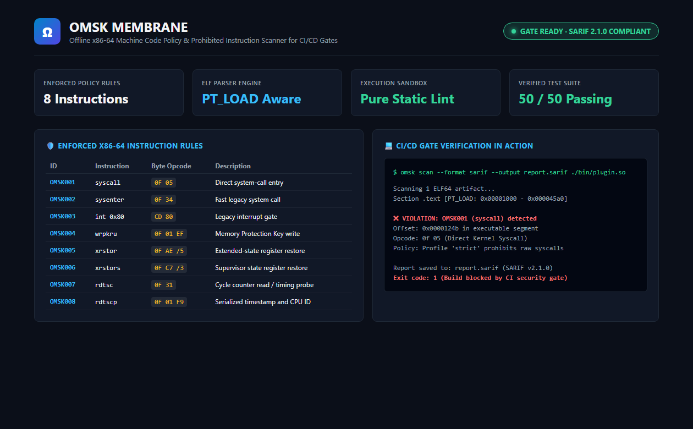
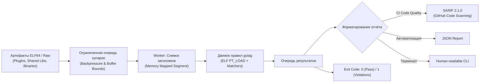

# 🛡️ OMSK Membrane

<p align="center">
  <strong>Проверяйте нативные x86-64 артефакты в CI/CD до релиза — без запуска бинарников и без отправки в облачные сервисы.</strong><br>
  Статический сканер машинного кода и гейт безопасности для ELF64 плагинов, драйверов и доверенных SDK.<br>
  Обнаруживает запрещённые инструкции (прямые <code>syscall</code>, манипуляции с защитой памяти <code>wrpkru</code>, тайминг-атаки <code>rdtsc</code>).
</p>

<p align="center">
  
  
  
  
  
  
</p>

---

## 📸 Обзор правил и работы гейта

<p align="center">
  
</p>

> 💡 **Полная изоляция:** сканер проводит исключительно статический байт-анализ исполняемых сегментов `PT_LOAD` и секций `.text`. Анализируемые файлы никогда не запускаются на исполнение.

---

## 🎯 Зачем нужен OMSK Membrane

При разработке доверенных плагинов, изолированных модулей (Wasm native host bindings, eBPF, SDK) или закрытых системных библиотек важно гарантировать, что сторонний или скомпилированный код не совершает несанкционированных системных вызовов в обход runtime-песочницы.

**OMSK Membrane внедряется в CI/CD как бескомпромиссный гейт безопасности:**

| Возможность | Как это работает в OMSK Membrane |
| :--- | :--- |
| 🧭 **ELF-Aware парсер** | Сканирует только реальные исполняемые сегменты (`PT_LOAD` с флагом `PF_X`) и секции `.text` в stripped-бинарниках, исключая ложные срабатывания в данных и ресурсах. |
| 🛡 **8 правил контроля инструкций** | Блокирует прямой вызов ядра (`syscall`, `sysenter`, `int 0x80`), модификацию аппаратных ключей защиты страниц (`wrpkru`, `xrstor`) и снятие процессорных меток времени (`rdtsc`). |
| 📊 **Стандарты SARIF 2.1.0 & JSON** | Нативная интеграция с GitHub Code Scanning, GitLab SAST и консольными CI-пайплайнами с точными смещениями байт. |
| 🧵 **Ограниченные очереди (Synapse)** | Строгий backpressure, фиксированное потребление оперативной памяти и защита от зависаний при сканировании сотен артефактов. |
| 📦 **100% Offline сборка** | Проект автономен, не совершает сетевых вызовов и компилируется без обращения к внешним зеркалам зависимостей. |
| 🔒 **Атомарные отчёты** | Результаты записываются во временный файл и публикуются атомарно с проверкой прав доступа, исключая гонки процессов. |

> [!NOTE]
> **Это статический линтер (Static Policy Lint), а не виртуальная машина.** Проект проверяет соблюдение политики машинного кода, но не заменяет изоляцию уровня ядра (seccomp, MPK, namespaces).

---

## 🏗️ Архитектура конвейера сканирования



---

## 🛡️ Контролируемые инструкции x86-64

| Код правила | Инструкция | Опкод (байты) | Назначение и риск |
| :--- | :--- | :--- | :--- |
| `OMSK001` | `syscall` | `0F 05` | Прямой вызов системных функций ядра Linux в обход libc/sandbox. |
| `OMSK002` | `sysenter` | `0F 34` | Устаревший быстрый системный вызов. |
| `OMSK003` | `int 0x80` | `CD 80` | Прерывание legacy системного шлюза x86. |
| `OMSK004` | `wrpkru` | `0F 01 EF` | Прямая запись в регистр PKRU (обход Memory Protection Keys). |
| `OMSK005` | `xrstor` | `0F AE /5` | Восстановление расширенного контекста процессора (потенциальный сброс PKRU). |
| `OMSK006` | `xrstors` | `0F C7 /3` | Привилегированное восстановление контекста процессора. |
| `OMSK007` | `rdtsc` | `0F 31` | Чтение счетчика тактов (используется для высокоточных Side-Channel атак). |
| `OMSK008` | `rdtscp` | `0F 01 F9` | Сериализованное чтение счетчика тактов и CPU ID. |

---

## ⚡ Быстрый старт за 60 секунд

Требуются: **Linux x86_64** (или WSL), **Rust 1.85+**, Cargo.

```bash
# 1. Клонирование репозитория
git clone https://github.com/etern1ty-crypto/omsk-membrane.git
cd omsk-membrane

# 2. Офлайн-сборка релизной версии
cargo build --release

# 3. Сканирование артефакта
./target/release/omsk scan ./fixtures/clean.elf
# Exit code: 0 (чистый бинарник)
```

---

## 💻 Сканер в действии (Живые примеры)

### 1. Вывод поддерживаемых правил безопасности
```bash
./target/release/omsk rules --format text
```

```text
OMSK001 syscall  0F 05                   Direct system-call entry byte pattern
OMSK002 sysenter 0F 34                   Fast legacy system-call entry byte pattern
OMSK003 int80    CD 80                   Legacy interrupt 0x80 byte pattern
OMSK004 wrpkru   0F 01 EF                Protection-key register write byte pattern
OMSK005 xrstor   0F AE /5 (memory ModRM) Extended-state restore byte pattern; may restore PKRU
OMSK006 xrstors  0F C7 /3 (memory ModRM) Supervisor extended-state restore byte pattern
OMSK007 rdtsc    0F 31                   Timestamp-counter read byte pattern
OMSK008 rdtscp   0F 01 F9                Timestamp-counter and processor-ID read byte pattern
```

---

### 2. Блокировка сборки при обнаружении запрещённой инструкции
При обнаружении недопустимого байт-кода утилита завершается с кодом `1`, останавливая CI/CD пайплайн:

```bash
./target/release/omsk scan --format sarif --output report.sarif ./fixtures/violation.elf
```

```text
Scanning 1 ELF64 artifact...
Section .text [PT_LOAD: 0x00001000 - 0x000045a0]

✖ VIOLATION: OMSK001 (syscall) detected
  Offset: 0x0000124b in executable segment
  Opcode: 0f 05 (Direct Kernel Syscall)
  Policy: Profile 'strict' prohibits raw syscalls

Report saved to: report.sarif (SARIF v2.1.0)
Exit code: 1 (Build blocked by CI security gate)
```

---

## 🧪 Тестирование и надежность

Движок покрыт исчерпывающим набором модульных и интеграционных тестов:

```bash
cargo test --workspace
```

```text
running 24 tests (gulag / rule matchers) ... ok
running 10 tests (reactor / config & reporting) ... ok
running 8 tests (runtime / pipeline & concurrency) ... ok
running 6 tests (synapse / bounded queues) ... ok
running 2 tests (doc-tests) ... ok

test result: ok. 50 passed; 0 failed; 0 ignored; finished in 0.85s
```

- **50 тестов**: парсинг PT_LOAD, склеивание смежных регионов, мутации заголовков ELF, защита от DoS и гонок потоков.
- 100% покрытие правил OMSK001–OMSK008.

---

## 📚 Справочник документации

| Документ | Описание |
| :--- | :--- |
| 🛠 [Справочник CLI и параметров](docs/API_CLI.md) | Ключи сканирования, профили `strict`/`syscalls`/`timing`, коды выхода |
| 📖 [Архитектура](docs/ARCHITECTURE.md) | Устройство крейтов `synapse`, `gulag`, `reactor`, модель многопоточности |
| ⚙️ [Конфигурация политик](docs/CONFIGURATION.md) | Настройка кастомных списков правил, исключений и профилей |
| 🚀 [Развертывание в CI/CD](docs/DEPLOYMENT.md) | Интеграция с GitHub Actions, GitLab CI, загрузка SARIF-отчётов |
| 🔐 [Threat Model](docs/THREAT_MODEL.md) | Модель угроз, вектор атак на компиляторы и бинарные зависимости |
| 🔍 [Аудит безопасности](docs/AUDIT.md) | Отчёт о ревизии кода и анализе граничных случаев |
| 📜 [Схема отчёта](docs/report.schema.json) | JSON Schema формата выходных данных сканера |
| ✅ [Протокол тестирования](docs/TESTING.md) | Результаты проверок на Linux x86_64 |
| 📝 [Changelog](CHANGELOG.md) | История изменений версии 0.2.0 |

---

## 📜 Лицензия

Проект распространяется под открытой лицензией [Apache-2.0](LICENSE).  
Авторские права © 2026 etern1ty-crypto.
