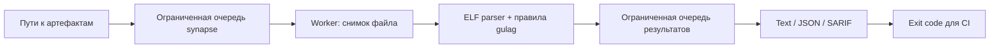

# OMSK Membrane

[](docs/TESTING.md)
[](Cargo.toml)
[](CHANGELOG.md)
[](LICENSE)

**Проверяйте нативные артефакты до публикации — не отправляя бинарники во внешние сервисы.**
OMSK Membrane проверяет ELF64 и явно заданные raw-данные на запрещённые x86-64 байтовые сигнатуры и выдаёт воспроизводимые отчёты для CI/CD.

> **Статус: верифицирован (100% тестов пройдены).** Проект успешно скомпилирован на Rust 1.85.1 (Linux x86_64). Пройдены все 49 Rust-тестов, 2 doc-теста, Clippy (`-D warnings`), rustfmt, rustdoc, preflight и 16 E2E black-box тестов на debug и release сборках через `scripts/verify.sh`. [Точный статус проверок →](docs/TESTING.md)

> **Это lint, не sandbox.** Совпадение может находиться внутри константы, а отсутствие совпадений не доказывает безопасность исполнения. Проект не исполняет анализируемые файлы, не реализует MPK/CET и не заменяет изоляцию.

## Для кого

Для platform/security engineers, которые выпускают контролируемые Linux x86-64 плагины, SDK и вычислительные модули и хотят обнаруживать нежелательные изменения машинного кода после сборки. Это не универсальная политика для всех системных программ: обычным исполняемым файлам системные вызовы часто необходимы.

## Возможности

- 🎯 **Политика в репозитории:** профили `strict`, `syscalls`, `timing` и явный список правил.
- 🧭 **ELF-aware:** исполняемые `PT_LOAD` в stripped binaries; исполняемые секции в `.o`.
- 🧾 **Text / JSON / SARIF 2.1.0:** точные смещения в файле, без выдуманных строк исходника.
- 🧵 **Ограниченная очередь:** backpressure, фиксированный worker и отсутствие busy-wait.
- 🛑 **Предсказуемое завершение:** ошибки не превращаются в успех; SIGINT/SIGTERM оставляют явно неполный отчёт.
- 📦 **Офлайн-сборка:** только локальные Rust crates, без зависимостей crates.io.
- 🔒 **Осторожный I/O:** лимиты, отказ от special files, экранирование и атомарная публикация нового отчёта без перезаписи.

## Архитектура



## Quickstart · 3 команды

Нужны **64-bit Linux**, Rust **1.85+**, Cargo и системный linker. Файл `rust-toolchain.toml` фиксирует проверяемую baseline-версию 1.85.1; если используется rustup, она и компоненты должны быть заранее установлены. Загрузка самого toolchain — отдельная операция с сетью, не часть offline Cargo build.

```bash
cd omsk-membrane-0.2.0
cargo build --offline --locked --release
./target/release/omsk scan fixtures/clean.elf
```

Ожидаемый exit code последней команды — `0`. Тестовые ELF — **данные для сканера, их нельзя запускать**. Время первоначальной сборки зависит от машины; обещания «50 μs cold start» удалены как неподтверждённые.

## Примеры

Проверить явно заданные машинные байты; ожидаемый код — `1`:

```bash
./target/release/omsk scan --input-format raw fixtures/syscall.bin
```

Применить конфигурацию и сохранить **новый** SARIF-отчёт:

```bash
./target/release/omsk scan --config .env.example --format sarif --output artifact-review.sarif fixtures/violation.elf
```

Получить JSON с ограничением размера списка находок:

```bash
./target/release/omsk scan --input-format raw --format json --max-findings 2 fixtures/all-rules.bin
```

| Код | Значение |
| --- | --- |
| `0` | Все файлы проверены, выбранные сигнатуры не найдены |
| `1` | Есть совпадения с политикой |
| `2` | Ошибка аргументов, чтения, формата, записи или worker |
| `130` / `143` | Кооперативная остановка по SIGINT / SIGTERM |

## 📚 Документация

- 📖 [Архитектура и внутреннее устройство](docs/ARCHITECTURE.md)
- ⚙️ [Настройка и конфигурация](docs/CONFIGURATION.md)
- 🚀 [Развёртывание и Production](docs/DEPLOYMENT.md)
- 🛠 [API / CLI справочник](docs/API_CLI.md)
- 🔍 [Аудит исходного проекта](docs/AUDIT.md)
- 🎯 [Выбор ниши и монетизация](docs/PRODUCT_DISCOVERY.md)
- 🛡 [Модель угроз и ограничения](docs/THREAT_MODEL.md)
- 🧪 [Тесты и фактический статус проверки](docs/TESTING.md)

## Разработка

```bash
bash scripts/verify.sh
```

Скрипт нормализует Rust-форматирование, запускает настоящие Rust-тесты, Clippy, rustdoc и Python black-box тесты **скомпилированного** CLI. Без Cargo он завершится ошибкой, а не выдаст фиктивный зелёный результат. Подробнее: [CONTRIBUTING.md](CONTRIBUTING.md).

## Roadmap

1. Пройти compiler/E2E gates и независимую проверку Linux signal FFI перед релизом.
2. Проверить полезность на реальных plugin build pipelines и измерить долю шумных находок.
3. Добавить PE/Mach-O и disassembly-backed режим только после отдельного проектирования и тестирования.
4. Рассмотреть подписанные профили и удобное объяснение исключений при подтверждённом спросе.

Roadmap — планы, а не скрытые заглушки в текущем API.

## License

[Apache License 2.0](LICENSE). Исходный текст лицензии сохранён без изменений; происхождение и характер переработки описаны в [NOTICE](NOTICE). Название исходного проекта сохранено, право на чужие товарные знаки не заявляется.
