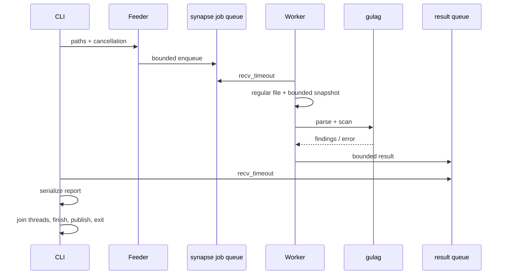

# Архитектура и внутреннее устройство

[← README](../README.md)

## Границы системы

OMSK — конечная CLI-задача, не daemon и не runtime для гостевого кода. Она получает список явных файлов, делает ограниченные immutable snapshots, определяет регионы для анализа и применяет policy matcher. Нет сетевых запросов, динамической загрузки библиотек и executable mappings анализируемого кода.

## Crates и ответственность

### `gulag`

- `src/rules.rs`: стабильные идентификаторы правил, signatures, профили и canonical ordering.
- `src/image.rs`: безопасный по индексам ELF64 parser и нормализация регионов.
- `src/lib.rs`: bounded findings, точный счётчик совпадений, отмена и публичный scanner API.

Crate запрещает `unsafe`. Он не читает файловую систему и получает уже доступный `&[u8]` от хоста.

### `synapse`

Обёртка над `std::sync::mpsc::sync_channel`. Producer и consumer не `Clone` и не `Sync`; операции требуют mutable endpoint, сохраняя SPSC-контракт на уровне публичного API. Оба endpoint можно перемещать между потоками для `T: Send`.

- ёмкость `1..65536` в API;
- блокировка producer при полной очереди;
- `try_send` возвращает исходное значение при Full/Disconnected;
- consumer получает buffered items до Disconnected;
- drop consumer освобождает blocked producer;
- `recv_timeout` вместо busy-wait.

Это **не** lock-free shared-memory ring и не межпроцессный IPC. Внутренние атомики и синхронизацию реализует стандартная библиотека. Исходный `SynapseHeader` удалён: сохранять декоративное выравнивание без протокола означало бы сохранять технический долг.

### `reactor` / binary `omsk`

- `config.rs`: CLI, explicit env file и precedence.
- `guest.rs`: историческое имя файла; теперь bounded immutable file reader, не Guest VM.
- `io_pump.rs`: feeder, один scanner worker, результат на каждый обработанный путь, joining.
- `report.rs`: deterministic text/JSON/SARIF, bounded per-file results.
- `output.rs`: stdout или атомарная no-clobber публикация.
- `shutdown.rs`: токен отмены и минимальная Linux signal FFI.
- `main.rs`: glue, выходные коды, stderr progress.

## Поддерживаемый ELF subset

- ELF64, little-endian, AMD64 (`e_machine=62`), ELF version 1.
- `ET_EXEC` и `ET_DYN`: file-backed `PT_LOAD` с `PF_X`. Section table для них не требуется.
- `ET_REL`: непустые `SHF_EXECINSTR` секции типа `SHT_PROGBITS`; compressed executable sections отвергаются.
- Header sizes проверяются; table counts ограничены 4096.
- Смещения, длины и сложения проверяются до индексирования.
- `p_filesz <= p_memsz`, alignment/congruence и virtual overflow проверяются.
- В этой версии executable `PT_LOAD` с zero-fill tail отвергается как unsupported.
- Overlapping executable file/virtual ranges отвергаются.
- Соседние executable virtual ranges допускаются только при непрерывных file ranges; они объединяются, чтобы найти сигнатуру на границе двух headers.
- `ET_REL` sections независимы: линковка ещё не выполнена, runtime addresses неизвестны. Для release gate предпочтителен окончательный `.so`/executable.

Названия регионов — `segment[N]`, `section[N]` или `coalesced PT_LOAD`. Section names не используются в качестве доверенного признака исполнимости.

Unknown, malformed и unsupported inputs дают ошибку; **никакого fallback в raw**. Полный список ограничений: [THREAT_MODEL.md](THREAT_MODEL.md).

## Matcher

На каждом byte offset проверяются включённые правила. Время — `O(B × R)`, где `B` — число просканированных байтов, `R <= 8`. Это оценка алгоритма, не измеренный benchmark.

Matcher не декодирует x86. `0F 05` внутри immediate тоже является совпадением. XRSTOR/XRSTORS проверяют opcode и memory ModRM extension; `byte_length=3` — длина сигнатуры, не всей инструкции с SIB/displacement.

Количество находок считается полностью, но сохраняются только первые `max_findings` на файл. Достижение лимита не делает результат passing и не прекращает подсчёт. Порядок: порядок файлов → file offset → canonical rule order.

## Память и backpressure

В job queue хранятся **пути**, а не полные бинарники. Reader/worker обрабатывает один snapshot за раз. Result queue имеет ёмкость 2; очередь путей по умолчанию 4. Writer не накапливает все findings по всем файлам.

SARIF writer сохраняет компактные artifact summaries и notifications для не более 512 аргументов. Labels для объединённых сегментов имеют ограниченную длину, чтобы не раздувать каждый finding.

Лимит размера файла — не обещание равного лимита RSS: `Vec` может резервировать дополнительную ёмкость; есть buffers и несколько reports. Настройте container memory limit и измерьте реальные артефакты.

## Завершение

SIGINT/SIGTERM handler только записывает номер сигнала в `AtomicI32`; он не аллоцирует, не логирует и не блокируется. FFI ограничена 64-bit Linux и находится в одном модуле с safety comments.

Отмена проверяется перед чтением, между 64 KiB чтениями, перед scan и каждые 4096 byte offsets. Это cooperative shutdown: kernel/filesystem I/O может блокироваться дольше, особенно на NFS/FUSE. Hard timeout задаёт внешняя среда.

При прекращении вывода result consumer уничтожается **до** `join`, освобождая scanner, заблокированный на send. Drop job consumer освобождает feeder. Паника worker/feeder не считается успешным окончанием. OOM abort/SIGKILL/power loss не гарантируют финальный отчёт.

## Публикация отчёта

`--output` создаёт mode-0600 temp в том же каталоге, записывает и синхронизирует данные, затем публикует hard link без возможности заменить существующее имя. Temp удаляется; каталог синхронизируется на Unix. При ошибке до публикации destination отсутствует.

Родительский каталог должен быть доверенным и поддерживать hard links. Если публикация состоялась, но последующий fsync каталога вернул ошибку, готовый destination может существовать, а команда вернёт ошибку. Перед повтором проверьте файл; перезапись не выполняется.
