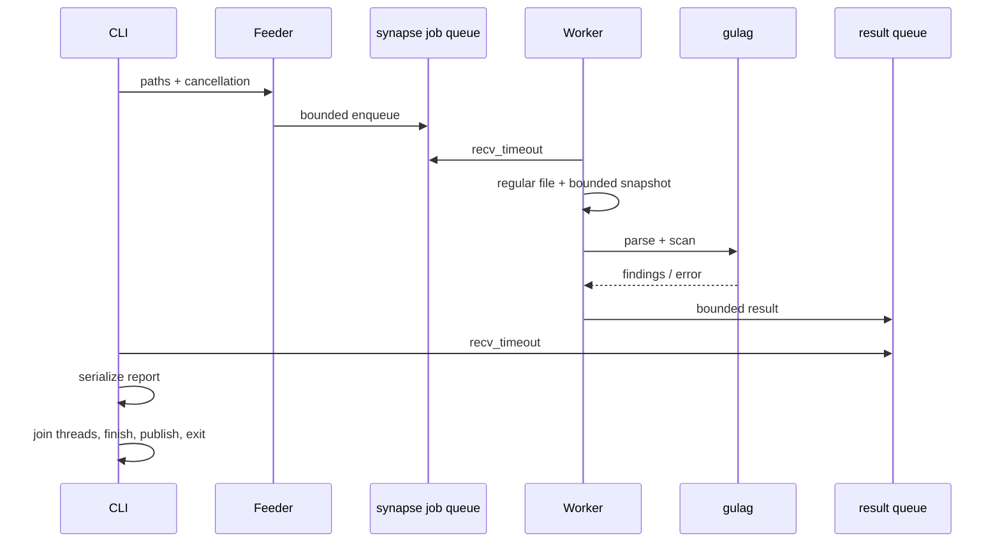

# OMSK Membrane 0.2.0 — полный исходный код

**Статус:** implementation candidate. Rust compilation, Clippy и Rust/E2E execution в среде подготовки не подтверждены. Подробности находятся в `docs/TESTING.md` и `docs/verification.json`.

Здесь приведено полное содержимое **всех** файлов source-репозитория с точными путями. Нет сокращённых участков кода. Binary fixtures представлены целиком в Base64; в ZIP они лежат обычными файлами. Для установки используйте ZIP, а не копирование листинга вручную.

## `omsk-membrane-0.2.0/.dockerignore`

<!-- BEGIN_FILE {"path": ".dockerignore", "encoding": "utf-8", "byte_length": 61, "sha256": "9828dcf14b5aa9da388b7f26b8944fb571f240c7ff564afa957149fa79c1509e", "fence": "```", "added_final_newline": false} -->
```text
target
.git
.env
.env.*
!.env.example
dist
*.log
__pycache__
```
<!-- END_FILE -->

## `omsk-membrane-0.2.0/.env.example`

<!-- BEGIN_FILE {"path": ".env.example", "encoding": "utf-8", "byte_length": 480, "sha256": "4a27fb21aacb1346e63730fe75da2ee6301d4892c0b8152be9456410ce7529fa", "fence": "```", "added_final_newline": false} -->
```text
# Explicitly load with: omsk scan --config .env.example artifact.so
# Precedence: defaults < this file < environment < CLI.
# No auto-loading of .env; no shell expansion or execution.
OMSK_PROFILE=strict
OMSK_INPUT_FORMAT=auto
OMSK_FORMAT=text
OMSK_MAX_FILE_BYTES=67108864
OMSK_MAX_FINDINGS=1000
OMSK_QUEUE_CAPACITY=4
OMSK_QUIET=false
# Uncomment to REPLACE the profile's rules with an explicit nonempty list:
# OMSK_DENY=syscall,sysenter,int80,wrpkru,xrstor,xrstors,rdtsc,rdtscp
```
<!-- END_FILE -->

## `omsk-membrane-0.2.0/.gitattributes`

<!-- BEGIN_FILE {"path": ".gitattributes", "encoding": "utf-8", "byte_length": 45, "sha256": "ae421865b8ded8624cf8e95cba0d315a1ca48558b0dae6edad7573bd28bd4a73", "fence": "```", "added_final_newline": false} -->
```text
* text=auto eol=lf
*.bin binary
*.elf binary
```
<!-- END_FILE -->

## `omsk-membrane-0.2.0/.github/workflows/ci.yml`

<!-- BEGIN_FILE {"path": ".github/workflows/ci.yml", "encoding": "utf-8", "byte_length": 1301, "sha256": "87f566c74efdb97be2650b96bdb04962c67a317f62740a07511db2e9699cdddb", "fence": "```", "added_final_newline": false} -->
```yaml
name: CI

on:
  push:
  pull_request:
  workflow_dispatch:

permissions:
  contents: read

jobs:
  verify:
    name: Rust ${{ matrix.toolchain }} / Linux
    runs-on: ubuntu-latest
    timeout-minutes: 15
    strategy:
      fail-fast: false
      matrix:
        toolchain: ['1.85.1', stable]
    env:
      RUSTUP_TOOLCHAIN: ${{ matrix.toolchain }}
    steps:
      - uses: actions/checkout@v4
      - name: Install toolchain
        run: rustup toolchain install "$RUSTUP_TOOLCHAIN" --profile minimal --component rustfmt,clippy
      - name: Rust, formatting, documentation and black-box verification
        run: bash scripts/verify.sh
      - name: Reject registry dependencies
        run: |
          cargo metadata --offline --locked --format-version 1 > metadata.json
          python3 -c 'import json; d=json.load(open("metadata.json")); assert all(p["source"] is None for p in d["packages"])'

  container:
    runs-on: ubuntu-latest
    timeout-minutes: 15
    steps:
      - uses: actions/checkout@v4
      - name: Build container
        run: docker build --tag omsk-ci .
      - name: Clean fixture in restricted container
        run: docker run --rm --network none --read-only --cap-drop ALL --security-opt no-new-privileges -v "$PWD/fixtures:/work:ro" omsk-ci scan --quiet clean.elf
```
<!-- END_FILE -->

## `omsk-membrane-0.2.0/.gitignore`

<!-- BEGIN_FILE {"path": ".gitignore", "encoding": "utf-8", "byte_length": 120, "sha256": "7cce11cdd7ced88a44444da4ecb7953cc5d3458989951e33a765a8aadf322d49", "fence": "```", "added_final_newline": false} -->
```text
/target/
/dist/
.env
.env.*
!.env.example
*.tmp
*.log
*.sarif
/report.json
__pycache__/
*.pyc
.DS_Store
.idea/
.vscode/
```
<!-- END_FILE -->

## `omsk-membrane-0.2.0/CHANGELOG.md`

<!-- BEGIN_FILE {"path": "CHANGELOG.md", "encoding": "utf-8", "byte_length": 2244, "sha256": "006f89bb49bdcd955b2d4caef2bee3291569748a3e294f32dfe66e03f23df801", "fence": "```", "added_final_newline": false} -->
```markdown
# Changelog

## 0.2.0 — implementation candidate, 2026-09-08

### Product

- Нативный VM prototype переориентирован на offline ELF64/raw byte-pattern policy gate.
- Убраны неподтверждённые isolation и performance claims.
- Добавлена явная модель угроз и проверяемая гипотеза рынка вместо обещания подтверждённого PMF.

### Added / changed

- Реальный `omsk scan/rules/config` CLI, eight-rule policy API, ELF parser.
- Bounded SPSC endpoints вместо одного atomic header.
- Immutable file input, finite worker pipeline, cancellation and joining.
- Text/JSON/SARIF, file offsets, bounded findings with exact counts.
- Atomic no-clobber report output и stderr progress.
- `.env.example`, multi-stage runtime Dockerfile, CI и regression suites.
- README и полноценная документация по архитектуре, конфигурации, API, deployment, audit и testing.
- Исторические crate names сохранены; API breaking changes допустимы для 0.x.

### Removed

- Registry dependencies `memmap2`/`libc`; file mmap path и fake guest ACTIVE state.
- Busy-wait loop, fake acknowledgement и необработанные command stubs.
- Из source distribution исключены `target/`, Windows build artifacts и caches.

### Breaking

- Булев `gulag::scan(&[u8])` заменён structured `scan` с format/policy/options/cancellation.
- `SynapseHeader` заменён `bounded`, `Producer`, `Consumer`.
- Binary называется `omsk` вместо демонстрационного бесконечного `reactor`.
- CLI scan официально ограничен 64-bit Linux; PE/Mach-O/other architectures — explicit error.
- JSON schema v1: virtual addresses — hex strings, file offsets — числа.

### Verification

Rust compilation, Rust tests, Clippy, formatting, E2E и container execution **не подтверждены** в исходной среде выдачи. Релиз не следует обозначать production-ready до выполнения [release gates](docs/DEPLOYMENT.md).
```
<!-- END_FILE -->

## `omsk-membrane-0.2.0/CONTRIBUTING.md`

<!-- BEGIN_FILE {"path": "CONTRIBUTING.md", "encoding": "utf-8", "byte_length": 2714, "sha256": "7741e95fa43f491017cb46bc6dd31f4e5b843f8968ba196e023112f322202d2e", "fence": "````", "added_final_newline": false} -->
````markdown
# Contributing

Спасибо за вклад. Главный принцип проекта: измеряемое поведение важнее красивых заявлений о безопасности.

## Подготовка

64-bit Linux, Rust 1.85+ с rustfmt/Clippy, Python 3.11+. Точная baseline указана в `rust-toolchain.toml`. Не добавляйте registry dependencies без обоснования функциональности, лицензии, maintenance и advisory review.

```bash
bash scripts/verify.sh
```

Скрипт форматирует исходники и запускает реальные проверки; сохраните форматирующие изменения в commit. При отсутствии compiler он завершается ошибкой. Не меняйте badge на passing только потому, что YAML workflow существует.

## Изменение правила

1. Стабильный ID и имя в `gulag/src/rules.rs`.
2. Документируйте точную byte signature, ModRM/prefix semantics и known false positives.
3. Тесты на offsets, truncated suffixes, разрешённые соседние encodings и policy selection.
4. Обновите CLI reference, schema enum, fixtures и catalogue assertions.
5. Не называйте матч доказанной reachable instruction, если decoding не реализован.

## Изменение parser

Все поля и сложения checked до slice indexing. Unsupported input — error, не raw fallback и не clean. Добавьте malformed/boundary/regression fixtures. Не исполняйте входные бинарники в тестах. Новые formats требуют полноценного parsing contract, а не success stub.

## Изменение runtime

Ни один output/worker error не должен давать exit 0. Проверяйте backpressure, drop ordering, malformed files, signal cancellation и atomic output race. Не расширяйте unsafe за пределы изолированного и документированного модуля без отдельного ревью.

## Pull request

Опишите проблему, user-visible change, совместимость API/schema и реально выполненные команды. Отделяйте tests authored от tests passed. Не публикуйте customer artifacts, credentials или private paths без согласия владельца.

Security issues: [SECURITY.md](SECURITY.md). Модель угроз: [docs/THREAT_MODEL.md](docs/THREAT_MODEL.md).
````
<!-- END_FILE -->

## `omsk-membrane-0.2.0/Cargo.lock`

<!-- BEGIN_FILE {"path": "Cargo.lock", "encoding": "utf-8", "byte_length": 286, "sha256": "7352aeae404748b312b3b065ba4479b8d07c3906dffb6a485d06f27b34948835", "fence": "```", "added_final_newline": false} -->
```text
# This file is automatically @generated by Cargo.
# It is not intended for manual editing.
version = 4

[[package]]
name = "gulag"
version = "0.2.0"

[[package]]
name = "reactor"
version = "0.2.0"
dependencies = [
 "gulag",
 "synapse",
]

[[package]]
name = "synapse"
version = "0.2.0"
```
<!-- END_FILE -->

## `omsk-membrane-0.2.0/Cargo.toml`

<!-- BEGIN_FILE {"path": "Cargo.toml", "encoding": "utf-8", "byte_length": 347, "sha256": "e50c10ffe2885b6fd26b3f6b737530702825384999acfb06a744d61b2fc49baa", "fence": "```", "added_final_newline": false} -->
```toml
[workspace]
members = ["gulag", "synapse", "reactor"]
default-members = ["reactor"]
resolver = "2"

[workspace.package]
version = "0.2.0"
edition = "2021"
rust-version = "1.85"
license = "Apache-2.0"

[workspace.lints.rust]
unsafe_op_in_unsafe_fn = "deny"

[profile.release]
lto = "thin"
codegen-units = 1
strip = "symbols"
overflow-checks = true
```
<!-- END_FILE -->

## `omsk-membrane-0.2.0/Dockerfile`

<!-- BEGIN_FILE {"path": "Dockerfile", "encoding": "utf-8", "byte_length": 525, "sha256": "78db35b312db01b7b36d6346874af935a141730b51da2646f4ed6fdf6748acd3", "fence": "```", "added_final_newline": false} -->
```text
FROM rust:1.85.1-slim-bookworm AS build
WORKDIR /src
COPY Cargo.toml Cargo.lock rust-toolchain.toml ./
COPY gulag ./gulag
COPY synapse ./synapse
COPY reactor ./reactor
COPY .env.example ./
RUN cargo build --offline --locked --release -p reactor --bin omsk

FROM debian:bookworm-slim AS runtime
RUN groupadd --gid 10001 omsk && useradd --uid 10001 --gid 10001 --no-create-home omsk
COPY --from=build /src/target/release/omsk /usr/local/bin/omsk
USER 10001:10001
WORKDIR /work
ENTRYPOINT ["/usr/local/bin/omsk"]
CMD ["--help"]
```
<!-- END_FILE -->

## `omsk-membrane-0.2.0/LICENSE`

<!-- BEGIN_FILE {"path": "LICENSE", "encoding": "utf-8", "byte_length": 10173, "sha256": "c4a2cd14eb3abe621891b235bbe2cfd65f1f71afcfcd5c9b691bb016387dfe88", "fence": "```", "added_final_newline": false} -->
```text
                                 Apache License
                           Version 2.0, January 2004
                        http://www.apache.org/licenses/

   TERMS AND CONDITIONS FOR USE, REPRODUCTION, AND DISTRIBUTION

   1. Definitions.

      "License" shall mean the terms and conditions for use, reproduction,
      and distribution as defined by Sections 1 through 9 of this document.

      "Licensor" shall mean the copyright owner or entity authorized by
      the copyright owner that is granting the License.

      "Legal Entity" shall mean the union of the acting entity and all
      other entities that control, are controlled by, or are under common
      control with that entity. For the purposes of this definition,
      "control" means (i) the power, direct or indirect, to cause the
      direction or management of such entity, whether by contract or
      otherwise, or (ii) ownership of fifty percent (50%) or more of the
      outstanding shares, or (iii) beneficial ownership of such entity.

      "You" (or "Your") shall mean an individual or Legal Entity
      exercising permissions granted by this License.

      "Source" form shall mean the preferred form for making modifications,
      including but not limited to software source code, documentation
      source, and configuration files.

      "Object" form shall mean any form resulting from mechanical
      transformation or translation of a Source form, including but
      not limited to compiled object code, generated documentation,
      and conversions to other media types.

      "Work" shall mean the work of authorship, whether in Source or
      Object form, made available under the License, as indicated by a
      copyright notice that is included in or attached to the work
      (an example is provided in the Appendix below).

      "Derivative Works" shall mean any work, whether in Source or Object
      form, that is based on (or derived from) the Work and for which the
      editorial revisions, annotations, elaborations, or other modifications
      represent, as a whole, an original work of authorship. For the purposes
      of this License, Derivative Works shall not include works that remain
      separable from, or merely link (or bind by name) to the interfaces of,
      the Work and Derivative Works thereof.

      "Contribution" shall mean any work of authorship, including
      the original version of the Work and any modifications or additions
      to that Work or Derivative Works thereof, that is intentionally
      submitted to Licensor for inclusion in the Work by the copyright owner
      or by an individual or Legal Entity authorized to submit on behalf of
      the copyright owner. For the purposes of this definition, "submitted"
      means any form of electronic, verbal, or written communication sent
      to the Licensor or its representatives, including but not limited to
      communication on electronic mailing lists, source code control systems,
      and issue tracking systems that are managed by, or on behalf of, the
      Licensor for the purpose of discussing and improving the Work, but
      excluding communication that is conspicuously marked or otherwise
      designated in writing by the copyright owner as "Not a Contribution."

      "Contributor" shall mean Licensor and any individual or Legal Entity
      on behalf of whom a Contribution has been received by Licensor and
      subsequently incorporated within the Work.

   2. Grant of Copyright License. Subject to the terms and conditions of
      this License, each Contributor hereby grants to You a perpetual,
      worldwide, non-exclusive, no-charge, royalty-free, irrevocable
      copyright license to reproduce, prepare Derivative Works of,
      publicly display, publicly perform, sublicense, and distribute the
      Work and such Derivative Works in Source or Object form.

   3. Grant of Patent License. Subject to the terms and conditions of
      this License, each Contributor hereby grants to You a perpetual,
      worldwide, non-exclusive, no-charge, royalty-free, irrevocable
      (except as stated in this section) patent license to make, have made,
      use, offer to sell, sell, import, and otherwise transfer the Work,
      where such license applies only to those patent claims licensable
      by such Contributor that are necessarily infringed by their
      Contribution(s) alone or by combination of their Contribution(s)
      with the Work to which such Contribution(s) was submitted. If You
      institute patent litigation against any entity (including a
      cross-claim or counterclaim in a lawsuit) alleging that the Work
      or a Contribution incorporated within the Work constitutes direct
      or contributory patent infringement, then any patent licenses
      granted to You under this License for that Work shall terminate
      as of the date such litigation is filed.

   4. Redistribution. You may reproduce and distribute copies of the
      Work or Derivative Works thereof in any medium, with or without
      modifications, and in Source or Object form, provided that You
      meet the following conditions:

      (a) You must give any other recipients of the Work or Derivative
          Works a copy of this License; and

      (b) You must cause any modified files to carry prominent notices
          stating that You changed the files; and

      (c) You must retain, in the Source form of any Derivative Works
          that You distribute, all copyright, patent, trademark, and
          attribution notices from the Source form of the Work,
          excluding those notices that do not pertain to any part of
          the Derivative Works; and

      (d) If the Work includes a "NOTICE" text file as part of its
          distribution, then any Derivative Works that You distribute must
          include a readable copy of the attribution notices contained
          within such NOTICE file, excluding those notices that do not
          pertain to any part of the Derivative Works, in at least one
          of the following places: within a NOTICE text file distributed
          as part of the Derivative Works; within the Source form or
          documentation, if provided along with the Derivative Works; or,
          within a display generated by the Derivative Works, if and
          wherever such third-party notices normally appear. The contents
          of the NOTICE file are for informational purposes only and
          do not modify the License. You may add Your own attribution
          notices within Derivative Works that You distribute, alongside
          or as an addendum to the NOTICE text from the Work, provided
          that such additional attribution notices cannot be construed
          as modifying the License.

      You may add Your own copyright statement to Your modifications and
      may provide additional or different license terms and conditions
      for use, reproduction, or distribution of Your modifications, or
      for any such Derivative Works as a whole, provided Your use,
      reproduction, and distribution of the Work otherwise complies with
      the conditions stated in this License.

   5. Submission of Contributions. Unless You explicitly state otherwise,
      any Contribution intentionally submitted for inclusion in the Work
      by You to the Licensor shall be under the terms and conditions of
      this License, without any additional terms or conditions.
      Notwithstanding the above, nothing herein shall supersede or modify
      the terms of any separate license agreement you may have executed
      with Licensor regarding such Contributions.

   6. Trademarks. This License does not grant permission to use the trade
      names, trademarks, service marks, or product names of the Licensor,
      except as required for reasonable and customary use in describing the
      origin of the Work and reproducing the content of the NOTICE file.

   7. Disclaimer of Warranty. Unless required by applicable law or
      agreed to in writing, Licensor provides the Work (and each
      Contributor provides its Contributions) on an "AS IS" BASIS,
      WITHOUT WARRANTIES OR CONDITIONS OF ANY KIND, either express or
      implied, including, without limitation, any warranties or conditions
      of TITLE, NON-INFRINGEMENT, MERCHANTABILITY, or FITNESS FOR A
      PARTICULAR PURPOSE. You are solely responsible for determining the
      appropriateness of using or redistributing the Work and assume any
      risks associated with Your exercise of permissions under this License.

   8. Limitation of Liability. In no event and under no legal theory,
      whether in tort (including negligence), contract, or otherwise,
      unless required by applicable law (such as deliberate and grossly
      negligent acts) or agreed to in writing, shall any Contributor be
      liable to You for damages, including any direct, indirect, special,
      incidental, or consequential damages of any character arising as a
      result of this License or out of the use or inability to use the
      Work (including but not limited to damages for loss of goodwill,
      work stoppage, computer failure or malfunction, or any and all
      other commercial damages or losses), even if such Contributor
      has been advised of the possibility of such damages.

   9. Accepting Warranty or Additional Liability. While redistributing
      the Work or Derivative Works thereof, You may choose to offer,
      and charge a fee for, acceptance of support, warranty, indemnity,
      or other liability obligations and/or rights consistent with this
      License. However, in accepting such obligations, You may act only
      on Your own behalf and on Your sole responsibility, not on behalf
      of any other Contributor, and only if You agree to indemnify,
      defend, and hold each Contributor harmless for any liability
      incurred by, or claims asserted against, such Contributor by reason
      of your accepting any such warranty or additional liability.

   END OF TERMS AND CONDITIONS
```
<!-- END_FILE -->

## `omsk-membrane-0.2.0/NOTICE`

<!-- BEGIN_FILE {"path": "NOTICE", "encoding": "utf-8", "byte_length": 477, "sha256": "bd1dfece338867aad1ecc9d533cb3608a1f75e6265e789d0ec8cdef6a0abbf85", "fence": "```", "added_final_newline": false} -->
```text
OMSK Membrane

This distribution is derived from the user-provided omsk-membrane-main archive.
The original Apache License 2.0 text in LICENSE is retained without changes.
Version 0.2.0 changes the prototype into a non-executing artifact policy scanner.
The implementation, tests and documentation were substantially revised in 2026.
No upstream ownership, trademark registration or additional rights are asserted.
No registry-sourced Rust crates are included in this version.
```
<!-- END_FILE -->

## `omsk-membrane-0.2.0/README.md`

<!-- BEGIN_FILE {"path": "README.md", "encoding": "utf-8", "byte_length": 7940, "sha256": "761fa108747a91e264138f8a1e73dd5a90830201632e8a44fc265596da1b4344", "fence": "````", "added_final_newline": false} -->
````markdown
# OMSK Membrane

[](docs/TESTING.md)
[](Cargo.toml)
[](CHANGELOG.md)
[](LICENSE)

**Проверяйте нативные артефакты до публикации — не отправляя бинарники во внешние сервисы.**
OMSK Membrane проверяет ELF64 и явно заданные raw-данные на запрещённые x86-64 байтовые сигнатуры и выдаёт воспроизводимые отчёты для CI/CD.

> **Статус: кандидат реализации, не подтверждённый production-релиз.** В среде подготовки отсутствовал Rust, а загрузка toolchain была заблокирована. Исходники, тесты и CI подготовлены; компиляция, Clippy и выполнение Rust/E2E-тестов здесь не подтверждены. [Точный статус проверок →](docs/TESTING.md)

> **Это lint, не sandbox.** Совпадение может находиться внутри константы, а отсутствие совпадений не доказывает безопасность исполнения. Проект не исполняет анализируемые файлы, не реализует MPK/CET и не заменяет изоляцию.

## Для кого

Для platform/security engineers, которые выпускают контролируемые Linux x86-64 плагины, SDK и вычислительные модули и хотят обнаруживать нежелательные изменения машинного кода после сборки. Это не универсальная политика для всех системных программ: обычным исполняемым файлам системные вызовы часто необходимы.

## Возможности

- 🎯 **Политика в репозитории:** профили `strict`, `syscalls`, `timing` и явный список правил.
- 🧭 **ELF-aware:** исполняемые `PT_LOAD` в stripped binaries; исполняемые секции в `.o`.
- 🧾 **Text / JSON / SARIF 2.1.0:** точные смещения в файле, без выдуманных строк исходника.
- 🧵 **Ограниченная очередь:** backpressure, фиксированный worker и отсутствие busy-wait.
- 🛑 **Предсказуемое завершение:** ошибки не превращаются в успех; SIGINT/SIGTERM оставляют явно неполный отчёт.
- 📦 **Офлайн-сборка:** только локальные Rust crates, без зависимостей crates.io.
- 🔒 **Осторожный I/O:** лимиты, отказ от special files, экранирование и атомарная публикация нового отчёта без перезаписи.

## Архитектура


## Quickstart · 3 команды

Нужны **64-bit Linux**, Rust **1.85+**, Cargo и системный linker. Файл `rust-toolchain.toml` фиксирует проверяемую baseline-версию 1.85.1; если используется rustup, она и компоненты должны быть заранее установлены. Загрузка самого toolchain — отдельная операция с сетью, не часть offline Cargo build.

```bash
cd omsk-membrane-0.2.0
cargo build --offline --locked --release
./target/release/omsk scan fixtures/clean.elf
```

Ожидаемый exit code последней команды — `0`. Тестовые ELF — **данные для сканера, их нельзя запускать**. Время первоначальной сборки зависит от машины; обещания «50 μs cold start» удалены как неподтверждённые.

## Примеры

Проверить явно заданные машинные байты; ожидаемый код — `1`:

```bash
./target/release/omsk scan --input-format raw fixtures/syscall.bin
```

Применить конфигурацию и сохранить **новый** SARIF-отчёт:

```bash
./target/release/omsk scan --config .env.example --format sarif --output artifact-review.sarif fixtures/violation.elf
```

Получить JSON с ограничением размера списка находок:

```bash
./target/release/omsk scan --input-format raw --format json --max-findings 2 fixtures/all-rules.bin
```

| Код | Значение |
| --- | --- |
| `0` | Все файлы проверены, выбранные сигнатуры не найдены |
| `1` | Есть совпадения с политикой |
| `2` | Ошибка аргументов, чтения, формата, записи или worker |
| `130` / `143` | Кооперативная остановка по SIGINT / SIGTERM |

## 📚 Документация

- 📖 [Архитектура и внутреннее устройство](docs/ARCHITECTURE.md)
- ⚙️ [Настройка и конфигурация](docs/CONFIGURATION.md)
- 🚀 [Развёртывание и Production](docs/DEPLOYMENT.md)
- 🛠 [API / CLI справочник](docs/API_CLI.md)
- 🔍 [Аудит исходного проекта](docs/AUDIT.md)
- 🎯 [Выбор ниши и монетизация](docs/PRODUCT_DISCOVERY.md)
- 🛡 [Модель угроз и ограничения](docs/THREAT_MODEL.md)
- 🧪 [Тесты и фактический статус проверки](docs/TESTING.md)

## Разработка

```bash
bash scripts/verify.sh
```

Скрипт нормализует Rust-форматирование, запускает настоящие Rust-тесты, Clippy, rustdoc и Python black-box тесты **скомпилированного** CLI. Без Cargo он завершится ошибкой, а не выдаст фиктивный зелёный результат. Подробнее: [CONTRIBUTING.md](CONTRIBUTING.md).

## Roadmap

1. Пройти compiler/E2E gates и независимую проверку Linux signal FFI перед релизом.
2. Проверить полезность на реальных plugin build pipelines и измерить долю шумных находок.
3. Добавить PE/Mach-O и disassembly-backed режим только после отдельного проектирования и тестирования.
4. Рассмотреть подписанные профили и удобное объяснение исключений при подтверждённом спросе.

Roadmap — планы, а не скрытые заглушки в текущем API.

## License

[Apache License 2.0](LICENSE). Исходный текст лицензии сохранён без изменений; происхождение и характер переработки описаны в [NOTICE](NOTICE). Название исходного проекта сохранено, право на чужие товарные знаки не заявляется.
````
<!-- END_FILE -->

## `omsk-membrane-0.2.0/SECURITY.md`

<!-- BEGIN_FILE {"path": "SECURITY.md", "encoding": "utf-8", "byte_length": 2396, "sha256": "ff7c15da880b029d0914e1b887aff549eebdbbe1df06368e40df83d048d1745b", "fence": "```", "added_final_newline": false} -->
```markdown
# Security policy

## Не использовать как sandbox

OMSK Membrane — статический byte-pattern lint. Чистый отчёт не разрешает исполнение недоверенного native code. Полная [модель угроз](docs/THREAT_MODEL.md) является частью публичного контракта.

## Reporting

Сообщайте о возможных parser crashes, unsafe-ошибках, silently passing failures, report injection, небезопасной записи и проблемах shutdown через приватный канал владельца вашего fork. Если в GitHub-репозитории включён Private vulnerability reporting, используйте его. Контактные данные и SLA здесь не выдумываются.

Не публикуйте реальные клиентские бинарники, секреты и чувствительные пути в публичном issue. По возможности подготовьте минимальный синтетический fixture, Rust/toolchain/OS версии, expected/actual behavior и точную команду воспроизведения.

## Supported versions

В этой выдаче только кандидат 0.2.0. Он не прошёл compiler/runtime validation в среде подготовки. До публикации подтверждённого релиза нет обещания security support SLA. Потребители должны закреплять проверенный source commit и проходить собственные release gates.

## Supply chain

Cargo.lock содержит только локальные crates. Это не означает отсутствие platform vulnerabilities: Rust compiler/std, OS libc, base images и CI actions проверяются отдельно. Перед production обновите и зафиксируйте одобренные версии/digests, выполните container/toolchain scanning.

Исходная memmap2 0.9.9 была в affected range [RUSTSEC-2026-0186](https://rustsec.org/advisories/RUSTSEC-2026-0186.html); зависимость удалена. Reachable exploit из предоставленного исходника не установлен.
```
<!-- END_FILE -->

## `omsk-membrane-0.2.0/docs/API_CLI.md`

<!-- BEGIN_FILE {"path": "docs/API_CLI.md", "encoding": "utf-8", "byte_length": 8635, "sha256": "034604918ee4ea8143f6fc34c10191d39a64acdf24c7ed2f6582e37323a462d4", "fence": "````", "added_final_newline": false} -->
````markdown
# API / CLI справочник

[← README](../README.md)

## Команды

```text
omsk scan [OPTIONS] [--] FILE [FILE ...]
omsk rules [--format text|json]
omsk config
omsk --help
omsk --version
```

`scan` выполняет одну конечную задачу. `rules` печатает полный каталог правил, независимо от профиля. `config` печатает пригодный для сохранения env example. `--help` не требует входных файлов. Неизвестные аргументы, повторённые опции и отсутствие значения после опции дают код `2`.

Все flags, defaults и precedence: [CONFIGURATION.md](CONFIGURATION.md).

## Правила

| ID | Имя | Сигнатура | Назначение |
| --- | --- | --- | --- |
| OMSK001 | `syscall` | `0F 05` | Direct system-call entry |
| OMSK002 | `sysenter` | `0F 34` | Fast legacy syscall entry |
| OMSK003 | `int80` | `CD 80` | Legacy interrupt syscall |
| OMSK004 | `wrpkru` | `0F 01 EF` | Запись PKRU |
| OMSK005 | `xrstor` | `0F AE /5`, memory ModRM | Restore extended state, включая возможный PKRU |
| OMSK006 | `xrstors` | `0F C7 /3`, memory ModRM | Supervisor extended-state restore |
| OMSK007 | `rdtsc` | `0F 31` | Чтение timestamp counter |
| OMSK008 | `rdtscp` | `0F 01 F9` | Чтение timestamp counter и processor ID |

XRSTOR/XRSTORS `/n` означает `ModRM.reg = n`; `ModRM.mod = 3` отвергается matcher как register form. Префиксы могут предшествовать сигнатуре, но offset указывает начало **самой сигнатуры**, а не обязательно начало инструкции.

## Коды завершения

| Код | Семантика |
| --- | --- |
| 0 | Все запрошенные inputs успешно разобраны и проверены; total_findings=0 |
| 1 | Все inputs проверены, есть хотя бы одно совпадение |
| 2 | Invalid arguments/config, I/O, malformed/unsupported input, worker failure, output failure |
| 130 | Получен SIGINT, отработала cooperative cancellation |
| 143 | Получен SIGTERM, отработала cooperative cancellation |

Ошибка важнее policy violation. Один missing file среди clean/violating files не может дать `0` или `1`. SIGINT/SIGTERM имеют приоритет в финальном коде; SIGKILL завершает процесс внешним образом, без гарантий cleanup.

## Потоки

- **stdout:** только выбранный report, help, config или каталог правил.
- **stderr:** `level=... event=...` прогресс и ошибки, без дампа environment или содержимого бинарника.
- **`--quiet`:** убирает progress, не скрывает hard command errors.
- **`--output FILE`:** report идёт только в новый файл; stdout пуст. Существующий или появившийся конкурентно destination не заменяется.

Не делайте `omsk scan artifact.so > artifact.so`: shell обрежет input **до запуска программы**. Используйте другой report path или `--output`.

## JSON schema v1

Формальное описание: [report.schema.json](report.schema.json).

Полный ожидаемый пример для `fixtures/violation.elf` (вручную составлен по fixture contract, не выдан за результат запуска):

```json
{
  "schema_version": 1,
  "tool": {"name": "omsk", "version": "0.2.0"},
  "analysis": "byte-pattern-lint",
  "input_format": "auto",
  "policy": {
    "name": "strict",
    "rules": ["syscall", "sysenter", "int80", "wrpkru", "xrstor", "xrstors", "rdtsc", "rdtscp"]
  },
  "files": [{
    "path": "fixtures/violation.elf",
    "status": "violations",
    "kind": "elf64-shared",
    "file_bytes": 132,
    "scanned_bytes": 4,
    "region_count": 1,
    "total_findings": 1,
    "omitted_findings": 0,
    "findings": [{
      "rule_id": "OMSK001",
      "rule": "syscall",
      "file_offset": 129,
      "byte_length": 2,
      "virtual_address": "0x400081",
      "region": "segment[0]"
    }]
  }],
  "summary": {
    "requested": 1, "completed": 1, "clean": 0, "violating": 1,
    "errors": 0, "cancelled": 0, "total_findings": 1, "reported_findings": 1
  },
  "complete": true,
  "exit_code": 1,
  "engine_error": null
}
```

`complete=true` означает, что **все запрошенные файлы успешно проверены**, а не «совпадений нет». `summary.completed` — число выданных per-file outcomes, включая error/cancelled; успешных проверок — `clean + violating`.

При per-file ошибке объект содержит `path`, `status` (`error`/`cancelled`) и `error`, без вымышленных findings. `engine_error` относится к инфраструктуре pipeline.

`total_findings` — полный счётчик; `findings` — ограниченный список. `omitted_findings` всегда равно `total_findings - len(findings)` для завершённого scan. Тот же принцип действует для summary.

`file_offset` — zero-based byte offset в исходном файле. `byte_length` — 2 или 3 байта сигнатуры. `virtual_address` — hex string или `null`, чтобы не терять 64-bit precision в JavaScript; у raw/ET_REL load address неизвестен.

## SARIF 2.1.0

- Стабильные rule IDs, severity `error`, kind `fail`.
- Binary location использует `region.byteOffset` и `byteLength`, не source line.
- URI содержит percent-encoded path; для absolute Linux paths используется `file://`.
- `artifacts` включает summaries всех обработанных файлов, в том числе clean/errors.
- Неполный scan даёт `invocations.executionSuccessful=false` и notification.
- Лимит списка findings даёт warning notification и сохраняет полный count.

Не все code-scanning UI одинаково отображают binary byte regions; проверьте ваш SARIF consumer. Совместимость с GitHub Code Scanning upload в этой среде не тестировалась. Plain JSON остаётся каноническим интеграционным интерфейсом для собственного CI.

## Rust API: scanner

```rust
use gulag::{scan, InputFormat, Policy, ScanOptions};

fn main() -> Result<(), Box<dyn std::error::Error>> {
    let bytes = [0x90, 0x0f, 0x05, 0xc3];
    let report = scan(
        &bytes,
        InputFormat::Raw,
        &Policy::from_profile("syscalls")?,
        ScanOptions { max_findings: 100 },
        || false,
    )?;
    assert_eq!(report.total_findings, 1);
    assert_eq!(report.findings[0].file_offset, 1);
    Ok(())
}
```

`Policy::from_profile/from_csv/new` возвращают `Result<Policy, String>`. В собственном API можно явно преобразовать строковую ошибку в ваш error type. `ScanError` реализует `std::error::Error`. Callback отмены имеет тип `Fn() -> bool`, должен быть дешёвым, без побочных эффектов и без panic.

`parse_image(&[u8], InputFormat)` возвращает `Image { kind, regions }`. Сам parser ничего не исполняет. Для embedding безопаснее использовать `gulag`, а не устанавливать process-global signal handlers хоста.

## Rust API: channel

```rust
fn main() -> Result<(), Box<dyn std::error::Error>> {
    let (mut producer, mut consumer) = synapse::bounded(4)?;
    producer.send(String::from("artifact.so"))?;
    drop(producer);
    assert_eq!(consumer.recv()?, "artifact.so");
    assert!(consumer.recv().is_err());
    Ok(())
}
```

`Producer`: `send`, `try_send`. `Consumer`: `recv`, `recv_timeout`, `try_recv`. API не предоставляет clone endpoints или межпроцессную память. Повторное использование независимых jobs требует новых каналов и собственного cancellation token.
````
<!-- END_FILE -->

## `omsk-membrane-0.2.0/docs/ARCHITECTURE.md`

<!-- BEGIN_FILE {"path": "docs/ARCHITECTURE.md", "encoding": "utf-8", "byte_length": 9188, "sha256": "fd51bee9ae17b943d0b5684b55cb244bd6a16b870ef2b04559da03d210bda52a", "fence": "````", "added_final_newline": false} -->
````markdown
# Архитектура и внутреннее устройство

[← README](../README.md)

## Границы системы

OMSK — конечная CLI-задача, не daemon и не runtime для гостевого кода. Она получает список явных файлов, делает ограниченные immutable snapshots, определяет регионы для анализа и применяет policy matcher. Нет сетевых запросов, динамической загрузки библиотек и executable mappings анализируемого кода.



## Crates и ответственность

### `gulag`

- `src/rules.rs`: стабильные идентификаторы правил, signatures, профили и canonical ordering.
- `src/image.rs`: безопасный по индексам ELF64 parser и нормализация регионов.
- `src/lib.rs`: bounded findings, точный счётчик совпадений, отмена и публичный scanner API.

Crate запрещает `unsafe`. Он не читает файловую систему и получает уже доступный `&[u8]` от хоста.

### `synapse`

Обёртка над `std::sync::mpsc::sync_channel`. Producer и consumer не `Clone` и не `Sync`; операции требуют mutable endpoint, сохраняя SPSC-контракт на уровне публичного API. Оба endpoint можно перемещать между потоками для `T: Send`.

- ёмкость `1..65536` в API;
- блокировка producer при полной очереди;
- `try_send` возвращает исходное значение при Full/Disconnected;
- consumer получает buffered items до Disconnected;
- drop consumer освобождает blocked producer;
- `recv_timeout` вместо busy-wait.

Это **не** lock-free shared-memory ring и не межпроцессный IPC. Внутренние атомики и синхронизацию реализует стандартная библиотека. Исходный `SynapseHeader` удалён: сохранять декоративное выравнивание без протокола означало бы сохранять технический долг.

### `reactor` / binary `omsk`

- `config.rs`: CLI, explicit env file и precedence.
- `guest.rs`: историческое имя файла; теперь bounded immutable file reader, не Guest VM.
- `io_pump.rs`: feeder, один scanner worker, результат на каждый обработанный путь, joining.
- `report.rs`: deterministic text/JSON/SARIF, bounded per-file results.
- `output.rs`: stdout или атомарная no-clobber публикация.
- `shutdown.rs`: токен отмены и минимальная Linux signal FFI.
- `main.rs`: glue, выходные коды, stderr progress.

## Поддерживаемый ELF subset

- ELF64, little-endian, AMD64 (`e_machine=62`), ELF version 1.
- `ET_EXEC` и `ET_DYN`: file-backed `PT_LOAD` с `PF_X`. Section table для них не требуется.
- `ET_REL`: непустые `SHF_EXECINSTR` секции типа `SHT_PROGBITS`; compressed executable sections отвергаются.
- Header sizes проверяются; table counts ограничены 4096.
- Смещения, длины и сложения проверяются до индексирования.
- `p_filesz <= p_memsz`, alignment/congruence и virtual overflow проверяются.
- В этой версии executable `PT_LOAD` с zero-fill tail отвергается как unsupported.
- Overlapping executable file/virtual ranges отвергаются.
- Соседние executable virtual ranges допускаются только при непрерывных file ranges; они объединяются, чтобы найти сигнатуру на границе двух headers.
- `ET_REL` sections независимы: линковка ещё не выполнена, runtime addresses неизвестны. Для release gate предпочтителен окончательный `.so`/executable.

Названия регионов — `segment[N]`, `section[N]` или `coalesced PT_LOAD`. Section names не используются в качестве доверенного признака исполнимости.

Unknown, malformed и unsupported inputs дают ошибку; **никакого fallback в raw**. Полный список ограничений: [THREAT_MODEL.md](THREAT_MODEL.md).

## Matcher

На каждом byte offset проверяются включённые правила. Время — `O(B × R)`, где `B` — число просканированных байтов, `R <= 8`. Это оценка алгоритма, не измеренный benchmark.

Matcher не декодирует x86. `0F 05` внутри immediate тоже является совпадением. XRSTOR/XRSTORS проверяют opcode и memory ModRM extension; `byte_length=3` — длина сигнатуры, не всей инструкции с SIB/displacement.

Количество находок считается полностью, но сохраняются только первые `max_findings` на файл. Достижение лимита не делает результат passing и не прекращает подсчёт. Порядок: порядок файлов → file offset → canonical rule order.

## Память и backpressure

В job queue хранятся **пути**, а не полные бинарники. Reader/worker обрабатывает один snapshot за раз. Result queue имеет ёмкость 2; очередь путей по умолчанию 4. Writer не накапливает все findings по всем файлам.

SARIF writer сохраняет компактные artifact summaries и notifications для не более 512 аргументов. Labels для объединённых сегментов имеют ограниченную длину, чтобы не раздувать каждый finding.

Лимит размера файла — не обещание равного лимита RSS: `Vec` может резервировать дополнительную ёмкость; есть buffers и несколько reports. Настройте container memory limit и измерьте реальные артефакты.

## Завершение

SIGINT/SIGTERM handler только записывает номер сигнала в `AtomicI32`; он не аллоцирует, не логирует и не блокируется. FFI ограничена 64-bit Linux и находится в одном модуле с safety comments.

Отмена проверяется перед чтением, между 64 KiB чтениями, перед scan и каждые 4096 byte offsets. Это cooperative shutdown: kernel/filesystem I/O может блокироваться дольше, особенно на NFS/FUSE. Hard timeout задаёт внешняя среда.

При прекращении вывода result consumer уничтожается **до** `join`, освобождая scanner, заблокированный на send. Drop job consumer освобождает feeder. Паника worker/feeder не считается успешным окончанием. OOM abort/SIGKILL/power loss не гарантируют финальный отчёт.

## Публикация отчёта

`--output` создаёт mode-0600 temp в том же каталоге, записывает и синхронизирует данные, затем публикует hard link без возможности заменить существующее имя. Temp удаляется; каталог синхронизируется на Unix. При ошибке до публикации destination отсутствует.

Родительский каталог должен быть доверенным и поддерживать hard links. Если публикация состоялась, но последующий fsync каталога вернул ошибку, готовый destination может существовать, а команда вернёт ошибку. Перед повтором проверьте файл; перезапись не выполняется.
````
<!-- END_FILE -->

## `omsk-membrane-0.2.0/docs/AUDIT.md`

<!-- BEGIN_FILE {"path": "docs/AUDIT.md", "encoding": "utf-8", "byte_length": 12151, "sha256": "35f96cae7c3c49dc141f6407f9f994d07dd12cea146955232fdbf164c54df066", "fence": "```", "added_final_newline": false} -->
```markdown
# Технический аудит исходного архива

[← README](../README.md)

## Область и достоверность

Проверены все исходные текстовые файлы архива `omsk-membrane-main.zip`, manifests, Dockerfile, README, задачи и сохранённые compiler diagnostics. `target/` не запускался и не принимался за доказательство работоспособности текущего исходника.

Номера строк ниже относятся к **исходному архиву**, не к переработанным файлам. Исходные checksums и размеры: [original-manifest.json](original-manifest.json). Состояние новых проверок: [TESTING.md](TESTING.md).

Rust compiler в среде отсутствовал. Выводы о типах, архитектуре и логике — source inspection; старые compiler logs являются вспомогательными артефактами. Не утверждается, что исходная версия была скомпилирована или что каждая проблема была динамически воспроизведена.

## Реестр дефектов и решений

| ID / приоритет | Исходный файл и строки | Проблема / влияние | Изменение в 0.2.0 | Проверка / граница |
| --- | --- | --- | --- | --- |
| A01 / critical | `README.md:23–26, 48–52, 81–84, 106–110`; `reactor/src/main.rs:17–18` | Обещания hardened VM, отсутствия syscalls и активного hardware shield не соответствуют коду | Изменено назначение на неисполняющий artifact lint; явная threat model; удалены ложные ACTIVE-сообщения | Изоляция не «починена», а исключена из заявленных возможностей |
| A02 / high | `reactor/src/main.rs:9–22` | Scanner `gulag` не вызывается; нет input/CLI/result workflow | Полный конечный CLI scan с per-file result и exit codes | Rust/E2E tests написаны, запуск заблокирован toolchain |
| A03 / high | `reactor/src/guest.rs:4, 10–14, 21–22`; `main.rs:2` | Anonymous mmap возвращает `MmapMut`, хранится как `Mmap`; попытка mutable access через read-only mapping. Модуль выключен из main | Mmap удалён; `guest.rs` теперь bounded immutable snapshot reader | Старые release diagnostics содержат E0308/E0596; текущая default main не подключала этот файл |
| A04 / high | `synapse/src/lib.rs:7–15` | Есть только head/tail; отсутствуют payload slots и producer/consumer протокол | Настоящие bounded channels с уникальными endpoints и disconnect semantics | API/queue tests; это не lock-free IPC |
| A05 / high | `reactor/src/io_pump.rs:28–35` | Head подтверждается через `tail=head` без чтения и обработки команды; фактический результат отсутствует | Worker реально читает файл, разбирает, сканирует и выдаёт outcome | Нет подтверждений необработанной работы |
| A06 / medium | `reactor/src/io_pump.rs:18, 38–46`; `main.rs:22` | Бесконечный busy-wait, редкий sleep, нет штатного shutdown | Blocking/backpressured queues, recv timeout, cancellation, thread join | CPU baseline не измерен; исправлена архитектура ожидания |
| A07 / high | `gulag/src/lib.rs:20–34` | Неполный даже для исходного намерения список: пропускаются SYSENTER/RDTSCP; state restore не учтён | Восемь named rules, включая memory XRSTOR/XRSTORS signatures | Это всё ещё конечный список сигнатур, не полный ISA verifier |
| A08 / high | `gulag/src/lib.rs:9–39`; `README.md:56–62` | Булев ответ подаётся как безопасность; `B8 0F 05 00 00 C3` содержит сигнатуру в MOV immediate | Структурированный результат, explicit byte-lint semantics, анализ только selected ELF regions | **Ложные instruction-level совпадения внутри executable bytes остаются ограничением**; предлагается review в disassembler |
| A09 / medium | `reactor/src/main.rs:10, 17–18`; `io_pump.rs:19` | Необоснованные security-state logs, указатель heap в stdout, нет report/data channel separation | Escaped progress в stderr; только report в stdout; без heap addresses | JSON/escaping/E2E tests |
| A10 / medium | `Cargo.lock:15–19`; `reactor/Cargo.toml:9–10` | `memmap2 0.9.9` входит в affected range RUSTSEC-2026-0186; зависимости не используются активным сценарием | `memmap2` и registry `libc` удалены вместе с ненужным mapping path | Reachable exploit не установлен: affected range methods в исходнике не вызываются |
| A11 / medium | `Dockerfile:2, 6–19, 27`; `README.md:70, 128` | Floating builder/nightly, ненужные LLVM tools, CMD только собирает, нет runtime image | Multi-stage stable baseline build и непривилегированный CLI runtime | Container recipe подготовлен; Docker build не выполнялся |
| A12 / medium | `gulag/tests/audit.rs:3–29`; `gulag/src/lib.rs:42–75` | Тестируется только маленький scanner; нет input/queue/config/lifecycle/output contracts | Regression tests, malformed ELF/header mutation, runtime I/O tests, compiled-CLI black-box suite | Написанные тесты не выданы за прошедшие |
| A13 / medium | `target/**` в ZIP | В архив включены Windows `.exe`, `.pdb`, incremental metadata и устаревшие diagnostics | Новый source ZIP исключает `target/` и executable build artifacts | Проверка состава ZIP и checksums |
| A14 / low | `.gitignore:1–5` | BOM и широкое `*.txt` скрывают полезные текстовые файлы; ignore не удаляет уже попавшие в архив artifacts | Узкие patterns, отдельный `.dockerignore`, text EOL policy | Репозиторий не содержит build cache |
| A15 / medium | `task.md:3–13`; `README.md:8, 28–34`; manifests `version=0.1.0` | Незакрытые io_uring/Guest задачи и несогласованные версии/производительность | Единая version 0.2.0, закрытый product scope, реальные docs/config; старые обещания удалены | io_uring/MPK/CET/snapshots не объявляются реализованными |

## Приоритет внедрения

1. **Сначала убрать опасное неверное обещание безопасности** и выбрать неисполняющий сценарий.
2. Заменить отсутствующий data plane и dormant Guest на полноценный input → scan → report workflow.
3. Добавить format/size/path validation, bounded memory, output/error contracts и shutdown.
4. Удалить ненужные registry dependencies и build garbage.
5. Подготовить regression suites, CI и документацию; блокировать production release до фактического compiler/E2E gate.

Все перечисленные изменения внесены в исходники. Термин «внесено» не равен «динамически проверено»: execution evidence приведён отдельно.

## Проверка opcode-контрпримеров

| Bytes | Исходный matcher | Что следует из этого |
| --- | --- | --- |
| `0F 34` | Не находил совпадение | SYSENTER отсутствовал в denylist |
| `0F 01 F9` | Не находил совпадение | RDTSCP отсутствовал в timing blacklist |
| `0F AE 28` | Не находил совпадение | XRSTOR memory form не учитывался |
| `B8 0F 05 00 00 C3` | Находил `0F 05` | Byte search не равен instruction decoding |

Для этих исходных patterns выполнена независимая Python-проверка; это не замена исполнения исходного Rust. Fixtures и GNU objdump используются как дополнительная проверка ожидаемой семантики данных. Сам fixture код никогда не исполняется.

## Dependency advisory

[RUSTSEC-2026-0186](https://rustsec.org/advisories/RUSTSEC-2026-0186.html), опубликованный 2026-06-22, отмечает unchecked pointer arithmetic в range methods `memmap2`; patched `>=0.9.11`. Исходная `0.9.9` находится в affected version range.

Это advisory типа **INFO Unsound**, не автоматически доказанная RCE в этом проекте. В исходнике нет вызовов `advise_range`, `unchecked_advise_range`, `flush_range` или `flush_async_range`. Предпочтительное решение здесь — удалить неиспользуемую библиотеку, а не оставить лишнюю dependency и просто поднять версию.

По `libc` не заявляется «уязвимостей нет»: полного сканирования актуальной advisory DB через cargo-audit не было. Новый lockfile содержит только три локальных crates. OS libc/stdlib/compiler/container supply chain по-прежнему требует отдельной проверки.

## Secrets и опасное поведение

В просмотренном исходном коде/manifest/config не обнаружены hardcoded credentials, private keys или сетевые endpoints для выгрузки данных. Это результат обзора предоставленных файлов, не исторический secret scan git history: `.git` отсутствовал.

Новый CLI не выполняет shell, не запускает artifact code, не пишет inputs. Input final symlinks, устройства и FIFO запрещены; на Linux open использует O_NOFOLLOW/O_NONBLOCK. Это не containment для атакующего, полностью контролирующего filesystem/родительские директории; production scanner должен работать в собственном restricted runner.

## Остаточные риски перед production

- Нет подтверждённой Rust compilation, Clippy, E2E и container build в этой среде.
- Нет независимого аудита FFI, formal verification, Miri/TSan и полноценного fuzzing campaign.
- Byte-level false positives, unknown ISA encodings, dynamic/JIT/generated code, dependencies и runtime memory policy не покрываются.
- Для release-blocking внедрения нужны реальные артефакты, review шума и зафиксированная политика.

Не заявляется, что «все возможные баги устранены» или что проект готов безопасно исполнять недоверенные программы.
```
<!-- END_FILE -->

## `omsk-membrane-0.2.0/docs/CHANGES.json`

<!-- BEGIN_FILE {"path": "docs/CHANGES.json", "encoding": "utf-8", "byte_length": 13448, "sha256": "3246f80fc44e85000921f359e1abc8737249072d69b039b7a0982d5885172b64", "fence": "```", "added_final_newline": false} -->
```json
{
  "baseline": "omsk-membrane-main.zip",
  "excluded_input_tree": "target/",
  "manifest_excludes_itself": true,
  "changes": [
    {
      "path": ".dockerignore",
      "status": "added",
      "original_sha256": null,
      "new_sha256": "9828dcf14b5aa9da388b7f26b8944fb571f240c7ff564afa957149fa79c1509e"
    },
    {
      "path": ".env.example",
      "status": "added",
      "original_sha256": null,
      "new_sha256": "4a27fb21aacb1346e63730fe75da2ee6301d4892c0b8152be9456410ce7529fa"
    },
    {
      "path": ".gitattributes",
      "status": "added",
      "original_sha256": null,
      "new_sha256": "ae421865b8ded8624cf8e95cba0d315a1ca48558b0dae6edad7573bd28bd4a73"
    },
    {
      "path": ".github/workflows/ci.yml",
      "status": "added",
      "original_sha256": null,
      "new_sha256": "87f566c74efdb97be2650b96bdb04962c67a317f62740a07511db2e9699cdddb"
    },
    {
      "path": ".gitignore",
      "status": "modified",
      "original_sha256": "df32519276f04f00b05d0deff324d165552fda9aa510bdf0b092f39bc7b29adb",
      "new_sha256": "7cce11cdd7ced88a44444da4ecb7953cc5d3458989951e33a765a8aadf322d49"
    },
    {
      "path": "CHANGELOG.md",
      "status": "added",
      "original_sha256": null,
      "new_sha256": "006f89bb49bdcd955b2d4caef2bee3291569748a3e294f32dfe66e03f23df801"
    },
    {
      "path": "CONTRIBUTING.md",
      "status": "added",
      "original_sha256": null,
      "new_sha256": "7741e95fa43f491017cb46bc6dd31f4e5b843f8968ba196e023112f322202d2e"
    },
    {
      "path": "Cargo.lock",
      "status": "modified",
      "original_sha256": "48542287e506edc1f8c0b492f1c39964248f11e9a0eb2a29f3875557f10ecb33",
      "new_sha256": "7352aeae404748b312b3b065ba4479b8d07c3906dffb6a485d06f27b34948835"
    },
    {
      "path": "Cargo.toml",
      "status": "modified",
      "original_sha256": "306c8be85b8fae2806de43e8a9c7f951d20da518491b6e0fbfe3656d77b0067a",
      "new_sha256": "e50c10ffe2885b6fd26b3f6b737530702825384999acfb06a744d61b2fc49baa"
    },
    {
      "path": "Dockerfile",
      "status": "modified",
      "original_sha256": "4ebf09389c73f92a2b08add9d0c58696682ad38f7c2264fae9172ae0a8bc085a",
      "new_sha256": "78db35b312db01b7b36d6346874af935a141730b51da2646f4ed6fdf6748acd3"
    },
    {
      "path": "LICENSE",
      "status": "unchanged",
      "original_sha256": "c4a2cd14eb3abe621891b235bbe2cfd65f1f71afcfcd5c9b691bb016387dfe88",
      "new_sha256": "c4a2cd14eb3abe621891b235bbe2cfd65f1f71afcfcd5c9b691bb016387dfe88"
    },
    {
      "path": "NOTICE",
      "status": "added",
      "original_sha256": null,
      "new_sha256": "bd1dfece338867aad1ecc9d533cb3608a1f75e6265e789d0ec8cdef6a0abbf85"
    },
    {
      "path": "README.md",
      "status": "modified",
      "original_sha256": "e4779eccef7e5a4c4234f0e23a69cf2be948168c14d8054978a1dcaade2a243a",
      "new_sha256": "761fa108747a91e264138f8a1e73dd5a90830201632e8a44fc265596da1b4344"
    },
    {
      "path": "SECURITY.md",
      "status": "added",
      "original_sha256": null,
      "new_sha256": "ff7c15da880b029d0914e1b887aff549eebdbbe1df06368e40df83d048d1745b"
    },
    {
      "path": "docs/API_CLI.md",
      "status": "added",
      "original_sha256": null,
      "new_sha256": "034604918ee4ea8143f6fc34c10191d39a64acdf24c7ed2f6582e37323a462d4"
    },
    {
      "path": "docs/ARCHITECTURE.md",
      "status": "added",
      "original_sha256": null,
      "new_sha256": "fd51bee9ae17b943d0b5684b55cb244bd6a16b870ef2b04559da03d210bda52a"
    },
    {
      "path": "docs/AUDIT.md",
      "status": "added",
      "original_sha256": null,
      "new_sha256": "35f96cae7c3c49dc141f6407f9f994d07dd12cea146955232fdbf164c54df066"
    },
    {
      "path": "docs/CONFIGURATION.md",
      "status": "added",
      "original_sha256": null,
      "new_sha256": "4cf5f631ca4a0423d7bb9b271b26f4d287581dc2c30974d7a5364cf1577fc502"
    },
    {
      "path": "docs/DEPLOYMENT.md",
      "status": "added",
      "original_sha256": null,
      "new_sha256": "9c62516ee832db8bd3534b3b874b666aee8d3a69d681c1e5a9acc676fac4722c"
    },
    {
      "path": "docs/PRODUCT_DISCOVERY.md",
      "status": "added",
      "original_sha256": null,
      "new_sha256": "05557ea34b5760b7bed4dcce925601797761bbf517be71912f317b38e687fead"
    },
    {
      "path": "docs/TESTING.md",
      "status": "added",
      "original_sha256": null,
      "new_sha256": "92a97143852dc7d9c0a48a1070c9a4672f8a102a29046859396718e3abb48c9d"
    },
    {
      "path": "docs/THREAT_MODEL.md",
      "status": "added",
      "original_sha256": null,
      "new_sha256": "e9563c0df2feffa59f9303f2611a4950df0a7323d26848d20cba4aa7fb1953e8"
    },
    {
      "path": "docs/original-manifest.json",
      "status": "added",
      "original_sha256": null,
      "new_sha256": "7a534addc73941a614fe796651c0730b13aa34cc6839ef46703a60c21571ca11"
    },
    {
      "path": "docs/preflight.json",
      "status": "added",
      "original_sha256": null,
      "new_sha256": "880e60562c3ba01e1eaa5f67dd9f2250f01453923f8a495c3d3c1a7d97d67d1c"
    },
    {
      "path": "docs/report.schema.json",
      "status": "added",
      "original_sha256": null,
      "new_sha256": "0f6d96604377583d107537f57073796ec2997ba541b0f8487f16ff08986401fe"
    },
    {
      "path": "docs/verification.json",
      "status": "added",
      "original_sha256": null,
      "new_sha256": "8b4e4790363e6287a9a5ac71bcd247795ff672bcea364a77ffe8ca4a3b06e403"
    },
    {
      "path": "fixtures/README.md",
      "status": "added",
      "original_sha256": null,
      "new_sha256": "d406c3846aea9d2c059e268e371f09ded2722d0b1614868c7c002e40655b0394"
    },
    {
      "path": "fixtures/all-rules.bin",
      "status": "added",
      "original_sha256": null,
      "new_sha256": "62a5fea303a6f9d6dfd247d14a37b3dd6973dd3d116c1ebc1864b59d36e77976"
    },
    {
      "path": "fixtures/clean.bin",
      "status": "added",
      "original_sha256": null,
      "new_sha256": "39be667df5c9e6069f69c26d1d7923c4939ad24c9fe2a1b10037b322be4421b3"
    },
    {
      "path": "fixtures/clean.elf",
      "status": "added",
      "original_sha256": null,
      "new_sha256": "68161d4ba281f4ee6e93dada44e2b61edbc3fe9f6e422e256b7bfe6b537c4395"
    },
    {
      "path": "fixtures/data-only-pattern.elf",
      "status": "added",
      "original_sha256": null,
      "new_sha256": "c93f94cfecafc8e58dd77ab47807ce1e8e93de5d80663a8c8b7544ec11c81e3a"
    },
    {
      "path": "fixtures/empty.bin",
      "status": "added",
      "original_sha256": null,
      "new_sha256": "e3b0c44298fc1c149afbf4c8996fb92427ae41e4649b934ca495991b7852b855"
    },
    {
      "path": "fixtures/immediate.bin",
      "status": "added",
      "original_sha256": null,
      "new_sha256": "313917b9a6880bfae20940b55b4e4bed9f152647e6998756315b99f9910d219e"
    },
    {
      "path": "fixtures/manifest.json",
      "status": "added",
      "original_sha256": null,
      "new_sha256": "1ca59867901d4b7fd4e7b1af2e91e989f10e1f7ed0d19e49e03eedda282472bf"
    },
    {
      "path": "fixtures/nonexec.elf",
      "status": "added",
      "original_sha256": null,
      "new_sha256": "0ab389ea7356d16d35e71c379836058a0e73deca503d20feb12db460cbd6cbed"
    },
    {
      "path": "fixtures/syscall.bin",
      "status": "added",
      "original_sha256": null,
      "new_sha256": "22d86850156be5bc7e4eaa18d58d8d47ccc13ec6cfc03a89a554333922238928"
    },
    {
      "path": "fixtures/truncated.elf",
      "status": "added",
      "original_sha256": null,
      "new_sha256": "786d95ff4308ec8ee6ce17efdaa94531800558a865f1db5c979a86d4b651fd51"
    },
    {
      "path": "fixtures/unknown.bin",
      "status": "added",
      "original_sha256": null,
      "new_sha256": "9dc728fe645a4b88fae96938a1e832e89de6dcc0db13791ffe63487e5f60adc3"
    },
    {
      "path": "fixtures/violation.elf",
      "status": "added",
      "original_sha256": null,
      "new_sha256": "1bc938f0e208cfc9250d960e4cac933cdf8b96f3009abdf8ee245d76a453fe62"
    },
    {
      "path": "fixtures/violation.o",
      "status": "added",
      "original_sha256": null,
      "new_sha256": "00134b9e6acfbd89ff93c7e5cad0e2d7b762b813ec3a5f982260e507605ef5b2"
    },
    {
      "path": "gulag/Cargo.toml",
      "status": "modified",
      "original_sha256": "769a68d2f0a62e9c5f08609b62fd01c62da346f8da71be13b2878e769021b755",
      "new_sha256": "56a0a1c6d5326e4745cfb84bd95f350ec58e6d570a3911e5c80b075511885e69"
    },
    {
      "path": "gulag/src/image.rs",
      "status": "added",
      "original_sha256": null,
      "new_sha256": "b729bc52e3d969ed756d068362b4f00b4e51f9cdb87a369a9ba72b80638c0d9d"
    },
    {
      "path": "gulag/src/lib.rs",
      "status": "modified",
      "original_sha256": "f8444dd24554863cf3fa2bcc4d831e04ec34e86956d22ba2e2cbc5e86ac7c3fb",
      "new_sha256": "60a720a6eca870a17822205beefbf2326f7f01f3cbfdc8ec328f06d2e8795ebf"
    },
    {
      "path": "gulag/src/rules.rs",
      "status": "added",
      "original_sha256": null,
      "new_sha256": "5c49467c67a3fd4b1881d1e16f91e2bf3bf959ba85f3af23e73a974a39eb4ee0"
    },
    {
      "path": "gulag/tests/audit.rs",
      "status": "modified",
      "original_sha256": "63d334a7c716cc4af9ba0c609a196399dd780dac9489145eade4be3e088e3185",
      "new_sha256": "4d7904c0ebb2fb918dd35e3d1cf70bc2727e01f3a315ee3c8e3ebf90f137d363"
    },
    {
      "path": "reactor/Cargo.toml",
      "status": "modified",
      "original_sha256": "4552f69a392b32a1055395a9b4eb3f44b7ac44bdd6b616b5d9d2dd0d73394c2c",
      "new_sha256": "c4b9d64c748f2de2548a50bc117df0ee7e70e3bd2be404fb571856db34a4237a"
    },
    {
      "path": "reactor/src/config.rs",
      "status": "added",
      "original_sha256": null,
      "new_sha256": "3b63846d311ee590fccb130ad25da6a68afa69b11f19f116dda0842cc1b55b8a"
    },
    {
      "path": "reactor/src/guest.rs",
      "status": "modified",
      "original_sha256": "9c76cb6a2ce37a1732bf818ec628106e9d70486d719be42ecab544370e964bb4",
      "new_sha256": "42fedf0bc4de24b9da1b813e2329802fbe283a4ba7eb7b489301be946eaada34"
    },
    {
      "path": "reactor/src/io_pump.rs",
      "status": "modified",
      "original_sha256": "6399a9770ceede09813167791245a2b07927fd3aeadac9ec907cd193031357a2",
      "new_sha256": "6d968e629ff38322a69e3651ec19c1787d832e5757f0717e79fee0d647ec199e"
    },
    {
      "path": "reactor/src/lib.rs",
      "status": "added",
      "original_sha256": null,
      "new_sha256": "d9880029b903e4707a45cdda0f7c8a1dc142090047e89d7df803339532cad7df"
    },
    {
      "path": "reactor/src/main.rs",
      "status": "modified",
      "original_sha256": "64617c8bd8723c81473f43645f436b0570adafdd104f053270fff451c7adde05",
      "new_sha256": "d2c1762ca898831702ef6db841ee9b6dcc193656bdd1010f1c1b3cd8a74f157e"
    },
    {
      "path": "reactor/src/output.rs",
      "status": "added",
      "original_sha256": null,
      "new_sha256": "68da578430b586bce10550876e307eed4fe716bf0111b2a0a7d79d3dd7ef94b4"
    },
    {
      "path": "reactor/src/report.rs",
      "status": "added",
      "original_sha256": null,
      "new_sha256": "efef6f2bbc3844bf89480e1cb304887a4cc988c5ae573745343a6517954cbd16"
    },
    {
      "path": "reactor/src/shutdown.rs",
      "status": "added",
      "original_sha256": null,
      "new_sha256": "dfb0ab61c00eb17d5fa9db856ca0b62c5bff2c62d82f256e8075a0b5702c1a5d"
    },
    {
      "path": "reactor/tests/runtime.rs",
      "status": "added",
      "original_sha256": null,
      "new_sha256": "9518924d135e2e916742dfd6b62cc6995999ac034f113154d3034ea2981bbb60"
    },
    {
      "path": "rust-toolchain.toml",
      "status": "added",
      "original_sha256": null,
      "new_sha256": "b09a8e67e82daeb310aa23f07fcd1e6ddab784e5dff26a9cc66aec8fb3d9360c"
    },
    {
      "path": "rustfmt.toml",
      "status": "added",
      "original_sha256": null,
      "new_sha256": "ef31f9c1abd703f253588f46bd86f902464b176c052b13cdbe82f0c3843faa9b"
    },
    {
      "path": "scripts/e2e.py",
      "status": "added",
      "original_sha256": null,
      "new_sha256": "3339acdf505504e70a7516ba92b388e8656ce4f41ae19a446df0bc19f8a7734f"
    },
    {
      "path": "scripts/make_fixtures.py",
      "status": "added",
      "original_sha256": null,
      "new_sha256": "cfe7e06a465830b9dbcaddbedc915e8dbc50b837600e8bda7189244cfef6071d"
    },
    {
      "path": "scripts/preflight.py",
      "status": "added",
      "original_sha256": null,
      "new_sha256": "3e666eee649af0deadb24b49a0054bb2cb1329c827c4b7fafbdde97880798f27"
    },
    {
      "path": "scripts/verify.sh",
      "status": "added",
      "original_sha256": null,
      "new_sha256": "4fa004972cdc484154b6215aa3a380a235bbe31b1f27fe06e5721e60faa9ac93"
    },
    {
      "path": "synapse/Cargo.toml",
      "status": "modified",
      "original_sha256": "24196012e265b37c7b3fe7f939a2f3723b8d86cb6851ca5bf4a8fbda67d508df",
      "new_sha256": "fbb4856c6a3f2a4eaca882d9d6d0ebbf2bbc3a22258f998c4239c2f727e76f62"
    },
    {
      "path": "synapse/src/lib.rs",
      "status": "modified",
      "original_sha256": "8c8dac28ad8b55de80f3cfb80b8cd1ca1f785aa4f93ec3b9eb33a37328bbac4a",
      "new_sha256": "1bda165acb99b9545fd22eb6f860bdcbc0a403da07379778b37006a7e39dc511"
    },
    {
      "path": "task.md",
      "status": "modified",
      "original_sha256": "be624fe29c47e626cdbaee3a30bf7a51f98a295cf1cfeaf84f9d30c83620e804",
      "new_sha256": "d892ce6acf978f7a53bc9dac86619301f845319ea7875337abdc93901d272ede"
    }
  ]
}
```
<!-- END_FILE -->

## `omsk-membrane-0.2.0/docs/CONFIGURATION.md`

<!-- BEGIN_FILE {"path": "docs/CONFIGURATION.md", "encoding": "utf-8", "byte_length": 5927, "sha256": "4cf5f631ca4a0423d7bb9b271b26f4d287581dc2c30974d7a5364cf1577fc502", "fence": "````", "added_final_newline": false} -->
````markdown
# Настройка и конфигурация

[← README](../README.md)

## Приоритет

`defaults < --config FILE < OMSK_* environment < CLI`

`.env` не читается автоматически. Команда `omsk config` печатает [пример](../.env.example), но сама не создаёт файл. `--config` принимает regular UTF-8 file не более 16 KiB.

```bash
./target/release/omsk scan --config .env.example --format json fixtures/clean.elf
```

Параметры проверяются после применения слоёв. Неизвестные ключи и дубликаты в config-файле — ошибки, даже если последующий слой мог бы их перекрыть. Неизвестные process environment keys игнорируются. Известная env-переменная с не-UTF-8 значением — ошибка.

Особое правило профилей: явный профиль более высокого уровня сбрасывает custom `OMSK_DENY` нижнего уровня. Если в одном уровне заданы и профиль, и список deny, список заменяет профиль. Порядок разных опций внутри одного CLI-вызова это не меняет.

## Полный справочник

| Env | CLI | Default | Допустимые значения |
| --- | --- | --- | --- |
| `OMSK_PROFILE` | `--profile` | `strict` | `strict`, `syscalls`, `timing` |
| `OMSK_DENY` | `--deny` | отсутствует | Непустой CSV из известных имён правил; без дубликатов |
| `OMSK_INPUT_FORMAT` | `--input-format` | `auto` | `auto`, `elf`, `raw` |
| `OMSK_FORMAT` | `--format` | `text` | `text`, `json`, `sarif` |
| `OMSK_MAX_FILE_BYTES` | `--max-file-bytes` | `67108864` (64 MiB) | Decimal integer `1..1073741824` |
| `OMSK_MAX_FINDINGS` | `--max-findings` | `1000` | Decimal integer `1..100000` на файл |
| `OMSK_QUEUE_CAPACITY` | `--queue-capacity` | `4` | Decimal integer `1..64` |
| `OMSK_QUIET` | `--quiet` / `--no-quiet` | `false` | `true`, `false` |

Нет сокращений `64M`, знаков `+/-`, shell expansion или числа с подчёркиваниями. Пустой deny не означает «разрешить всё»: он отвергается. Empty/unsupported artifacts тоже отвергаются.

`--config`, `--output` и пути к входным файлам намеренно задаются только в CLI. Environment не может незаметно направить запись в произвольный файл.

## Профили

| Профиль | Правила |
| --- | --- |
| `syscalls` | `syscall`, `sysenter`, `int80` |
| `timing` | `rdtsc`, `rdtscp` |
| `strict` | Все восемь правил |

`timing` не доказывает детерминизм: другие источники времени, random instructions, shared memory и OS calls этим профилем не покрываются. `strict` — максимально широкий **текущий** набор сигнатур, не complete ISA security policy.

```bash
OMSK_PROFILE=timing ./target/release/omsk scan --input-format raw fixtures/all-rules.bin
./target/release/omsk scan --deny syscall,sysenter,int80 --input-format raw fixtures/all-rules.bin
```

Ожидаемые counts — 2 и 3 соответственно; обе команды должны вернуть `1`. Это ожидаемые значения fixtures, а не утверждение о выполнении Rust-команд в среде подготовки.

## Синтаксис env-файла

- `KEY=value`, blank lines, комментарии `#`.
- CRLF и UTF-8 BOM поддерживаются.
- Значение можно целиком заключить в `'` или `"`; после закрывающей кавычки допустим комментарий.
- Escapes, `$VARIABLE`, command substitution, `export`, backticks и multiline values не поддерживаются.
- Парсер не запускает shell и не выполняет команды.

```dotenv
OMSK_PROFILE=syscalls
OMSK_FORMAT="sarif" # машинный отчёт
OMSK_MAX_FILE_BYTES=33554432
OMSK_MAX_FINDINGS=500
OMSK_QUEUE_CAPACITY=2
OMSK_QUIET=true
```

## Пути и границы

До 512 уникальных **буквально разных** аргументов-путей, каждый 1..4096 UTF-8 bytes. Не выполняются recursion, glob expansion, чтение stdin или поиск на диске. Glob может развернуть shell — его результат всё равно проходит лимит аргументов. `-` означает буквальное имя файла, не stdin.

```bash
./target/release/omsk scan -- --plugin.so
```

CLI принимает только UTF-8 аргументы. Symlink в последнем компоненте input path запрещён; symlink в родительском каталоге не является отдельной политикой containment. Hard links и различные алиасы пути не дедуплицируются по inode. Используйте immutable CI workspace.

## Что фиксировать в production

Храните policy config рядом с build recipe, запускайте с явным `--config` и очищайте конфликтующие `OMSK_*` в runner environment. Записывайте версию scanner, конфигурацию, build identity и SHA-256 артефакта отдельно в release manifest. CLI не предоставляет криптографической аттестации input bytes.
````
<!-- END_FILE -->

## `omsk-membrane-0.2.0/docs/DEPLOYMENT.md`

<!-- BEGIN_FILE {"path": "docs/DEPLOYMENT.md", "encoding": "utf-8", "byte_length": 6629, "sha256": "9c62516ee832db8bd3534b3b874b666aee8d3a69d681c1e5a9acc676fac4722c", "fence": "````", "added_final_newline": false} -->
````markdown
# Развёртывание и Production

[← README](../README.md)

## Release gate: сначала подтверждение сборки

Эта выдача не прошла Rust compilation в среде подготовки: Cargo/rustc отсутствовали, сеть для установки была заблокирована. **Не внедряйте blocking production gate, пока не прошли следующие проверки.**

```bash
bash scripts/verify.sh
```

Скрипт сначала запускает formatter (изменения нужно включить в первый commit), затем Clippy, Rust tests, rustdoc, debug/release build и black-box tests обоих binaries. Автоматизация есть в [CI workflow](../.github/workflows/ci.yml). Наличие workflow не означает, что он уже выполнялся.

Перед внешним релизом дополнительно:

- проверить signal FFI и parser независимым ревью;
- подтвердить работу на вашем Linux/kernel/filesystem и реальных immutable artifacts;
- обновить baseline toolchain до одобренного вашей security policy stable и зафиксировать точную версию;
- зафиксировать base image digests, версии CI actions и проверить OS/standard-library advisories;
- проверить потребитель SARIF, false positives и ресурсные лимиты;
- сформировать build manifest с hashes и подтверждёнными test logs.

`1.85.1` в toolchain/Docker — воспроизводимая исходная baseline, не утверждение, что это новейший безопасный Rust на дату релиза. CI также проверяет `stable`. Проект не содержит registry crates, но compiler, std, libc OS, container image и CI actions остаются частью supply chain.

## Локальная установка

```bash
cargo build --offline --locked --release -p reactor --bin omsk
install -m 0755 target/release/omsk "$HOME/.local/bin/omsk"
omsk --version
```

Каталог `$HOME/.local/bin` должен существовать и быть в PATH. Если нет, используйте `mkdir -p "$HOME/.local/bin"` и полный путь к бинарнику. Root не нужен.

Offline означает отсутствие загрузок **Cargo crates** при уже установленном toolchain. Первоначальная установка Rust/components, Docker base images и CI actions требует сети или заранее подготовленного internal mirror/cache.

## Container

Dockerfile — multi-stage build; runtime непривилегированный UID/GID 10001, без compiler и package build tools. Он запускает CLI, а не сборку по CMD.

```bash
docker build --tag omsk-membrane:0.2.0 .
docker run --rm --network none --read-only --cap-drop ALL \
  --security-opt no-new-privileges --memory 256m --cpus 1 \
  -v "$PWD/fixtures:/work:ro" \
  omsk-membrane:0.2.0 scan --format json clean.elf
```

Сохранение stdout удобно делать на хосте. Не пробрасывайте Docker socket, секреты, HOME или весь filesystem. Увеличивайте memory limit только после измерения нагрузок. Container build/runtime здесь **не выполнялись** — Docker daemon отсутствует.

Для `--output` нужен отдельный writable каталог, принадлежащий UID 10001, с поддержкой hard links. Input volume оставляйте read-only. Обработка `SIGTERM` рассчитана на прямой запуск бинарника через exec-form ENTRYPOINT; shell wrapper должен использовать `exec`.

## Пример CI gate без потери exit code

```bash
set +e
./target/release/omsk scan --config .env.example --format json \
  --output "omsk-${CI_JOB_ID:-local}.json" fixtures/clean.elf fixtures/violation.elf
status=$?
set -e
case "$status" in
  0) echo "No selected byte patterns found" ;;
  1) echo "Policy matches: review report" >&2 ;;
  2) echo "Scanner error: gate is not passing" >&2 ;;
  130|143) echo "Scanner interrupted" >&2 ;;
  *) echo "Unexpected process failure: $status" >&2 ;;
esac
exit "$status"
```

Это пример с fixtures; для настоящего pipeline замените их явными release artifacts. Не используйте `|| true` на blocking gate. Если поначалу нужен advisory rollout, настройте необязательный job в CI, сохраняя исходный код результата и report; не подменяйте errors на pass.

## Ресурсы и время

- По умолчанию файл до 64 MiB; максимальная настройка 1 GiB.
- Один scanner worker; max 512 input paths.
- Job queue 4, result queue 2, max stored findings 1000 на файл.
- Cancellation checkpoints не являются hard timeout.

Запускайте на локальном immutable storage. На NFS/FUSE даже чтение regular file может зависнуть внутри kernel; внешний CI timeout/container limit остаётся необходимым. CPU/time benchmarks не выполнялись; прежние 5M OPS и <2% overhead не перенесены.

## Наблюдаемость и инциденты

Собирайте stdout-report и stderr отдельно. Progress events: `scan_start`, `file_complete`, `scan_end`, `command_failed`. Path/error strings экранируются. Содержимое артефактов и environment не логируется.

При `complete=false` проверьте per-file errors, `engine_error`, signal exit и filesystem. При `--output` already exists выберите новый путь, не удаляйте отчёт автоматически. При отказе fsync после публикации файл может быть уже создан — сначала проверьте его.

Rollback: убрать обязательность отдельного scan job, не отключая остальные security checks. OMSK не модифицирует inputs и не меняет глобальные host security settings.
````
<!-- END_FILE -->

## `omsk-membrane-0.2.0/docs/PRODUCT_DISCOVERY.md`

<!-- BEGIN_FILE {"path": "docs/PRODUCT_DISCOVERY.md", "encoding": "utf-8", "byte_length": 10197, "sha256": "05557ea34b5760b7bed4dcce925601797761bbf517be71912f317b38e687fead", "fence": "```", "added_final_newline": false} -->
```markdown
# Product Discovery

[← README](../README.md)

## 1. Что было в архиве на самом деле

Rust workspace с тремя crates, edition 2021:

| Компонент | Реальная реализация | Не реализовано в исходнике |
| --- | --- | --- |
| `gulag` | Поиск четырёх байтовых последовательностей, булев результат; unit/integration tests | Дизассемблирование, модель control flow, доказательство безопасности |
| `synapse` | Выравненный заголовок с `AtomicU64 head/tail` | Слоты, payload, producer/consumer API, правила заполнения и освобождения |
| `reactor` | Heap-объект `Arc<SynapseHeader>` и бесконечное ожидание | Загрузка артефакта, вызов verifier, обработка команд, завершение |
| `guest.rs` | Не подключённый к main фрагмент anonymous mmap с ошибочными типами | Рабочий guest lifecycle, изоляция, snapshots |

Прямые внешние зависимости: `libc = 0.2`, `memmap2 = 0.9`. Lockfile содержит `libc 0.2.178` и `memmap2 0.9.9`; последний также зависит от libc. Async runtime, web-server, база данных, CLI parser и io_uring dependency отсутствуют. Dockerfile устанавливает nightly, хотя README обещает stable.

Исходная задача: низколатентное взаимодействие хоста с ограниченным нативным гостем. Но слой изоляции не написан, а безопасное исполнение недоверенного native code — самостоятельный многолетний инженерный продукт, не результат добавления ещё нескольких запрещённых опкодов.

**Полезное ядро:** небольшой неисполняющий scanner, идея разделения policy/transport/host и отсутствие привязки к внешнему сервису. Его можно превратить в инструмент контроля артефактов, не выдавая прототип за VM.

## 2. Три сценария

Оценки ниже качественные, основаны на соответствии исходному коду и сложности внедрения; это не данные продаж и не доказанный PMF.

| Сценарий | Кто платит / использует | Ценность | Ограничение | Решение |
| --- | --- | --- | --- | --- |
| **1. Offline CI gate для Linux x86-64 plugins/SDK** | Platform lead / security engineer команды, выпускающей контролируемые native модули | Выявлять новые сигнатуры после обновления compiler/vendor dependency, хранить политику и отчёт в pipeline | Требует точной формулировки политики и ручной проверки ложных совпадений | **Выбран** |
| **2. QA raw x86-64 firmware/code blobs** | Embedded/build engineering | Дешёвая офлайн-проверка специально выделенных code regions | Большая часть firmware не x86; весь образ содержит данные; без ELF metadata границы задаёт пользователь | Дополнительный raw-режим, не отдельный рынок без интервью |
| **3. Bounded SPSC transport для доверенных Rust workers** | Backend/platform developers | Простой transport с backpressure и закрытием | Конкуренция со std/crossbeam/flume; одного заголовка недостаточно для нового преимущества | Внутренний компонент, не самостоятельный SaaS |

## 3. Почему выбран #1

**Портрет пользователя:** senior platform/security engineer, поддерживающий build/release pipeline для `.so` и `.o`, иногда в offline/air-gapped среде. Пользователь управляет артефактами, а не запускает случайные программы из интернета.

**Боль:** после изменения compiler flags или сторонней библиотеки нужно понять, появились ли в контролируемом вычислительном модуле запрещённые инструкционные сигнатуры. Одноразовый `grep` по `objdump` хрупок, плохо сигнализирует ошибки и не даёт устойчивого машинного отчёта.

**Предложение:** маленький local-first CLI с versioned policy, строгим определением просматриваемых регионов, точными file offsets, отчётами и fail-closed ошибками. Не нужны аккаунт, сеть или передача интеллектуальной собственности стороннему сервису.

Не заявляется, что OMSK «безопаснее всех конкурентов» или что спрос уже подтверждён. Его отличие от ручного скрипта — воспроизводимый интерфейс и обработка эксплуатационных ошибок; это гипотеза пользы, которую нужно проверять.

## 4. Рыночные сигналы и границы сравнения

- [Microsoft BinSkim](https://github.com/microsoft/binskim) — существующий binary-analysis инструмент для PE/ELF, ориентированный на compiler/linker settings и другие характеристики безопасности. Его [руководство](https://github.com/microsoft/binskim/blob/main/docs/UserGuide.md) показывает реальное использование binary checks и SARIF в инженерных процессах. **Это подтверждает категорию задач, но не спрос на OMSK.**
- [Microsoft Learn: Use BinSkim to check binaries](https://learn.microsoft.com/en-us/windows-hardware/drivers/driversecurity/binskim-check-binaries) описывает проверку настроек компиляции и подписи. OMSK не заменяет эти проверки; он дополняет их узкой байтовой политикой.
- [Native Client research paper](https://research.google.com/pubs/archive/34913.pdf) описывает необходимость ограничений code layout, control flow и памяти для настоящей изоляции. Это инженерное основание отказаться от обещания sandbox на основе четырёх сигнатур.

Источники просмотрены при подготовке ревизии 2026-09-08. Пользовательские интервью, цены конкурентов, TAM и готовность платить не исследованы; выдуманных количественных оценок нет.

## 5. Проверяемый коммерческий путь

**Начинать не с B2B SaaS**, а с open-source CLI и платного внедрения политики в CI заказчика. Причина: узкая техническая ниша, исходная Apache-2.0 лицензия и отсутствие доказанного регулярного спроса.

Возможные платные услуги, а не уже существующие функции:

- внедрение и сопровождение policy profiles для конкретного SDK;
- разбор находок и снижение шума на собственных артефактах клиента;
- поддержка air-gapped сборок и внутренних release gates;
- позднее — централизованное управление политиками, только если команды этого потребуют.

Цена не установлена. Предлагать оплачиваемый пилот следует после того, как появится подтверждённая ценность, а не по вымышленной оценке рынка.

## 6. План валидации PMF

1. Найти команды с уже документированными запретами на прямые syscalls/таймеры в plugin code.
2. Получить разрешённые immutable build artifacts, запустить сначала в advisory-режиме pipeline (внешняя настройка CI, не `--ignore-errors`).
3. Для каждой находки сравнить с disassembler и классифицировать: настоящая регрессия / разрешённое поведение / данные в executable region.
4. Оценить время интеграции, время triage, полезные изменения release decisions и повторное использование инструмента.
5. Включать blocking gate только после согласования политики и допустимого уровня шума.

Критерий отказа от гипотезы: почти все результаты требуют ручного triage без пользы для release decision. Тогда приоритет — disassembly-backed режим, а не добавление SaaS-панели.
```
<!-- END_FILE -->

## `omsk-membrane-0.2.0/docs/TESTING.md`

<!-- BEGIN_FILE {"path": "docs/TESTING.md", "encoding": "utf-8", "byte_length": 6599, "sha256": "92a97143852dc7d9c0a48a1070c9a4672f8a102a29046859396718e3abb48c9d", "fence": "````", "added_final_newline": false} -->
````markdown
# Тесты и фактический статус проверки

[← README](../README.md)

## Честный release status

**Компиляция Rust, Rust tests, Clippy, rustfmt, rustdoc, compiled-CLI E2E и Docker здесь не выполнены.** Cargo/rustc отсутствуют. Попытки загрузить toolchain и установить distro packages закончились отсутствием сетевого DNS-доступа. Docker daemon также не доступен.

`bash scripts/verify.sh` фактически запускался и завершился кодом **127** с сообщением `Required tool missing: cargo. Verification did NOT pass.` Это не failure проекта, обнаруженный компилятором, но и не пройденный build gate.

Поэтому badge в README показывает **unverified**, а выдача обозначена как implementation candidate. Форматирование будет нормализовано при первом запуске verify script с Rust; его изменения следует включить в первый проверенный commit.

## Что проверялось доступными инструментами

Машиночитаемое evidence: [verification.json](verification.json). Вывод статической проверки: [preflight.json](preflight.json).

- Безопасная распаковка, отсутствие archive traversal/symlink entries, отдельный immutable исходный снимок.
- TOML manifests и lockfile: три локальных packages, без registry sources.
- Баланс delimiters и format-string braces в Rust-файлах. **Это не Rust syntax/type checking.**
- Python syntax и выполнение генератора fixtures.
- Hash/length fixtures и независимые ожидания по byte-pattern matching. **Oracle не вызывает Rust scanner.**
- Разбор fixture ELF утилитой GNU readelf и дизассемблирование code fixtures GNU objdump, если указано в evidence.
- Локальные Markdown links, существование модулей/include files, отсутствие executable stubs.
- Контроль совпадения LICENSE с оригиналом и итогового ZIP/source listing.

Ни одна из этих проверок не подменяет сборку или runtime-тесты Rust. Counters «authored» в evidence — количество написанных тестов, не прошедших.

## Полная проверка на Linux с Rust

```bash
bash scripts/verify.sh
```

Нужны Rust/Cargo с rustfmt+Clippy и Python 3.11+. Зависимостей PyPI у test scripts нет. Toolchain 1.85.1 указан в `rust-toolchain.toml`; также желательно проверить актуальный stable.

Скрипт выполняет:

1. Formatter, затем formatting check.
2. Clippy с `-D warnings`, workspace/all-targets, offline/locked.
3. Rust unit/integration tests и doc tests.
4. Debug и release сборку `omsk`.
5. Rustdoc с `-D warnings`.
6. Offline repository preflight.
7. Black-box tests **обоих скомпилированных binaries**.

```bash
cargo test --offline --locked --workspace --all-targets
cargo test --offline --locked --workspace --doc
python3 scripts/e2e.py --binary target/debug/omsk
```

`e2e.py` отвергает отсутствие binary. Он не запускает Python-имитацию scanner и не помечает отсутствие Cargo как skipped success.

## Написанное покрытие

### Scanner / ELF

Все восемь правил и их последние допустимые offsets; 256 ModRM значений для XRSTOR и XRSTORS; one-byte/empty inputs; prefix handling; immediate false-positive semantics; capped storage и точный count; профили; cancellation; stripped ELF; неисполняемые trailing bytes; ошибочные/обрезанные headers; overflow; machine/class/endianness; unsupported numbering/alignment/tails; overlapping/adjacent regions; relocatable PROGBITS; deterministic input mutation.

Header mutation test — regression stress, не полноценный coverage-guided fuzzer и не security certification.

### Channel / runtime

Queue capacity, Full, FIFO ordering, drain/disconnect, blocked sender release, recv timeout, многократная передача между потоками, bounded input, immutable snapshot, symlink rejection, atomic publication, output race/no-clobber, drop cleanup, pipeline order, broken writer cleanup, cancellation и unreadable inputs.

### Compiled CLI black-box

Help/version/rules, fixture outcomes, JSON structure, counts/caps, profiles, mixed file errors, SARIF binary regions и notifications, UTF-8/control filenames, invalid args, limits, regular-file restrictions/FIFO, config precedence, non-executing env parser, no-clobber, output=input, broken pipe, SIGINT/SIGTERM.

SARIF checks покрывают используемую структуру, не являются полной внешней schema certification или тестом загрузки в GitHub.

## Fixtures

[manifest.json](../fixtures/manifest.json) содержит hashes, размеры, ожидаемые exit codes/counts. Перегенерация:

```bash
python3 scripts/make_fixtures.py
```

Fixtures никогда не исполняются. `clean` означает отсутствие **выбранных byte patterns**, а не безопасный native executable. Некоторые ELF преднамеренно минимальны и предназначены только для parser/lint testing.

## Ещё необходимо перед production

- Реальное выполнение всех gates и ревью результатов.
- Fuzzing campaign parser/matcher; при необходимости Miri/санитайзеры на поддерживаемой конфигурации.
- Проверка signal ABI и shutdown на целевой Linux-платформе.
- Реальные linker outputs, ложные совпадения, RSS и throughput.
- Container build/run, OS/stdlib/toolchain advisory review.
- Проверка SARIF consumer и operational rollout сначала без блокировки релизов.
````
<!-- END_FILE -->

## `omsk-membrane-0.2.0/docs/THREAT_MODEL.md`

<!-- BEGIN_FILE {"path": "docs/THREAT_MODEL.md", "encoding": "utf-8", "byte_length": 7355, "sha256": "e9563c0df2feffa59f9303f2611a4950df0a7323d26848d20cba4aa7fb1953e8", "fence": "```", "added_final_newline": false} -->
```markdown
# Модель угроз и ограничения

[← README](../README.md)

## Что именно проверяется

Выбранные byte signatures отсутствуют или присутствуют в определённых file-backed executable regions файла, прочитанного в immutable in-process buffer. Формат/ввод с ошибкой не превращается в passing scan.

OMSK **не исполняет** проверяемый файл. Внутренний Rust worker не является guest sandbox. В файле `guest.rs` нет виртуальной машины — это переиспользованное имя модуля bounded reader.

## Чего результат не доказывает

- Безопасности запуска, memory safety, code integrity или отсутствия вредоносной логики.
- Отсутствия всех способов syscall, изменения памяти или side channels.
- Валидных границ инструкций, достижимости control flow и полноты disassembly.
- Детерминизма при профиле `timing`.
- Безопасности shared libraries, loader, relocations, JIT/self-modifying code.
- Реализации MPK, CET, shadow stacks, snapshots, io_uring или zero-syscall runtime.
- Hard wall-clock/memory guarantee на shared/NFS/FUSE storage.

Даже полноценный дизассемблер без runtime isolation не решил бы эти задачи. [Исследование Native Client](https://research.google.com/pubs/archive/34913.pdf) описывает дополнительные code-layout, control-flow и memory constraints для sandboxing.

## False positives и false negatives

Поиск консервативен на уровне **байтов**. `MOV eax, 0x0000050f` содержит последовательность `0F 05`, но это не инструкция SYSCALL. Такая находка намеренно видна; не называйте её доказанной уязвимостью.

ELF selection исключает неисполняемые области, однако executable regions могут содержать константы. Сигнатура может начинаться внутри другой инструкции. Preceding prefixes не входят в `file_offset`/`byte_length`.

Обратное ограничение: чистый результат не исключает опасные инструкции вне текущего набора, привнесённый loader/runtime code, вызов опасного кода через импорт, генерацию инструкций во время исполнения и изменение прав страниц. Метаданные ELF используются для определения предмета lint, не являются доверенной аттестацией того, что OS в действительности исполнит именно эти байты.

ET_REL анализируется до линковки; отдельные sections независимы. Финальная линковка/relocations могут менять код — release gate следует запускать также на окончательном immutable `.so`.

## Враждебный файл

Для уменьшения attack surface:

- только explicit supported formats; no auto raw fallback;
- checked ranges/overflow, ограниченное количество таблиц;
- отказ от overlapping/unsupported executable layouts;
- файл ограничен по размеру до и во время чтения;
- findings storage ограничен; полный счётчик не теряется;
- reader использует owned buffer, а не file-backed mmap, изменяемый извне;
- labels формируются из числовых индексов и имеют ограниченный размер;
- JSON и terminal output экранируются;
- queues ограничены и lifecycle конечен.

Это инженерные меры, но не сертификат отсутствия parser bugs. Для недоверенных artifacts запускайте сам scanner в отдельном ограниченном CI container/VM с immutable read-only input. Не давайте ему secrets и сетевой доступ.

## Файловая система и отчёты

Путь input должен указывать на regular file. Linux O_NOFOLLOW защищает последний компонент от symlink swap; O_NONBLOCK не позволяет зависнуть на FIFO, подменённом перед open. Повторная проверка inode/dev, размера и mtime выявляет часть concurrent modifications.

Это не криптографическая гарантия snapshot consistency. Атакующий, меняющий content с восстановлением mtime/size, может обойти detection изменения; hard links и symlinks в parent directories не являются containment-политикой. Input workspace должен быть immutable и доверенно управляться runner.

Output parent должен принадлежать доверенному процессу и поддерживать hard links. Temp создаётся через create_new с mode 0600, publication не заменяет существующий destination. SIGKILL может оставить temp; они не должны считаться готовыми reports. Crash/power loss не гарантируют cleanup.

## Signal FFI

Единственный unsafe-модуль — `reactor/src/shutdown.rs`, 64-bit Linux libc ABI для `signal`. Handler имеет static lifetime и выполняет только AtomicI32 store/compare-exchange. Guard сохраняет старые dispositions и восстанавливает после join.

Это требует независимого ревью и реальных SIGINT/SIGTERM tests перед production. На неподдерживаемой платформе scan возвращает ошибку, а не симулирует graceful shutdown. Встраиваемое приложение должно управлять своими signal handlers; используйте `gulag` напрямую.

## За пределами scope

PE/Mach-O/ELF32/big-endian/non-AMD64, extended ELF numbering, executable zero-fill tails и compressed executable sections сейчас явно не поддержаны. Для PE/Mach-O нет заглушек, которые бы возвращали «успех».

Механизм исключений по regex/offset, криптографическая подпись, hash attestation, multi-process IPC, SaaS и policy management не реализованы и не заявляются. Не добавляйте широкие подавления для получения зелёного CI без review.
```
<!-- END_FILE -->

## `omsk-membrane-0.2.0/docs/original-manifest.json`

<!-- BEGIN_FILE {"path": "docs/original-manifest.json", "encoding": "utf-8", "byte_length": 2490, "sha256": "7a534addc73941a614fe796651c0730b13aa34cc6839ef46703a60c21571ca11", "fence": "```", "added_final_newline": false} -->
```json
[
  {
    "path": ".gitignore",
    "bytes": 96,
    "lines": 9,
    "sha256": "df32519276f04f00b05d0deff324d165552fda9aa510bdf0b092f39bc7b29adb"
  },
  {
    "path": "Cargo.lock",
    "bytes": 716,
    "lines": 36,
    "sha256": "48542287e506edc1f8c0b492f1c39964248f11e9a0eb2a29f3875557f10ecb33"
  },
  {
    "path": "Cargo.toml",
    "bytes": 284,
    "lines": 12,
    "sha256": "306c8be85b8fae2806de43e8a9c7f951d20da518491b6e0fbfe3656d77b0067a"
  },
  {
    "path": "Dockerfile",
    "bytes": 883,
    "lines": 27,
    "sha256": "4ebf09389c73f92a2b08add9d0c58696682ad38f7c2264fae9172ae0a8bc085a"
  },
  {
    "path": "LICENSE",
    "bytes": 10173,
    "lines": 176,
    "sha256": "c4a2cd14eb3abe621891b235bbe2cfd65f1f71afcfcd5c9b691bb016387dfe88"
  },
  {
    "path": "README.md",
    "bytes": 5042,
    "lines": 140,
    "sha256": "e4779eccef7e5a4c4234f0e23a69cf2be948168c14d8054978a1dcaade2a243a"
  },
  {
    "path": "gulag/Cargo.toml",
    "bytes": 76,
    "lines": 6,
    "sha256": "769a68d2f0a62e9c5f08609b62fd01c62da346f8da71be13b2878e769021b755"
  },
  {
    "path": "gulag/src/lib.rs",
    "bytes": 1881,
    "lines": 75,
    "sha256": "f8444dd24554863cf3fa2bcc4d831e04ec34e86956d22ba2e2cbc5e86ac7c3fb"
  },
  {
    "path": "gulag/tests/audit.rs",
    "bytes": 860,
    "lines": 30,
    "sha256": "63d334a7c716cc4af9ba0c609a196399dd780dac9489145eade4be3e088e3185"
  },
  {
    "path": "reactor/Cargo.toml",
    "bytes": 172,
    "lines": 11,
    "sha256": "4552f69a392b32a1055395a9b4eb3f44b7ac44bdd6b616b5d9d2dd0d73394c2c"
  },
  {
    "path": "reactor/src/guest.rs",
    "bytes": 441,
    "lines": 24,
    "sha256": "9c76cb6a2ce37a1732bf818ec628106e9d70486d719be42ecab544370e964bb4"
  },
  {
    "path": "reactor/src/io_pump.rs",
    "bytes": 1642,
    "lines": 52,
    "sha256": "6399a9770ceede09813167791245a2b07927fd3aeadac9ec907cd193031357a2"
  },
  {
    "path": "reactor/src/main.rs",
    "bytes": 665,
    "lines": 27,
    "sha256": "64617c8bd8723c81473f43645f436b0570adafdd104f053270fff451c7adde05"
  },
  {
    "path": "synapse/Cargo.toml",
    "bytes": 78,
    "lines": 6,
    "sha256": "24196012e265b37c7b3fe7f939a2f3723b8d86cb6851ca5bf4a8fbda67d508df"
  },
  {
    "path": "synapse/src/lib.rs",
    "bytes": 641,
    "lines": 26,
    "sha256": "8c8dac28ad8b55de80f3cfb80b8cd1ca1f785aa4f93ec3b9eb33a37328bbac4a"
  },
  {
    "path": "task.md",
    "bytes": 585,
    "lines": 13,
    "sha256": "be624fe29c47e626cdbaee3a30bf7a51f98a295cf1cfeaf84f9d30c83620e804"
  }
]
```
<!-- END_FILE -->

## `omsk-membrane-0.2.0/docs/preflight.json`

<!-- BEGIN_FILE {"path": "docs/preflight.json", "encoding": "utf-8", "byte_length": 801, "sha256": "880e60562c3ba01e1eaa5f67dd9f2250f01453923f8a495c3d3c1a7d97d67d1c", "fence": "```", "added_final_newline": false} -->
```json
{
  "scope": "offline static repository checks, NOT Rust compilation or CLI execution",
  "checks": [
    {
      "name": "toml-and-local-only-lockfile",
      "status": "passed"
    },
    {
      "name": "rust-delimiters-and-format-braces-only",
      "status": "passed",
      "files": 14,
      "format_strings": 66,
      "is_compilation": false
    },
    {
      "name": "python-syntax",
      "status": "passed"
    },
    {
      "name": "fixture-hashes-and-independent-expectations",
      "status": "passed",
      "fixtures": 12,
      "reference_cases": 8,
      "tests_rust_implementation": false
    },
    {
      "name": "relative-documentation-links",
      "status": "passed",
      "links": 37
    }
  ],
  "rust_test_functions_authored": 49,
  "python_e2e_methods_authored": 16
}
```
<!-- END_FILE -->

## `omsk-membrane-0.2.0/docs/report.schema.json`

<!-- BEGIN_FILE {"path": "docs/report.schema.json", "encoding": "utf-8", "byte_length": 6073, "sha256": "0f6d96604377583d107537f57073796ec2997ba541b0f8487f16ff08986401fe", "fence": "```", "added_final_newline": false} -->
```json
{
  "$schema": "https://json-schema.org/draft/2020-12/schema",
  "title": "OMSK Membrane JSON report v1",
  "type": "object",
  "properties": {
    "schema_version": {
      "const": 1
    },
    "tool": {
      "type": "object",
      "properties": {
        "name": {
          "const": "omsk"
        },
        "version": {
          "type": "string"
        }
      },
      "required": [
        "name",
        "version"
      ],
      "additionalProperties": false
    },
    "analysis": {
      "const": "byte-pattern-lint"
    },
    "input_format": {
      "enum": [
        "auto",
        "elf",
        "raw"
      ]
    },
    "policy": {
      "type": "object",
      "properties": {
        "name": {
          "enum": [
            "strict",
            "syscalls",
            "timing",
            "custom"
          ]
        },
        "rules": {
          "type": "array",
          "minItems": 1,
          "maxItems": 8,
          "uniqueItems": true,
          "items": {
            "enum": [
              "syscall",
              "sysenter",
              "int80",
              "wrpkru",
              "xrstor",
              "xrstors",
              "rdtsc",
              "rdtscp"
            ]
          }
        }
      },
      "required": [
        "name",
        "rules"
      ],
      "additionalProperties": false
    },
    "files": {
      "type": "array",
      "maxItems": 512,
      "items": {
        "oneOf": [
          {
            "$ref": "#/$defs/fileSuccess"
          },
          {
            "$ref": "#/$defs/fileFailure"
          }
        ]
      }
    },
    "summary": {
      "$ref": "#/$defs/summary"
    },
    "complete": {
      "type": "boolean"
    },
    "exit_code": {
      "enum": [
        0,
        1,
        2,
        130,
        143
      ]
    },
    "engine_error": {
      "type": [
        "string",
        "null"
      ]
    }
  },
  "required": [
    "schema_version",
    "tool",
    "analysis",
    "input_format",
    "policy",
    "files",
    "summary",
    "complete",
    "exit_code",
    "engine_error"
  ],
  "additionalProperties": false,
  "$defs": {
    "finding": {
      "type": "object",
      "properties": {
        "rule_id": {
          "enum": [
            "OMSK001",
            "OMSK002",
            "OMSK003",
            "OMSK004",
            "OMSK005",
            "OMSK006",
            "OMSK007",
            "OMSK008"
          ]
        },
        "rule": {
          "enum": [
            "syscall",
            "sysenter",
            "int80",
            "wrpkru",
            "xrstor",
            "xrstors",
            "rdtsc",
            "rdtscp"
          ]
        },
        "file_offset": {
          "type": "integer",
          "minimum": 0
        },
        "byte_length": {
          "enum": [
            2,
            3
          ]
        },
        "virtual_address": {
          "type": [
            "string",
            "null"
          ],
          "pattern": "^0x[0-9a-f]{1,16}$"
        },
        "region": {
          "type": "string",
          "minLength": 1
        }
      },
      "required": [
        "rule_id",
        "rule",
        "file_offset",
        "byte_length",
        "virtual_address",
        "region"
      ],
      "additionalProperties": false
    },
    "fileSuccess": {
      "type": "object",
      "properties": {
        "path": {
          "type": "string"
        },
        "status": {
          "enum": [
            "clean",
            "violations"
          ]
        },
        "kind": {
          "enum": [
            "raw",
            "elf64-executable",
            "elf64-shared",
            "elf64-object"
          ]
        },
        "file_bytes": {
          "type": "integer",
          "minimum": 0
        },
        "scanned_bytes": {
          "type": "integer",
          "minimum": 0
        },
        "region_count": {
          "type": "integer",
          "minimum": 1,
          "maximum": 4096
        },
        "total_findings": {
          "type": "integer",
          "minimum": 0
        },
        "omitted_findings": {
          "type": "integer",
          "minimum": 0
        },
        "findings": {
          "type": "array",
          "maxItems": 100000,
          "items": {
            "$ref": "#/$defs/finding"
          }
        }
      },
      "required": [
        "path",
        "status",
        "kind",
        "file_bytes",
        "scanned_bytes",
        "region_count",
        "total_findings",
        "omitted_findings",
        "findings"
      ],
      "additionalProperties": false
    },
    "fileFailure": {
      "type": "object",
      "properties": {
        "path": {
          "type": "string"
        },
        "status": {
          "enum": [
            "error",
            "cancelled"
          ]
        },
        "error": {
          "type": "string"
        }
      },
      "required": [
        "path",
        "status",
        "error"
      ],
      "additionalProperties": false
    },
    "summary": {
      "type": "object",
      "properties": {
        "requested": {
          "type": "integer",
          "minimum": 0
        },
        "completed": {
          "type": "integer",
          "minimum": 0
        },
        "clean": {
          "type": "integer",
          "minimum": 0
        },
        "violating": {
          "type": "integer",
          "minimum": 0
        },
        "errors": {
          "type": "integer",
          "minimum": 0
        },
        "cancelled": {
          "type": "integer",
          "minimum": 0
        },
        "total_findings": {
          "type": "integer",
          "minimum": 0
        },
        "reported_findings": {
          "type": "integer",
          "minimum": 0
        }
      },
      "required": [
        "requested",
        "completed",
        "clean",
        "violating",
        "errors",
        "cancelled",
        "total_findings",
        "reported_findings"
      ],
      "additionalProperties": false
    }
  }
}
```
<!-- END_FILE -->

## `omsk-membrane-0.2.0/docs/verification.json`

<!-- BEGIN_FILE {"path": "docs/verification.json", "encoding": "utf-8", "byte_length": 3415, "sha256": "8b4e4790363e6287a9a5ac71bcd247795ff672bcea364a77ffe8ca4a3b06e403", "fence": "```", "added_final_newline": false} -->
```json
{
  "revision": "0.2.0 implementation candidate",
  "review_date_user_timezone": "2026-09-08 Europe/Moscow",
  "rust_compilation": {
    "status": "blocked",
    "reason": "cargo and rustc are not installed; network DNS unavailable for toolchain installation"
  },
  "rust_tests": {
    "status": "not_run"
  },
  "clippy": {
    "status": "not_run"
  },
  "rustfmt": {
    "status": "not_run"
  },
  "rustdoc": {
    "status": "not_run"
  },
  "compiled_cli_e2e": {
    "status": "not_run"
  },
  "container_build_and_run": {
    "status": "not_run",
    "reason": "Docker/Podman not installed"
  },
  "production_ready_claim": false,
  "checks": [
    {
      "name": "python-fixture-generation",
      "status": "passed",
      "exit_code": 0
    },
    {
      "name": "shell-syntax",
      "status": "passed",
      "exit_code": 0
    },
    {
      "name": "rust-gate-enforces-missing-compiler",
      "status": "blocked_as_expected",
      "exit_code": 127
    },
    {
      "name": "e2e-rejects-missing-binary",
      "status": "blocked_as_expected",
      "exit_code": 2
    },
    {
      "name": "readelf-fixtures",
      "status": "passed",
      "exit_code": 0
    },
    {
      "name": "readelf-object",
      "status": "passed",
      "exit_code": 0
    },
    {
      "name": "objdump-all-rules",
      "status": "passed",
      "exit_code": 0
    },
    {
      "name": "objdump-immediate",
      "status": "passed",
      "exit_code": 0
    },
    {
      "name": "original-license-preserved",
      "status": "passed",
      "sha256": "c4a2cd14eb3abe621891b235bbe2cfd65f1f71afcfcd5c9b691bb016387dfe88"
    },
    {
      "name": "no-rust-implementation-stubs",
      "status": "passed"
    },
    {
      "name": "repository-preflight",
      "status": "passed",
      "exit_code": 0
    },
    {
      "name": "json-schema-ajv2020-doc-example-and-negative-cases",
      "status": "passed",
      "cases": 9,
      "scope": "Schema compilation and authored example validation; not Rust serializer execution and not SARIF certification"
    },
    {
      "name": "workflow-yaml-structure",
      "status": "passed"
    },
    {
      "name": "workspace-version-consistency",
      "status": "passed"
    },
    {
      "name": "limited-original-source-secret-pattern-scan",
      "status": "passed"
    }
  ],
  "input_archive_sha256": "28d43cba626da604bbfaa983862cc33bc6f79214194ba75ec60f0086134f0669",
  "static_preflight": {
    "scope": "offline static repository checks, NOT Rust compilation or CLI execution",
    "checks": [
      {
        "name": "toml-and-local-only-lockfile",
        "status": "passed"
      },
      {
        "name": "rust-delimiters-and-format-braces-only",
        "status": "passed",
        "files": 14,
        "format_strings": 66,
        "is_compilation": false
      },
      {
        "name": "python-syntax",
        "status": "passed"
      },
      {
        "name": "fixture-hashes-and-independent-expectations",
        "status": "passed",
        "fixtures": 12,
        "reference_cases": 8,
        "tests_rust_implementation": false
      },
      {
        "name": "relative-documentation-links",
        "status": "passed",
        "links": 37
      }
    ],
    "rust_test_functions_authored": 49,
    "python_e2e_methods_authored": 16
  },
  "authored_not_executed": {
    "rust_test_functions": 49,
    "python_e2e_test_methods": 16
  }
}
```
<!-- END_FILE -->

## `omsk-membrane-0.2.0/fixtures/README.md`

<!-- BEGIN_FILE {"path": "fixtures/README.md", "encoding": "utf-8", "byte_length": 1243, "sha256": "d406c3846aea9d2c059e268e371f09ded2722d0b1614868c7c002e40655b0394", "fence": "```", "added_final_newline": false} -->
```markdown
# Scanner fixtures — DO NOT EXECUTE

Эти файлы предназначены для чтения, разбора и дизассемблирования, не для запуска. «clean» означает отсутствие выбранных сигнатур, не безопасность кода.

- `clean.bin`, `syscall.bin`, `all-rules.bin`: minimal raw code bytes.
- `immediate.bin`: MOV immediate содержит 0F 05; демонстрирует намеренную byte-level консервативность.
- `clean.elf`, `violation.elf`: минимальные ELF64 AMD64 с одним executable PT_LOAD, без section table.
- `data-only-pattern.elf`: сигнатура за пределами executable segment не сканируется.
- `nonexec.elf`: отсутствие executable regions должно дать ошибку.
- `violation.o`: ELF64 ET_REL с executable PROGBITS.
- `truncated.elf`, `empty.bin`, `unknown.bin`: негативные cases.

[manifest.json](manifest.json) задаёт размеры, SHA-256 и ожидаемые результаты. [Генератор](../scripts/make_fixtures.py) детерминирован и использует только Python stdlib.
```
<!-- END_FILE -->

## `omsk-membrane-0.2.0/fixtures/all-rules.bin`

<!-- BEGIN_FILE {"path": "fixtures/all-rules.bin", "encoding": "base64", "byte_length": 27, "sha256": "62a5fea303a6f9d6dfd247d14a37b3dd6973dd3d116c1ebc1864b59d36e77976", "fence": "```", "added_final_newline": true} -->
```base64
DwWQDzSQzYCQDwHvkA+uKJAPxxiQDzGQDwH5
```
<!-- END_FILE -->

## `omsk-membrane-0.2.0/fixtures/clean.bin`

<!-- BEGIN_FILE {"path": "fixtures/clean.bin", "encoding": "base64", "byte_length": 3, "sha256": "39be667df5c9e6069f69c26d1d7923c4939ad24c9fe2a1b10037b322be4421b3", "fence": "```", "added_final_newline": true} -->
```base64
kJDD
```
<!-- END_FILE -->

## `omsk-membrane-0.2.0/fixtures/clean.elf`

<!-- BEGIN_FILE {"path": "fixtures/clean.elf", "encoding": "base64", "byte_length": 131, "sha256": "68161d4ba281f4ee6e93dada44e2b61edbc3fe9f6e422e256b7bfe6b537c4395", "fence": "```", "added_final_newline": true} -->
```base64
f0VMRgIBAQAAAAAAAAAAAAMAPgABAAAAgABAAAAAAABAAAAAAAAAAAAAAAAAAAAAAAAAAEAAOAABAAAAAAAAAAEAAAAFAAAAgAAAAAAAAACAAEAAAAAAAIAAQAAAAAAAAwAAAAAAAAADAAAAAAAAAAEAAAAAAAAAAAAAAAAAAACQkMM=
```
<!-- END_FILE -->

## `omsk-membrane-0.2.0/fixtures/data-only-pattern.elf`

<!-- BEGIN_FILE {"path": "fixtures/data-only-pattern.elf", "encoding": "base64", "byte_length": 132, "sha256": "c93f94cfecafc8e58dd77ab47807ce1e8e93de5d80663a8c8b7544ec11c81e3a", "fence": "```", "added_final_newline": true} -->
```base64
f0VMRgIBAQAAAAAAAAAAAAMAPgABAAAAgABAAAAAAABAAAAAAAAAAAAAAAAAAAAAAAAAAEAAOAABAAAAAAAAAAEAAAAFAAAAgAAAAAAAAACAAEAAAAAAAIAAQAAAAAAAAgAAAAAAAAACAAAAAAAAAAEAAAAAAAAAAAAAAAAAAACQww8F
```
<!-- END_FILE -->

## `omsk-membrane-0.2.0/fixtures/empty.bin`

<!-- BEGIN_FILE {"path": "fixtures/empty.bin", "encoding": "base64", "byte_length": 0, "sha256": "e3b0c44298fc1c149afbf4c8996fb92427ae41e4649b934ca495991b7852b855", "fence": "```", "added_final_newline": true} -->
```base64

```
<!-- END_FILE -->

## `omsk-membrane-0.2.0/fixtures/immediate.bin`

<!-- BEGIN_FILE {"path": "fixtures/immediate.bin", "encoding": "base64", "byte_length": 6, "sha256": "313917b9a6880bfae20940b55b4e4bed9f152647e6998756315b99f9910d219e", "fence": "```", "added_final_newline": true} -->
```base64
uA8FAADD
```
<!-- END_FILE -->

## `omsk-membrane-0.2.0/fixtures/manifest.json`

<!-- BEGIN_FILE {"path": "fixtures/manifest.json", "encoding": "utf-8", "byte_length": 2434, "sha256": "1ca59867901d4b7fd4e7b1af2e91e989f10e1f7ed0d19e49e03eedda282472bf", "fence": "```", "added_final_newline": false} -->
```json
{
  "all-rules.bin": {
    "bytes": 27,
    "expected_exit": 1,
    "expected_matches": 8,
    "input_format": "raw",
    "sha256": "62a5fea303a6f9d6dfd247d14a37b3dd6973dd3d116c1ebc1864b59d36e77976"
  },
  "clean.bin": {
    "bytes": 3,
    "expected_exit": 0,
    "expected_matches": 0,
    "input_format": "raw",
    "sha256": "39be667df5c9e6069f69c26d1d7923c4939ad24c9fe2a1b10037b322be4421b3"
  },
  "clean.elf": {
    "bytes": 131,
    "expected_exit": 0,
    "expected_matches": 0,
    "input_format": "auto",
    "sha256": "68161d4ba281f4ee6e93dada44e2b61edbc3fe9f6e422e256b7bfe6b537c4395"
  },
  "data-only-pattern.elf": {
    "bytes": 132,
    "expected_exit": 0,
    "expected_matches": 0,
    "input_format": "auto",
    "sha256": "c93f94cfecafc8e58dd77ab47807ce1e8e93de5d80663a8c8b7544ec11c81e3a"
  },
  "empty.bin": {
    "bytes": 0,
    "expected_exit": 2,
    "expected_matches": null,
    "input_format": "raw",
    "sha256": "e3b0c44298fc1c149afbf4c8996fb92427ae41e4649b934ca495991b7852b855"
  },
  "immediate.bin": {
    "bytes": 6,
    "expected_exit": 1,
    "expected_matches": 1,
    "input_format": "raw",
    "sha256": "313917b9a6880bfae20940b55b4e4bed9f152647e6998756315b99f9910d219e"
  },
  "nonexec.elf": {
    "bytes": 130,
    "expected_exit": 2,
    "expected_matches": null,
    "input_format": "auto",
    "sha256": "0ab389ea7356d16d35e71c379836058a0e73deca503d20feb12db460cbd6cbed"
  },
  "syscall.bin": {
    "bytes": 4,
    "expected_exit": 1,
    "expected_matches": 1,
    "input_format": "raw",
    "sha256": "22d86850156be5bc7e4eaa18d58d8d47ccc13ec6cfc03a89a554333922238928"
  },
  "truncated.elf": {
    "bytes": 6,
    "expected_exit": 2,
    "expected_matches": null,
    "input_format": "auto",
    "sha256": "786d95ff4308ec8ee6ce17efdaa94531800558a865f1db5c979a86d4b651fd51"
  },
  "unknown.bin": {
    "bytes": 19,
    "expected_exit": 2,
    "expected_matches": null,
    "input_format": "auto",
    "sha256": "9dc728fe645a4b88fae96938a1e832e89de6dcc0db13791ffe63487e5f60adc3"
  },
  "violation.elf": {
    "bytes": 132,
    "expected_exit": 1,
    "expected_matches": 1,
    "input_format": "auto",
    "sha256": "1bc938f0e208cfc9250d960e4cac933cdf8b96f3009abdf8ee245d76a453fe62"
  },
  "violation.o": {
    "bytes": 195,
    "expected_exit": 1,
    "expected_matches": 1,
    "input_format": "auto",
    "sha256": "00134b9e6acfbd89ff93c7e5cad0e2d7b762b813ec3a5f982260e507605ef5b2"
  }
}
```
<!-- END_FILE -->

## `omsk-membrane-0.2.0/fixtures/nonexec.elf`

<!-- BEGIN_FILE {"path": "fixtures/nonexec.elf", "encoding": "base64", "byte_length": 130, "sha256": "0ab389ea7356d16d35e71c379836058a0e73deca503d20feb12db460cbd6cbed", "fence": "```", "added_final_newline": true} -->
```base64
f0VMRgIBAQAAAAAAAAAAAAMAPgABAAAAgABAAAAAAABAAAAAAAAAAAAAAAAAAAAAAAAAAEAAOAABAAAAAAAAAAEAAAAEAAAAgAAAAAAAAACAAEAAAAAAAIAAQAAAAAAAAgAAAAAAAAACAAAAAAAAAAEAAAAAAAAAAAAAAAAAAAAPBQ==
```
<!-- END_FILE -->

## `omsk-membrane-0.2.0/fixtures/syscall.bin`

<!-- BEGIN_FILE {"path": "fixtures/syscall.bin", "encoding": "base64", "byte_length": 4, "sha256": "22d86850156be5bc7e4eaa18d58d8d47ccc13ec6cfc03a89a554333922238928", "fence": "```", "added_final_newline": true} -->
```base64
kA8Fww==
```
<!-- END_FILE -->

## `omsk-membrane-0.2.0/fixtures/truncated.elf`

<!-- BEGIN_FILE {"path": "fixtures/truncated.elf", "encoding": "base64", "byte_length": 6, "sha256": "786d95ff4308ec8ee6ce17efdaa94531800558a865f1db5c979a86d4b651fd51", "fence": "```", "added_final_newline": true} -->
```base64
f0VMRgIB
```
<!-- END_FILE -->

## `omsk-membrane-0.2.0/fixtures/unknown.bin`

<!-- BEGIN_FILE {"path": "fixtures/unknown.bin", "encoding": "base64", "byte_length": 19, "sha256": "9dc728fe645a4b88fae96938a1e832e89de6dcc0db13791ffe63487e5f60adc3", "fence": "```", "added_final_newline": true} -->
```base64
bm90IGFuIEVMRiBhcnRpZmFjdA==
```
<!-- END_FILE -->

## `omsk-membrane-0.2.0/fixtures/violation.elf`

<!-- BEGIN_FILE {"path": "fixtures/violation.elf", "encoding": "base64", "byte_length": 132, "sha256": "1bc938f0e208cfc9250d960e4cac933cdf8b96f3009abdf8ee245d76a453fe62", "fence": "```", "added_final_newline": true} -->
```base64
f0VMRgIBAQAAAAAAAAAAAAMAPgABAAAAgABAAAAAAABAAAAAAAAAAAAAAAAAAAAAAAAAAEAAOAABAAAAAAAAAAEAAAAFAAAAgAAAAAAAAACAAEAAAAAAAIAAQAAAAAAABAAAAAAAAAAEAAAAAAAAAAEAAAAAAAAAAAAAAAAAAACQDwXD
```
<!-- END_FILE -->

## `omsk-membrane-0.2.0/fixtures/violation.o`

<!-- BEGIN_FILE {"path": "fixtures/violation.o", "encoding": "base64", "byte_length": 195, "sha256": "00134b9e6acfbd89ff93c7e5cad0e2d7b762b813ec3a5f982260e507605ef5b2", "fence": "```", "added_final_newline": true} -->
```base64
f0VMRgIBAQAAAAAAAAAAAAEAPgABAAAAAAAAAAAAAAAAAAAAAAAAAEAAAAAAAAAAAAAAAEAAAAAAAEAAAgAAAAAAAAAAAAAAAAAAAAAAAAAAAAAAAAAAAAAAAAAAAAAAAAAAAAAAAAAAAAAAAAAAAAAAAAAAAAAAAAAAAAAAAAAAAAAAAQAAAAYAAAAAAAAAAAAAAAAAAADAAAAAAAAAAAMAAAAAAAAAAAAAAAAAAAABAAAAAAAAAAAAAAAAAAAADwXD
```
<!-- END_FILE -->

## `omsk-membrane-0.2.0/gulag/Cargo.toml`

<!-- BEGIN_FILE {"path": "gulag/Cargo.toml", "encoding": "utf-8", "byte_length": 243, "sha256": "56a0a1c6d5326e4745cfb84bd95f350ec58e6d570a3911e5c80b075511885e69", "fence": "```", "added_final_newline": false} -->
```toml
[package]
name = "gulag"
version.workspace = true
edition.workspace = true
rust-version.workspace = true
license.workspace = true
description = "Bounded x86-64 byte-pattern analysis for ELF artifacts"
publish = false

[lints]
workspace = true
```
<!-- END_FILE -->

## `omsk-membrane-0.2.0/gulag/src/image.rs`

<!-- BEGIN_FILE {"path": "gulag/src/image.rs", "encoding": "utf-8", "byte_length": 10502, "sha256": "b729bc52e3d969ed756d068362b4f00b4e51f9cdb87a369a9ba72b80638c0d9d", "fence": "```", "added_final_newline": false} -->
```rust
use crate::ScanError;

const MAX_TABLE_ENTRIES: usize = 4096;
const ELF_HEADER_SIZE: usize = 64;

#[derive(Debug, Clone, Copy, PartialEq, Eq)]
pub enum InputFormat {
    /// Only a supported ELF is accepted. Unknown data is an error.
    Auto,
    Elf,
    /// Explicitly scan every supplied byte; no file-format validation.
    Raw,
}

impl InputFormat {
    pub fn parse(value: &str) -> Result<Self, String> {
        match value {
            "auto" => Ok(Self::Auto),
            "elf" => Ok(Self::Elf),
            "raw" => Ok(Self::Raw),
            _ => Err(format!("invalid input format {value:?}; expected auto, elf or raw")),
        }
    }

    pub const fn name(self) -> &'static str {
        match self {
            Self::Auto => "auto",
            Self::Elf => "elf",
            Self::Raw => "raw",
        }
    }
}

#[derive(Debug, Clone, Copy, PartialEq, Eq)]
pub enum ImageKind {
    Raw,
    ElfExecutable,
    ElfShared,
    ElfObject,
}

impl ImageKind {
    pub const fn name(self) -> &'static str {
        match self {
            Self::Raw => "raw",
            Self::ElfExecutable => "elf64-executable",
            Self::ElfShared => "elf64-shared",
            Self::ElfObject => "elf64-object",
        }
    }
}

#[derive(Debug, Clone, PartialEq, Eq)]
pub struct Region {
    pub name: String,
    pub file_offset: usize,
    pub length: usize,
    /// Relocatable object sections and raw input have no load address here.
    pub virtual_address: Option<u64>,
}

#[derive(Debug, Clone, PartialEq, Eq)]
pub struct Image {
    pub kind: ImageKind,
    pub regions: Vec<Region>,
}

fn invalid(message: impl Into<String>) -> ScanError {
    ScanError::InvalidInput(message.into())
}

fn range(data: &[u8], offset: usize, length: usize) -> Result<&[u8], ScanError> {
    offset
        .checked_add(length)
        .and_then(|end| data.get(offset..end))
        .ok_or_else(|| invalid("ELF range overflows or extends past the end of the file"))
}

fn u16_at(data: &[u8], offset: usize) -> Result<u16, ScanError> {
    let bytes = range(data, offset, 2)?;
    Ok(u16::from_le_bytes([bytes[0], bytes[1]]))
}

fn u32_at(data: &[u8], offset: usize) -> Result<u32, ScanError> {
    let bytes = range(data, offset, 4)?;
    Ok(u32::from_le_bytes([bytes[0], bytes[1], bytes[2], bytes[3]]))
}

fn u64_at(data: &[u8], offset: usize) -> Result<u64, ScanError> {
    let bytes = range(data, offset, 8)?;
    Ok(u64::from_le_bytes([
        bytes[0], bytes[1], bytes[2], bytes[3], bytes[4], bytes[5], bytes[6], bytes[7],
    ]))
}

fn usize_at(data: &[u8], offset: usize) -> Result<usize, ScanError> {
    usize::try_from(u64_at(data, offset)?)
        .map_err(|_| invalid("ELF offset is not representable on this host"))
}

fn check_table(
    data: &[u8],
    offset: usize,
    count: usize,
    entry_size: usize,
    expected_size: usize,
) -> Result<(), ScanError> {
    if count == 0 || count > MAX_TABLE_ENTRIES {
        return Err(invalid("ELF table must have 1..4096 entries; extended numbering is unsupported"));
    }
    if entry_size != expected_size || offset < ELF_HEADER_SIZE {
        return Err(invalid("ELF table has an invalid entry size or offset"));
    }
    let length = count
        .checked_mul(entry_size)
        .ok_or_else(|| invalid("ELF table size overflows"))?;
    range(data, offset, length)?;
    Ok(())
}

/// Parse a deliberately limited, validated ELF64 little-endian AMD64 subset.
///
/// Executables and shared objects use executable PT_LOAD segments, not section
/// names, so stripping the section table does not bypass scanning. ET_REL uses
/// file-backed SHF_EXECINSTR sections. Unsupported layouts fail closed.
pub fn parse_image(data: &[u8], format: InputFormat) -> Result<Image, ScanError> {
    if data.is_empty() {
        return Err(invalid("empty input is not an artifact"));
    }
    if format == InputFormat::Raw {
        return Ok(Image {
            kind: ImageKind::Raw,
            regions: vec![Region {
                name: "raw".into(),
                file_offset: 0,
                length: data.len(),
                virtual_address: None,
            }],
        });
    }
    if !data.starts_with(b"\x7fELF") {
        return Err(invalid("unsupported input; expected ELF64 AMD64 (use --input-format raw explicitly for code bytes)"));
    }
    range(data, 0, ELF_HEADER_SIZE)?;
    if data[4] != 2 || data[5] != 1 || data[6] != 1 {
        return Err(invalid("only ELF64, little-endian, ELF version 1 is supported"));
    }
    if u16_at(data, 18)? != 62 || u32_at(data, 20)? != 1 {
        return Err(invalid("only AMD64 ELF machine 62, version 1 is supported"));
    }
    if u16_at(data, 52)? as usize != ELF_HEADER_SIZE {
        return Err(invalid("invalid ELF64 header size"));
    }
    let kind = match u16_at(data, 16)? {
        1 => ImageKind::ElfObject,
        2 => ImageKind::ElfExecutable,
        3 => ImageKind::ElfShared,
        _ => return Err(invalid("only ELF ET_REL, ET_EXEC and ET_DYN are supported")),
    };
    let mut regions = if kind == ImageKind::ElfObject {
        object_regions(data)?
    } else {
        load_regions(data)?
    };
    if regions.is_empty() {
        return Err(invalid("ELF contains no nonempty file-backed executable regions"));
    }
    regions.sort_by_key(|region| region.file_offset);
    for adjacent in regions.windows(2) {
        if adjacent[0].file_offset + adjacent[0].length > adjacent[1].file_offset {
            return Err(invalid("overlapping executable file ranges are unsupported"));
        }
    }
    if kind != ImageKind::ElfObject {
        validate_virtual_ranges(&regions)?;
        // Coalesce adjacent file and virtual ranges so a signature straddling
        // two headers is not missed. ET_REL sections remain independent.
        let mut merged: Vec<Region> = Vec::new();
        for region in regions {
            if let Some(previous) = merged.last_mut() {
                let contiguous_memory = previous.virtual_address.map(|base| {
                    Some(base + previous.length as u64) == region.virtual_address
                }) == Some(true);
                if previous.file_offset + previous.length == region.file_offset && contiguous_memory {
                    previous.length += region.length;
                    // Keep the label bounded even for thousands of tiny headers.
                    previous.name = "coalesced PT_LOAD".into();
                    continue;
                }
            }
            merged.push(region);
        }
        regions = merged;
    }
    Ok(Image { kind, regions })
}

fn load_regions(data: &[u8]) -> Result<Vec<Region>, ScanError> {
    let table = usize_at(data, 32)?;
    let count = u16_at(data, 56)? as usize;
    let entry_size = u16_at(data, 54)? as usize;
    check_table(data, table, count, entry_size, 56)?;
    let mut regions = Vec::new();
    for index in 0..count {
        let entry = table + index * entry_size;
        if u32_at(data, entry)? != 1 {
            continue;
        }
        let flags = u32_at(data, entry + 4)?;
        let offset = usize_at(data, entry + 8)?;
        let address = u64_at(data, entry + 16)?;
        let size = usize_at(data, entry + 32)?;
        let memory_size = u64_at(data, entry + 40)?;
        let alignment = u64_at(data, entry + 48)?;
        if size as u64 > memory_size {
            return Err(invalid("ELF PT_LOAD file size exceeds memory size"));
        }
        address
            .checked_add(memory_size)
            .ok_or_else(|| invalid("ELF virtual address range overflows"))?;
        if alignment > 1
            && (!alignment.is_power_of_two() || address % alignment != offset as u64 % alignment)
        {
            return Err(invalid("ELF PT_LOAD alignment or address congruence is invalid"));
        }
        range(data, offset, size)?;
        if flags & 1 != 0 {
            if memory_size != size as u64 {
                return Err(invalid("executable zero-fill PT_LOAD tails are unsupported"));
            }
            if size != 0 {
                regions.push(Region {
                    name: format!("segment[{index}]"),
                    file_offset: offset,
                    length: size,
                    virtual_address: Some(address),
                });
            }
        }
    }
    Ok(regions)
}

fn object_regions(data: &[u8]) -> Result<Vec<Region>, ScanError> {
    let table = usize_at(data, 40)?;
    let count = u16_at(data, 60)? as usize;
    let entry_size = u16_at(data, 58)? as usize;
    check_table(data, table, count, entry_size, 64)?;
    let mut regions = Vec::new();
    for index in 0..count {
        let entry = table + index * entry_size;
        let section_type = u32_at(data, entry + 4)?;
        let flags = u64_at(data, entry + 8)?;
        let offset = usize_at(data, entry + 24)?;
        let size = usize_at(data, entry + 32)?;
        let alignment = u64_at(data, entry + 48)?;
        if alignment > 1 && !alignment.is_power_of_two() {
            return Err(invalid("ELF section alignment is not a power of two"));
        }
        if section_type != 8 && section_type != 0 {
            range(data, offset, size)?;
        }
        if flags & 4 != 0 && size != 0 {
            if section_type != 1 || flags & 0x800 != 0 {
                return Err(invalid("executable sections must be uncompressed SHT_PROGBITS"));
            }
            regions.push(Region {
                name: format!("section[{index}]"),
                file_offset: offset,
                length: size,
                virtual_address: None,
            });
        }
    }
    Ok(regions)
}

fn validate_virtual_ranges(regions: &[Region]) -> Result<(), ScanError> {
    let mut sorted: Vec<&Region> = regions.iter().collect();
    sorted.sort_by_key(|region| region.virtual_address);
    for adjacent in sorted.windows(2) {
        let (Some(left), Some(right)) = (adjacent[0].virtual_address, adjacent[1].virtual_address) else {
            return Err(invalid("internal ELF virtual address invariant failed"));
        };
        let end = left + adjacent[0].length as u64;
        if end > right {
            return Err(invalid("overlapping executable virtual ranges are unsupported"));
        }
        if end == right && adjacent[0].file_offset + adjacent[0].length != adjacent[1].file_offset {
            return Err(invalid("adjacent executable virtual ranges must be contiguous in the file"));
        }
    }
    Ok(())
}
```
<!-- END_FILE -->

## `omsk-membrane-0.2.0/gulag/src/lib.rs`

<!-- BEGIN_FILE {"path": "gulag/src/lib.rs", "encoding": "utf-8", "byte_length": 4605, "sha256": "60a720a6eca870a17822205beefbf2326f7f01f3cbfdc8ec328f06d2e8795ebf", "fence": "````", "added_final_newline": false} -->
````rust
//! Non-executing, bounded byte-pattern policy analysis.
//!
//! A clean report means only that the selected signatures were absent from the
//! scanned regions. It does not establish instruction boundaries, reachability,
//! memory isolation, deterministic behavior or safety of execution.
//!
//! ```
//! use gulag::{scan, InputFormat, Policy, ScanOptions};
//!
//! let report = scan(
//!     &[0x90, 0x0f, 0x05, 0xc3],
//!     InputFormat::Raw,
//!     &Policy::strict(),
//!     ScanOptions::default(),
//!     || false,
//! ).unwrap();
//! assert_eq!(report.total_findings, 1);
//! assert_eq!(report.findings[0].file_offset, 1);
//! ```

#![forbid(unsafe_code)]

mod image;
mod rules;

pub use image::{parse_image, Image, ImageKind, InputFormat, Region};
pub use rules::{Policy, Rule};

use std::fmt;

#[derive(Debug, Clone, PartialEq, Eq)]
pub enum ScanError {
    InvalidInput(String),
    Cancelled,
    AllocationFailed,
}

impl fmt::Display for ScanError {
    fn fmt(&self, f: &mut fmt::Formatter<'_>) -> fmt::Result {
        match self {
            Self::InvalidInput(message) => f.write_str(message),
            Self::Cancelled => f.write_str("scan cancelled; no complete result for this file"),
            Self::AllocationFailed => f.write_str("could not allocate bounded result storage"),
        }
    }
}

impl std::error::Error for ScanError {}

/// Maximum stored findings. The scanner still counts every match after this cap.
#[derive(Debug, Clone, Copy)]
pub struct ScanOptions {
    pub max_findings: usize,
}

impl Default for ScanOptions {
    fn default() -> Self {
        Self { max_findings: 1000 }
    }
}

#[derive(Debug, Clone, PartialEq, Eq)]
pub struct Finding {
    pub rule: Rule,
    /// Offset in the original file, not a source line or decoded instruction index.
    pub file_offset: u64,
    /// Signature length, not the complete instruction length.
    pub byte_length: usize,
    pub virtual_address: Option<u64>,
    pub region: String,
}

#[derive(Debug, Clone, PartialEq, Eq)]
pub struct ScanReport {
    pub kind: ImageKind,
    pub file_bytes: u64,
    pub scanned_bytes: u64,
    pub region_count: usize,
    pub total_findings: u64,
    pub findings: Vec<Finding>,
}

impl ScanReport {
    pub fn omitted_findings(&self) -> u64 {
        self.total_findings - self.findings.len() as u64
    }
}

/// Scan each byte offset in the selected executable regions.
///
/// This is deliberately conservative: a signature in an immediate or embedded
/// constant also matches. Cancellation is checked at least every 4096 bytes.
/// Invalid/unsupported ELF never falls back to raw input.
pub fn scan(
    data: &[u8],
    input_format: InputFormat,
    policy: &Policy,
    options: ScanOptions,
    is_cancelled: impl Fn() -> bool,
) -> Result<ScanReport, ScanError> {
    if !(1..=100_000).contains(&options.max_findings) {
        return Err(ScanError::InvalidInput(
            "max_findings must be between 1 and 100000".into(),
        ));
    }
    if is_cancelled() {
        return Err(ScanError::Cancelled);
    }
    let image = parse_image(data, input_format)?;
    let mut report = ScanReport {
        kind: image.kind,
        file_bytes: data.len() as u64,
        scanned_bytes: 0,
        region_count: image.regions.len(),
        total_findings: 0,
        findings: Vec::new(),
    };
    report
        .findings
        .try_reserve(options.max_findings.min(data.len()))
        .map_err(|_| ScanError::AllocationFailed)?;

    for region in image.regions {
        let bytes = &data[region.file_offset..region.file_offset + region.length];
        for offset in 0..bytes.len() {
            if offset & 4095 == 0 && is_cancelled() {
                return Err(ScanError::Cancelled);
            }
            for &rule in policy.rules() {
                if rule.matches(&bytes[offset..]) {
                    report.total_findings += 1;
                    if report.findings.len() < options.max_findings {
                        report.findings.push(Finding {
                            rule,
                            file_offset: (region.file_offset + offset) as u64,
                            byte_length: rule.signature_len(),
                            virtual_address: region.virtual_address.map(|base| base + offset as u64),
                            region: region.name.clone(),
                        });
                    }
                }
            }
        }
        report.scanned_bytes += bytes.len() as u64;
    }
    if is_cancelled() {
        return Err(ScanError::Cancelled);
    }
    Ok(report)
}
````
<!-- END_FILE -->

## `omsk-membrane-0.2.0/gulag/src/rules.rs`

<!-- BEGIN_FILE {"path": "gulag/src/rules.rs", "encoding": "utf-8", "byte_length": 5609, "sha256": "5c49467c67a3fd4b1881d1e16f91e2bf3bf959ba85f3af23e73a974a39eb4ee0", "fence": "```", "added_final_newline": false} -->
```rust
//! The rule set is a list of byte signatures, not a complete x86 decoder.

use std::fmt;

/// Stable rule identifiers. Changing an identifier is a report-schema change.
#[derive(Debug, Clone, Copy, PartialEq, Eq, PartialOrd, Ord)]
pub enum Rule {
    Syscall,
    Sysenter,
    Int80,
    Wrpkru,
    Xrstor,
    Xrstors,
    Rdtsc,
    Rdtscp,
}

impl Rule {
    /// Canonical order, also used when a custom policy is supplied.
    pub const ALL: [Self; 8] = [
        Self::Syscall,
        Self::Sysenter,
        Self::Int80,
        Self::Wrpkru,
        Self::Xrstor,
        Self::Xrstors,
        Self::Rdtsc,
        Self::Rdtscp,
    ];

    pub const fn id(self) -> &'static str {
        match self {
            Self::Syscall => "OMSK001",
            Self::Sysenter => "OMSK002",
            Self::Int80 => "OMSK003",
            Self::Wrpkru => "OMSK004",
            Self::Xrstor => "OMSK005",
            Self::Xrstors => "OMSK006",
            Self::Rdtsc => "OMSK007",
            Self::Rdtscp => "OMSK008",
        }
    }

    pub const fn name(self) -> &'static str {
        match self {
            Self::Syscall => "syscall",
            Self::Sysenter => "sysenter",
            Self::Int80 => "int80",
            Self::Wrpkru => "wrpkru",
            Self::Xrstor => "xrstor",
            Self::Xrstors => "xrstors",
            Self::Rdtsc => "rdtsc",
            Self::Rdtscp => "rdtscp",
        }
    }

    pub const fn signature(self) -> &'static str {
        match self {
            Self::Syscall => "0F 05",
            Self::Sysenter => "0F 34",
            Self::Int80 => "CD 80",
            Self::Wrpkru => "0F 01 EF",
            Self::Xrstor => "0F AE /5 (memory ModRM)",
            Self::Xrstors => "0F C7 /3 (memory ModRM)",
            Self::Rdtsc => "0F 31",
            Self::Rdtscp => "0F 01 F9",
        }
    }

    pub const fn description(self) -> &'static str {
        match self {
            Self::Syscall => "Direct system-call entry byte pattern",
            Self::Sysenter => "Fast legacy system-call entry byte pattern",
            Self::Int80 => "Legacy interrupt 0x80 byte pattern",
            Self::Wrpkru => "Protection-key register write byte pattern",
            Self::Xrstor => "Extended-state restore byte pattern; may restore PKRU",
            Self::Xrstors => "Supervisor extended-state restore byte pattern",
            Self::Rdtsc => "Timestamp-counter read byte pattern",
            Self::Rdtscp => "Timestamp-counter and processor-ID read byte pattern",
        }
    }

    /// Matched signature length, NOT the full decoded instruction length.
    pub const fn signature_len(self) -> usize {
        match self {
            Self::Syscall | Self::Sysenter | Self::Int80 | Self::Rdtsc => 2,
            _ => 3,
        }
    }

    pub fn from_name(name: &str) -> Option<Self> {
        Self::ALL.into_iter().find(|rule| rule.name() == name)
    }

    pub(crate) fn matches(self, data: &[u8]) -> bool {
        match self {
            Self::Syscall => data.starts_with(&[0x0f, 0x05]),
            Self::Sysenter => data.starts_with(&[0x0f, 0x34]),
            Self::Int80 => data.starts_with(&[0xcd, 0x80]),
            Self::Wrpkru => data.starts_with(&[0x0f, 0x01, 0xef]),
            Self::Rdtsc => data.starts_with(&[0x0f, 0x31]),
            Self::Rdtscp => data.starts_with(&[0x0f, 0x01, 0xf9]),
            Self::Xrstor | Self::Xrstors => {
                let (opcode, extension) = if self == Self::Xrstor {
                    (0xae, 5)
                } else {
                    (0xc7, 3)
                };
                data.starts_with(&[0x0f, opcode])
                    && data.get(2).is_some_and(|modrm| {
                        modrm >> 6 != 3 && (modrm >> 3) & 7 == extension
                    })
            }
        }
    }
}

impl fmt::Display for Rule {
    fn fmt(&self, f: &mut fmt::Formatter<'_>) -> fmt::Result {
        f.write_str(self.name())
    }
}

/// A nonempty set of rules in deterministic order.
#[derive(Debug, Clone, PartialEq, Eq)]
pub struct Policy {
    rules: Vec<Rule>,
}

impl Policy {
    pub fn strict() -> Self {
        Self {
            rules: Rule::ALL.to_vec(),
        }
    }

    pub fn from_profile(profile: &str) -> Result<Self, String> {
        match profile {
            "strict" => Ok(Self::strict()),
            "syscalls" => Self::new(&[Rule::Syscall, Rule::Sysenter, Rule::Int80]),
            "timing" => Self::new(&[Rule::Rdtsc, Rule::Rdtscp]),
            _ => Err(format!("unknown profile {profile:?}; expected strict, syscalls or timing")),
        }
    }

    pub fn new(rules: &[Rule]) -> Result<Self, String> {
        if rules.is_empty() {
            return Err("a policy must contain at least one rule".into());
        }
        Ok(Self {
            rules: Rule::ALL
                .into_iter()
                .filter(|rule| rules.contains(rule))
                .collect(),
        })
    }

    pub fn from_csv(value: &str) -> Result<Self, String> {
        let mut rules = Vec::new();
        for part in value.split(',') {
            let name = part.trim();
            let rule = Rule::from_name(name)
                .ok_or_else(|| format!("unknown or empty rule name {name:?}"))?;
            if rules.contains(&rule) {
                return Err(format!("duplicate rule {name:?}"));
            }
            rules.push(rule);
        }
        Self::new(&rules)
    }

    pub fn rules(&self) -> &[Rule] {
        &self.rules
    }
}

impl Default for Policy {
    fn default() -> Self {
        Self::strict()
    }
}
```
<!-- END_FILE -->

## `omsk-membrane-0.2.0/gulag/tests/audit.rs`

<!-- BEGIN_FILE {"path": "gulag/tests/audit.rs", "encoding": "utf-8", "byte_length": 10241, "sha256": "4d7904c0ebb2fb918dd35e3d1cf70bc2727e01f3a315ee3c8e3ebf90f137d363", "fence": "```", "added_final_newline": false} -->
```rust
use gulag::{parse_image, scan, ImageKind, InputFormat, Policy, Rule, ScanError, ScanOptions};
use std::cell::Cell;

fn analyze(bytes: &[u8]) -> gulag::ScanReport {
    scan(bytes, InputFormat::Raw, &Policy::strict(), ScanOptions::default(), || false).unwrap()
}

fn put16(bytes: &mut [u8], offset: usize, value: u16) { bytes[offset..offset + 2].copy_from_slice(&value.to_le_bytes()); }
fn put32(bytes: &mut [u8], offset: usize, value: u32) { bytes[offset..offset + 4].copy_from_slice(&value.to_le_bytes()); }
fn put64(bytes: &mut [u8], offset: usize, value: u64) { bytes[offset..offset + 8].copy_from_slice(&value.to_le_bytes()); }

fn elf(payload: &[u8]) -> Vec<u8> {
    let mut bytes = vec![0; 128 + payload.len()];
    bytes[..7].copy_from_slice(b"\x7fELF\x02\x01\x01");
    put16(&mut bytes, 16, 3);
    put16(&mut bytes, 18, 62);
    put32(&mut bytes, 20, 1);
    put64(&mut bytes, 32, 64);
    put16(&mut bytes, 52, 64);
    put16(&mut bytes, 54, 56);
    put16(&mut bytes, 56, 1);
    put32(&mut bytes, 64, 1);
    put32(&mut bytes, 68, 5);
    put64(&mut bytes, 72, 128);
    put64(&mut bytes, 80, 0x400080);
    put64(&mut bytes, 96, payload.len() as u64);
    put64(&mut bytes, 104, payload.len() as u64);
    put64(&mut bytes, 112, 1);
    bytes[128..].copy_from_slice(payload);
    bytes
}

fn scan_elf(bytes: &[u8]) -> Result<gulag::ScanReport, ScanError> {
    scan(bytes, InputFormat::Auto, &Policy::strict(), ScanOptions::default(), || false)
}

#[test]
fn detects_every_rule_at_the_last_possible_offset() {
    let cases: &[(Rule, &[u8])] = &[
        (Rule::Syscall, &[0x0f, 0x05]),
        (Rule::Sysenter, &[0x0f, 0x34]),
        (Rule::Int80, &[0xcd, 0x80]),
        (Rule::Wrpkru, &[0x0f, 0x01, 0xef]),
        (Rule::Xrstor, &[0x0f, 0xae, 0x28]),
        (Rule::Xrstors, &[0x0f, 0xc7, 0x18]),
        (Rule::Rdtsc, &[0x0f, 0x31]),
        (Rule::Rdtscp, &[0x0f, 0x01, 0xf9]),
    ];
    for (rule, payload) in cases {
        let mut bytes = vec![0x90; 9];
        bytes.extend_from_slice(payload);
        let report = analyze(&bytes);
        assert_eq!(report.total_findings, 1);
        assert_eq!(report.findings[0].rule, *rule);
        assert_eq!(report.findings[0].file_offset, 9);
        assert_eq!(report.findings[0].byte_length, payload.len());
    }
}

#[test]
fn xrstor_modrm_is_memory_only_and_uses_correct_extension() {
    for modrm in 0..=u8::MAX {
        let report = analyze(&[0x0f, 0xae, modrm]);
        let expected = modrm >> 6 != 3 && (modrm >> 3) & 7 == 5;
        assert_eq!(report.total_findings, u64::from(expected), "ModRM={modrm:02x}");
    }
}

#[test]
fn xrstors_modrm_is_memory_only_and_uses_correct_extension() {
    for modrm in 0..=u8::MAX {
        let report = analyze(&[0x0f, 0xc7, modrm]);
        let expected = modrm >> 6 != 3 && (modrm >> 3) & 7 == 3;
        assert_eq!(report.total_findings, u64::from(expected), "ModRM={modrm:02x}");
    }
}

#[test]
fn accepts_nonmatching_bytes_and_one_byte_input() {
    assert_eq!(analyze(&[0x90, 0xc3]).total_findings, 0);
    assert_eq!(analyze(&[0x0f]).total_findings, 0);
}

#[test]
fn rejects_empty_artifact() {
    assert!(scan(&[], InputFormat::Raw, &Policy::strict(), ScanOptions::default(), || false).is_err());
}

#[test]
fn explicitly_reports_immediate_byte_matches() {
    // MOV eax, 0x0000050f; RET. A byte lint deliberately also matches data.
    let report = analyze(&[0xb8, 0x0f, 0x05, 0, 0, 0xc3]);
    assert_eq!(report.total_findings, 1);
    assert_eq!(report.findings[0].file_offset, 1);
}

#[test]
fn recognizes_signatures_after_rex_or_legacy_prefix() {
    assert_eq!(analyze(&[0x48, 0x0f, 0xae, 0x28]).total_findings, 1);
    assert_eq!(analyze(&[0x66, 0x0f, 0x05]).total_findings, 1);
}

#[test]
fn bounded_storage_never_changes_failure_count() {
    let bytes = [0x0f, 0x05].repeat(100);
    let report = scan(&bytes, InputFormat::Raw, &Policy::strict(), ScanOptions { max_findings: 2 }, || false).unwrap();
    assert_eq!(report.total_findings, 100);
    assert_eq!(report.findings.len(), 2);
    assert_eq!(report.omitted_findings(), 98);
    assert_eq!(report.scanned_bytes, 200);
}

#[test]
fn rejects_invalid_result_limits() {
    for limit in [0, 100_001, usize::MAX] {
        assert!(scan(&[0x90], InputFormat::Raw, &Policy::strict(), ScanOptions { max_findings: limit }, || false).is_err());
    }
}

#[test]
fn profiles_and_custom_policy_are_nonempty_and_canonical() {
    assert!(Policy::new(&[]).is_err());
    assert!(Policy::from_csv("").is_err());
    assert!(Policy::from_csv("syscall,syscall").is_err());
    assert!(Policy::from_csv("SYSCALL").is_err());
    assert!(Policy::from_profile("sandbox").is_err());
    assert_eq!(Policy::from_csv("rdtscp,syscall").unwrap().rules(), &[Rule::Syscall, Rule::Rdtscp]);
    assert_eq!(Policy::from_profile("timing").unwrap().rules(), &[Rule::Rdtsc, Rule::Rdtscp]);
}

#[test]
fn profile_filters_rules() {
    let report = scan(&[0x0f, 0x05, 0x0f, 0x31], InputFormat::Raw, &Policy::from_profile("timing").unwrap(), ScanOptions::default(), || false).unwrap();
    assert_eq!(report.total_findings, 1);
    assert_eq!(report.findings[0].rule, Rule::Rdtsc);
}

#[test]
fn cancellation_before_work_is_not_a_pass() {
    assert_eq!(scan(&[0x90], InputFormat::Raw, &Policy::strict(), ScanOptions::default(), || true), Err(ScanError::Cancelled));
}

#[test]
fn cancellation_during_scan_is_observed() {
    let calls = Cell::new(0);
    let bytes = vec![0x90; 100_000];
    let result = scan(&bytes, InputFormat::Raw, &Policy::strict(), ScanOptions::default(), || {
        calls.set(calls.get() + 1);
        calls.get() >= 3
    });
    assert_eq!(result, Err(ScanError::Cancelled));
}

#[test]
fn stripped_elf_uses_executable_segments() {
    let report = scan_elf(&elf(&[0x90, 0x0f, 0x05, 0xc3])).unwrap();
    assert_eq!(report.kind, ImageKind::ElfShared);
    assert_eq!(report.scanned_bytes, 4);
    assert_eq!(report.findings[0].file_offset, 129);
    assert_eq!(report.findings[0].virtual_address, Some(0x400081));
}

#[test]
fn does_not_scan_non_executable_file_padding() {
    let mut bytes = elf(&[0x90, 0xc3]);
    bytes.extend_from_slice(&[0x0f, 0x05]);
    assert_eq!(scan_elf(&bytes).unwrap().total_findings, 0);
}

#[test]
fn rejects_missing_executable_regions() {
    let mut bytes = elf(&[0x90]);
    put32(&mut bytes, 68, 4);
    assert!(scan_elf(&bytes).is_err());
}

#[test]
fn auto_never_falls_back_to_raw() {
    for bytes in [b"\x90\xc3".as_slice(), b"MZbad", b"\x7fELFbad"] {
        assert!(parse_image(bytes, InputFormat::Auto).is_err());
    }
}

#[test]
fn malformed_headers_offsets_sizes_and_architectures_fail_closed() {
    let original = elf(&[0x90, 0xc3]);
    for length in 0..original.len() {
        assert!(scan_elf(&original[..length]).is_err(), "accepted truncated length {length}");
    }
    for (offset, value) in [(4, 1), (5, 2), (6, 0), (18, 3), (52, 1), (54, 1), (56, 0)] {
        let mut bytes = original.clone();
        bytes[offset] = value;
        assert!(scan_elf(&bytes).is_err(), "accepted malformed offset {offset}");
    }
    for offset in [32, 72, 80, 96, 104] {
        let mut bytes = original.clone();
        put64(&mut bytes, offset, u64::MAX);
        assert!(scan_elf(&bytes).is_err(), "accepted overflowing field {offset}");
    }
}

#[test]
fn rejects_extended_program_header_numbering() {
    let mut bytes = elf(&[0x90]);
    put16(&mut bytes, 56, 0xffff);
    assert!(scan_elf(&bytes).is_err());
}

#[test]
fn rejects_invalid_alignment_and_executable_zero_fill() {
    let mut bytes = elf(&[0x90]);
    put64(&mut bytes, 112, 3);
    assert!(scan_elf(&bytes).is_err());
    let mut bytes = elf(&[0x90]);
    put64(&mut bytes, 104, 2);
    assert!(scan_elf(&bytes).is_err());
}

fn two_segments(second_offset: usize, second_address: u64) -> Vec<u8> {
    let mut bytes = elf(&[0x90]);
    bytes.resize(256, 0x90);
    put16(&mut bytes, 56, 2);
    put64(&mut bytes, 72, 192);
    put64(&mut bytes, 80, 0x4000c0);
    let header: Vec<u8> = bytes[64..120].to_vec();
    bytes[120..176].copy_from_slice(&header);
    put64(&mut bytes, 128, second_offset as u64);
    put64(&mut bytes, 136, second_address);
    put64(&mut bytes, 152, 2);
    put64(&mut bytes, 160, 2);
    bytes[192] = 0x0f;
    if second_offset < 255 { bytes[second_offset] = 0x05; }
    bytes
}

#[test]
fn joins_contiguous_regions_to_find_boundary_signature() {
    let report = scan_elf(&two_segments(193, 0x4000c1)).unwrap();
    assert_eq!(report.region_count, 1);
    assert_eq!(report.findings[0].file_offset, 192);
}

#[test]
fn rejects_ambiguous_or_overlapping_executable_layout() {
    assert!(scan_elf(&two_segments(192, 0x4000c1)).is_err());
    assert!(scan_elf(&two_segments(200, 0x4000c0)).is_err());
    assert!(scan_elf(&two_segments(200, 0x4000c1)).is_err());
}

#[test]
fn relocatable_object_scans_executable_progbits() {
    let mut bytes = elf(&[0x90]);
    bytes.resize(195, 0);
    put16(&mut bytes, 16, 1);
    put64(&mut bytes, 32, 0);
    put64(&mut bytes, 40, 64);
    put16(&mut bytes, 56, 0);
    put16(&mut bytes, 58, 64);
    put16(&mut bytes, 60, 2);
    bytes[64..192].fill(0);
    put32(&mut bytes, 132, 1);
    put64(&mut bytes, 136, 6);
    put64(&mut bytes, 152, 192);
    put64(&mut bytes, 160, 3);
    bytes[192..].copy_from_slice(&[0x0f, 0x05, 0xc3]);
    let report = scan_elf(&bytes).unwrap();
    assert_eq!(report.kind, ImageKind::ElfObject);
    assert_eq!(report.findings[0].file_offset, 192);
    assert_eq!(report.findings[0].virtual_address, None);
    put32(&mut bytes, 132, 8);
    assert!(scan_elf(&bytes).is_err());
}

#[test]
fn random_input_and_header_mutation_never_panics() {
    let mut state = 0x91u64;
    for length in 1..512 {
        let mut bytes = vec![0; length];
        for byte in &mut bytes {
            state = state.wrapping_mul(6364136223846793005).wrapping_add(1);
            *byte = (state >> 24) as u8;
        }
        let _ = scan_elf(&bytes);
        let _ = analyze(&bytes);
    }
    let original = elf(&[0x90, 0xc3]);
    for offset in 0..original.len() {
        for value in [0, 1, 127, 255] {
            let mut bytes = original.clone();
            bytes[offset] = value;
            let _ = scan_elf(&bytes);
        }
    }
}
```
<!-- END_FILE -->

## `omsk-membrane-0.2.0/reactor/Cargo.toml`

<!-- BEGIN_FILE {"path": "reactor/Cargo.toml", "encoding": "utf-8", "byte_length": 357, "sha256": "c4b9d64c748f2de2548a50bc117df0ee7e70e3bd2be404fb571856db34a4237a", "fence": "```", "added_final_newline": false} -->
```toml
[package]
name = "reactor"
version.workspace = true
edition.workspace = true
rust-version.workspace = true
license.workspace = true
description = "OMSK Membrane offline artifact policy gate"
publish = false

[[bin]]
name = "omsk"
path = "src/main.rs"

[dependencies]
gulag = { path = "../gulag" }
synapse = { path = "../synapse" }

[lints]
workspace = true
```
<!-- END_FILE -->

## `omsk-membrane-0.2.0/reactor/src/config.rs`

<!-- BEGIN_FILE {"path": "reactor/src/config.rs", "encoding": "utf-8", "byte_length": 15043, "sha256": "3b63846d311ee590fccb130ad25da6a68afa69b11f19f116dda0842cc1b55b8a", "fence": "```", "added_final_newline": false} -->
```rust
use crate::guest::read_regular_file;
use crate::report::OutputFormat;
use gulag::{InputFormat, Policy};
use std::collections::{BTreeMap, BTreeSet};
use std::path::PathBuf;

pub const HELP: &str = "OMSK Membrane — offline x86-64 artifact policy gate

Usage:
  omsk scan [OPTIONS] [--] FILE [FILE ...]
  omsk rules [--format text|json]
  omsk config
  omsk --help
  omsk --version

Scan options:
  --config PATH          Explicit environment file (maximum 16 KiB)
  --input-format FORMAT  auto (ELF only), elf, raw [default: auto]
  --profile PROFILE      strict, syscalls, timing [default: strict]
  --deny RULES           Comma-separated rules; REPLACES the profile
  --format FORMAT        text, json, sarif [default: text]
  --max-file-bytes N     1..1073741824 [default: 67108864]
  --max-findings N       Stored findings per file, 1..100000 [default: 1000]
  --queue-capacity N     Bounded path queue, 1..64 [default: 4]
  --output PATH          Atomically publish a NEW report; never overwrite
  --quiet                Suppress progress on stderr
  --no-quiet             Override OMSK_QUIET=true
  --help                 Show this help

Precedence: defaults < --config < OMSK_* environment < command line.
Input: explicit regular files, up to 512; no symlinks, recursion or stdin.
Only 64-bit Linux is currently supported for the CLI.
Exit: 0 no matches; 1 matches; 2 error; 130 SIGINT; 143 SIGTERM.
A clean scan is NOT a security proof or permission to execute an artifact.
";

pub const CONFIG_EXAMPLE: &str = include_str!("../../.env.example");

pub const ENV_KEYS: [&str; 9] = [
    "OMSK_PROFILE",
    "OMSK_DENY",
    "OMSK_INPUT_FORMAT",
    "OMSK_FORMAT",
    "OMSK_MAX_FILE_BYTES",
    "OMSK_MAX_FINDINGS",
    "OMSK_QUEUE_CAPACITY",
    "OMSK_QUIET",
    "OMSK_UNUSED_RESERVED",
];

#[derive(Debug, Clone)]
pub struct Settings {
    pub profile: String,
    pub policy: Policy,
    pub input_format: InputFormat,
    pub output_format: OutputFormat,
    pub max_file_bytes: usize,
    pub max_findings: usize,
    pub queue_capacity: usize,
    pub quiet: bool,
}

impl Default for Settings {
    fn default() -> Self {
        Self {
            profile: "strict".into(),
            policy: Policy::strict(),
            input_format: InputFormat::Auto,
            output_format: OutputFormat::Text,
            max_file_bytes: 67_108_864,
            max_findings: 1000,
            queue_capacity: 4,
            quiet: false,
        }
    }
}

#[derive(Debug)]
pub enum Command {
    Help,
    Version,
    ConfigExample,
    Rules { json: bool },
    Scan {
        settings: Settings,
        paths: Vec<PathBuf>,
        output: Option<PathBuf>,
    },
}

fn is_known_key(key: &str) -> bool {
    ENV_KEYS[..8].contains(&key)
}

pub fn environment() -> Result<BTreeMap<String, String>, String> {
    let mut result = BTreeMap::new();
    for key in &ENV_KEYS[..8] {
        match std::env::var(key) {
            Ok(value) => { result.insert((*key).to_owned(), value); }
            Err(std::env::VarError::NotPresent) => {}
            Err(std::env::VarError::NotUnicode(_)) => return Err(format!("{key} must be UTF-8")),
        }
    }
    Ok(result)
}

fn insert_once(map: &mut BTreeMap<String, String>, key: &str, value: String) -> Result<(), String> {
    if map.insert(key.to_owned(), value).is_some() {
        return Err(format!("duplicate option for {key}"));
    }
    Ok(())
}

fn next_value(args: &[String], index: &mut usize) -> Result<String, String> {
    let option = &args[*index];
    *index += 1;
    args.get(*index).cloned().ok_or_else(|| format!("missing value after {option}"))
}

pub fn parse(args: Vec<String>, env: BTreeMap<String, String>) -> Result<Command, String> {
    let Some(first) = args.first() else { return Ok(Command::Help); };
    match first.as_str() {
        "--help" | "-h" | "help" if args.len() == 1 => return Ok(Command::Help),
        "--version" | "-V" if args.len() == 1 => return Ok(Command::Version),
        "config" if args.len() == 1 => return Ok(Command::ConfigExample),
        "rules" => {
            let format = match args.as_slice() {
                [_] => "text",
                [_, flag, value] if flag == "--format" => value.as_str(),
                _ => return Err("usage: omsk rules [--format text|json]".into()),
            };
            return match format {
                "text" => Ok(Command::Rules { json: false }),
                "json" => Ok(Command::Rules { json: true }),
                _ => Err("rules supports only text or json output".into()),
            };
        }
        "scan" => {}
        _ => return Err(format!("unknown command or extra arguments: {first:?}; use --help")),
    }
    let mut cli = BTreeMap::new();
    let mut paths = Vec::new();
    let mut config = None;
    let mut output = None;
    let mut positional_only = false;
    let mut index = 1;
    while index < args.len() {
        let arg = &args[index];
        if positional_only || !arg.starts_with('-') || arg == "-" {
            if arg.is_empty() || arg.len() > 4096 {
                return Err("input path must contain 1..4096 UTF-8 bytes".into());
            }
            paths.push(PathBuf::from(arg));
        } else if arg == "--" {
            positional_only = true;
        } else if arg == "--help" || arg == "-h" {
            return Ok(Command::Help);
        } else {
            match arg.as_str() {
                "--config" => {
                    let value = next_value(&args, &mut index)?;
                    if config.replace(PathBuf::from(value)).is_some() {
                        return Err("duplicate --config".into());
                    }
                }
                "--output" => {
                    let value = next_value(&args, &mut index)?;
                    if output.replace(PathBuf::from(value)).is_some() {
                        return Err("duplicate --output".into());
                    }
                }
                "--quiet" => insert_once(&mut cli, "OMSK_QUIET", "true".into())?,
                "--no-quiet" => insert_once(&mut cli, "OMSK_QUIET", "false".into())?,
                option => {
                    let key = match option {
                        "--input-format" => "OMSK_INPUT_FORMAT",
                        "--profile" => "OMSK_PROFILE",
                        "--deny" => "OMSK_DENY",
                        "--format" => "OMSK_FORMAT",
                        "--max-file-bytes" => "OMSK_MAX_FILE_BYTES",
                        "--max-findings" => "OMSK_MAX_FINDINGS",
                        "--queue-capacity" => "OMSK_QUEUE_CAPACITY",
                        _ => return Err(format!("unknown option {option:?}; use -- before a filename starting with '-'")),
                    };
                    let value = next_value(&args, &mut index)?;
                    insert_once(&mut cli, key, value)?;
                }
            }
        }
        if paths.len() > 512 {
            return Err("at most 512 input files are accepted per invocation".into());
        }
        index += 1;
    }
    if paths.is_empty() {
        return Err("scan requires at least one input file".into());
    }
    let mut distinct = BTreeSet::new();
    if paths.iter().any(|path| !distinct.insert(path)) {
        return Err("duplicate input path; each argument must be unique".into());
    }
    let mut values = if let Some(path) = config {
        let bytes = read_regular_file(&path, 16_384, || false)
            .map_err(|error| format!("config {path:?}: {error}"))?;
        let text = std::str::from_utf8(&bytes).map_err(|_| "config must be UTF-8")?;
        parse_env_file(text)?
    } else {
        BTreeMap::new()
    };
    overlay(&mut values, env.into_iter().filter(|(key, _)| is_known_key(key)).collect());
    overlay(&mut values, cli);
    Ok(Command::Scan {
        settings: settings_from_values(&values)?,
        paths,
        output,
    })
}

fn overlay(base: &mut BTreeMap<String, String>, layer: BTreeMap<String, String>) {
    // An explicit higher-priority profile resets a lower-priority custom list.
    // If both are set in the same layer, the custom list wins.
    if layer.contains_key("OMSK_PROFILE") && !layer.contains_key("OMSK_DENY") {
        base.remove("OMSK_DENY");
    }
    base.extend(layer);
}

pub fn parse_env_file(text: &str) -> Result<BTreeMap<String, String>, String> {
    let mut values = BTreeMap::new();
    for (index, original) in text.trim_start_matches('\u{feff}').lines().enumerate() {
        let line = original.trim();
        if line.is_empty() || line.starts_with('#') {
            continue;
        }
        let (key, raw) = line.split_once('=').ok_or_else(|| format!("config line {}: expected KEY=value", index + 1))?;
        let key = key.trim();
        if !is_known_key(key) {
            return Err(format!("config line {}: unknown key {key:?}", index + 1));
        }
        let raw = raw.trim();
        let value = if raw.starts_with('"') || raw.starts_with('\'') {
            let quote = raw.as_bytes()[0] as char;
            let rest = &raw[1..];
            let close = rest.find(quote).ok_or_else(|| format!("config line {}: unclosed quote", index + 1))?;
            let trailing = rest[close + 1..].trim();
            if !trailing.is_empty() && !trailing.starts_with('#') {
                return Err(format!("config line {}: unexpected text after quote", index + 1));
            }
            &rest[..close]
        } else {
            raw.split('#').next().unwrap_or("").trim()
        };
        if value.chars().any(|ch| matches!(ch, '\\' | '$' | '`' | '\'' | '"')) {
            return Err(format!("config line {}: escapes and shell expansion are unsupported", index + 1));
        }
        if values.insert(key.to_owned(), value.to_owned()).is_some() {
            return Err(format!("config line {}: duplicate key {key}", index + 1));
        }
    }
    Ok(values)
}

fn number(values: &BTreeMap<String, String>, key: &str, default: usize, max: usize) -> Result<usize, String> {
    let Some(text) = values.get(key) else { return Ok(default); };
    if text.is_empty() || !text.bytes().all(|byte| byte.is_ascii_digit()) {
        return Err(format!("{key} must be a positive decimal integer"));
    }
    let value = text.parse::<usize>().map_err(|_| format!("{key} overflows this host's integer range"))?;
    if !(1..=max).contains(&value) {
        return Err(format!("{key} must be between 1 and {max}"));
    }
    Ok(value)
}

fn settings_from_values(values: &BTreeMap<String, String>) -> Result<Settings, String> {
    let mut settings = Settings::default();
    if let Some(profile) = values.get("OMSK_PROFILE") {
        settings.policy = Policy::from_profile(profile)?;
        settings.profile.clone_from(profile);
    }
    if let Some(deny) = values.get("OMSK_DENY") {
        settings.policy = Policy::from_csv(deny)?;
        settings.profile = "custom".into();
    }
    if let Some(format) = values.get("OMSK_INPUT_FORMAT") {
        settings.input_format = InputFormat::parse(format)?;
    }
    if let Some(format) = values.get("OMSK_FORMAT") {
        settings.output_format = OutputFormat::parse(format)?;
    }
    if let Some(quiet) = values.get("OMSK_QUIET") {
        settings.quiet = match quiet.as_str() {
            "true" => true,
            "false" => false,
            _ => return Err("OMSK_QUIET must be true or false".into()),
        };
    }
    settings.max_file_bytes = number(values, "OMSK_MAX_FILE_BYTES", settings.max_file_bytes, 1_073_741_824)?;
    settings.max_findings = number(values, "OMSK_MAX_FINDINGS", settings.max_findings, 100_000)?;
    settings.queue_capacity = number(values, "OMSK_QUEUE_CAPACITY", settings.queue_capacity, 64)?;
    Ok(settings)
}

#[cfg(test)]
mod tests {
    use super::*;

    fn parsed(args: &[&str]) -> Result<Command, String> {
        parse(args.iter().map(|value| (*value).to_owned()).collect(), BTreeMap::new())
    }

    #[test]
    fn help_and_version_do_not_need_files() {
        assert!(matches!(parsed(&[]).unwrap(), Command::Help));
        assert!(matches!(parsed(&["--version"]).unwrap(), Command::Version));
        assert!(matches!(parsed(&["scan", "--help"]).unwrap(), Command::Help));
    }

    #[test]
    fn rejects_unknown_duplicate_and_missing_options() {
        for args in [
            vec!["scan"],
            vec!["scan", "--bogus", "a"],
            vec!["scan", "--max-findings"],
            vec!["scan", "--quiet", "--quiet", "a"],
            vec!["scan", "a", "a"],
            vec!["scan", "--profile", "unknown", "a"],
            vec!["scan", "--deny", "", "a"],
            vec!["scan", "--max-findings", "0", "a"],
            vec!["scan", "--max-file-bytes", "9999999999999999999999999", "a"],
        ] {
            assert!(parsed(&args).is_err(), "accepted {args:?}");
        }
    }

    #[test]
    fn separator_accepts_option_like_filename() {
        let Command::Scan { paths, .. } = parsed(&["scan", "--", "--help"]).unwrap() else { panic!("wrong command") };
        assert_eq!(paths, vec![PathBuf::from("--help")]);
    }

    #[test]
    fn environment_is_overridden_by_cli() {
        let env = BTreeMap::from([("OMSK_PROFILE".into(), "timing".into()), ("OMSK_QUIET".into(), "true".into())]);
        let args = ["scan", "--profile", "syscalls", "--no-quiet", "a"].map(String::from).to_vec();
        let Command::Scan { settings, .. } = parse(args, env).unwrap() else { panic!("wrong command") };
        assert_eq!(settings.profile, "syscalls");
        assert!(!settings.quiet);
    }

    #[test]
    fn configuration_comments_quotes_and_crlf() {
        let values = parse_env_file("\u{feff}# comment\r\nOMSK_PROFILE='timing' # policy\r\nOMSK_MAX_FINDINGS=2\r\n").unwrap();
        let settings = settings_from_values(&values).unwrap();
        assert_eq!(settings.profile, "timing");
        assert_eq!(settings.max_findings, 2);
    }

    #[test]
    fn configuration_is_not_a_shell() {
        for text in ["export OMSK_PROFILE=strict", "OMSK_UNKNOWN=1", "OMSK_PROFILE=$(echo strict)", "OMSK_PROFILE=strict\nOMSK_PROFILE=timing", "OMSK_PROFILE=\"strict\" trailing"] {
            assert!(parse_env_file(text).is_err(), "accepted {text:?}");
        }
    }

    #[test]
    fn higher_priority_profile_resets_custom_rules() {
        let env = BTreeMap::from([("OMSK_DENY".into(), "syscall".into())]);
        let args = ["scan", "--profile", "timing", "a"].map(String::from).to_vec();
        let Command::Scan { settings, .. } = parse(args, env).unwrap() else { panic!("wrong command") };
        assert_eq!(settings.profile, "timing");
        assert_eq!(settings.policy, Policy::from_profile("timing").unwrap());
    }

    #[test]
    fn shipped_example_is_valid() {
        let values = parse_env_file(CONFIG_EXAMPLE).unwrap();
        let settings = settings_from_values(&values).unwrap();
        assert_eq!(settings.max_file_bytes, 67_108_864);
        assert_eq!(settings.policy, Policy::strict());
    }
}
```
<!-- END_FILE -->

## `omsk-membrane-0.2.0/reactor/src/guest.rs`

<!-- BEGIN_FILE {"path": "reactor/src/guest.rs", "encoding": "utf-8", "byte_length": 3369, "sha256": "42fedf0bc4de24b9da1b813e2329802fbe283a4ba7eb7b489301be946eaada34", "fence": "```", "added_final_newline": false} -->
```rust
//! Bounded immutable input snapshots. No guest execution or executable mapping.

use std::fmt;
use std::fs::{self, OpenOptions};
use std::io::{self, Read};
use std::path::Path;

#[derive(Debug)]
pub enum InputError {
    Cancelled,
    Io(io::Error),
    Rejected(String),
}

impl fmt::Display for InputError {
    fn fmt(&self, f: &mut fmt::Formatter<'_>) -> fmt::Result {
        match self {
            Self::Cancelled => f.write_str("input read cancelled"),
            Self::Io(error) => write!(f, "{error}"),
            Self::Rejected(message) => f.write_str(message),
        }
    }
}

impl std::error::Error for InputError {}

impl From<io::Error> for InputError {
    fn from(error: io::Error) -> Self {
        Self::Io(error)
    }
}

pub fn read_regular_file(
    path: &Path,
    max_bytes: usize,
    is_cancelled: impl Fn() -> bool,
) -> Result<Vec<u8>, InputError> {
    if is_cancelled() {
        return Err(InputError::Cancelled);
    }
    let before_open = fs::symlink_metadata(path)?;
    if !before_open.file_type().is_file() {
        return Err(InputError::Rejected("input must be a regular file, not a symlink, directory, device or pipe".into()));
    }
    let mut options = OpenOptions::new();
    options.read(true);
    #[cfg(target_os = "linux")]
    {
        use std::os::unix::fs::OpenOptionsExt;
        // Linux UAPI values: O_NOFOLLOW | O_NONBLOCK. O_NONBLOCK prevents
        // blocking if a regular-file path is swapped for a FIFO before open.
        options.custom_flags(0x20000 | 0x800);
    }
    let mut file = options.open(path)?;
    let initial = file.metadata()?;
    if !initial.file_type().is_file() {
        return Err(InputError::Rejected("opened input is not a regular file".into()));
    }
    #[cfg(unix)]
    {
        use std::os::unix::fs::MetadataExt;
        if before_open.dev() != initial.dev() || before_open.ino() != initial.ino() {
            return Err(InputError::Rejected("input was replaced while opening".into()));
        }
    }
    if initial.len() > max_bytes as u64 {
        return Err(InputError::Rejected(format!("input exceeds maximum of {max_bytes} bytes")));
    }
    let mut data = Vec::new();
    let mut chunk = [0u8; 65_536];
    loop {
        if is_cancelled() {
            return Err(InputError::Cancelled);
        }
        let length = match file.read(&mut chunk) {
            Ok(length) => length,
            Err(error) if error.kind() == io::ErrorKind::Interrupted => continue,
            Err(error) => return Err(error.into()),
        };
        if length == 0 {
            break;
        }
        if length > max_bytes.saturating_sub(data.len()) {
            return Err(InputError::Rejected(format!("input grew beyond maximum of {max_bytes} bytes")));
        }
        data.try_reserve(length)
            .map_err(|_| InputError::Rejected("could not allocate input buffer".into()))?;
        data.extend_from_slice(&chunk[..length]);
    }
    let final_metadata = file.metadata()?;
    if initial.len() != final_metadata.len()
        || initial.len() != data.len() as u64
        || initial.modified().ok() != final_metadata.modified().ok()
    {
        return Err(InputError::Rejected("input changed during the read; use immutable build artifacts".into()));
    }
    if is_cancelled() {
        return Err(InputError::Cancelled);
    }
    Ok(data)
}
```
<!-- END_FILE -->

## `omsk-membrane-0.2.0/reactor/src/io_pump.rs`

<!-- BEGIN_FILE {"path": "reactor/src/io_pump.rs", "encoding": "utf-8", "byte_length": 6496, "sha256": "6d968e629ff38322a69e3651ec19c1787d832e5757f0717e79fee0d647ec199e", "fence": "```", "added_final_newline": false} -->
```rust
//! Finite, backpressured artifact pipeline. No polling loop or fake ACKs.

use crate::config::Settings;
use crate::guest::{read_regular_file, InputError};
use crate::shutdown::Cancellation;
use gulag::{ScanError, ScanOptions, ScanReport};
use std::io;
use std::path::PathBuf;
use std::thread;
use std::time::Duration;
use synapse::RecvTimeoutError;

#[derive(Debug)]
pub enum FileIssue {
    Cancelled,
    Failed(String),
}

impl FileIssue {
    pub fn message(&self) -> &str {
        match self {
            Self::Cancelled => "cancelled; no complete scan for this artifact",
            Self::Failed(message) => message,
        }
    }
}

#[derive(Debug)]
pub struct FileReport {
    pub index: usize,
    pub path: PathBuf,
    pub result: Result<ScanReport, FileIssue>,
}

impl FileReport {
    pub fn status(&self) -> &'static str {
        match &self.result {
            Ok(report) if report.total_findings == 0 => "clean",
            Ok(_) => "violations",
            Err(FileIssue::Cancelled) => "cancelled",
            Err(FileIssue::Failed(_)) => "error",
        }
    }
}

#[derive(Debug, Default)]
pub struct Summary {
    pub requested: usize,
    pub completed: usize,
    pub clean: usize,
    pub violating: usize,
    pub errors: usize,
    pub cancelled: usize,
    pub total_findings: u64,
    pub reported_findings: u64,
}

impl Summary {
    fn record(&mut self, report: &FileReport) {
        self.completed += 1;
        match &report.result {
            Ok(scan) => {
                self.total_findings += scan.total_findings;
                self.reported_findings += scan.findings.len() as u64;
                if scan.total_findings == 0 {
                    self.clean += 1;
                } else {
                    self.violating += 1;
                }
            }
            Err(FileIssue::Cancelled) => self.cancelled += 1,
            Err(FileIssue::Failed(_)) => self.errors += 1,
        }
    }
}

#[derive(Debug)]
pub struct PumpOutcome {
    pub summary: Summary,
    pub complete: bool,
    pub engine_error: Option<String>,
}

fn scan_one(index: usize, path: PathBuf, settings: &Settings, cancellation: &Cancellation) -> FileReport {
    let result = match read_regular_file(&path, settings.max_file_bytes, || cancellation.is_cancelled()) {
        Ok(bytes) => gulag::scan(
            &bytes,
            settings.input_format,
            &settings.policy,
            ScanOptions { max_findings: settings.max_findings },
            || cancellation.is_cancelled(),
        ).map_err(|error| match error {
            ScanError::Cancelled => FileIssue::Cancelled,
            _ => FileIssue::Failed(error.to_string()),
        }),
        Err(InputError::Cancelled) => Err(FileIssue::Cancelled),
        Err(error) => Err(FileIssue::Failed(error.to_string())),
    };
    FileReport { index, path, result }
}

/// Process each input in argument order. The callback is the single writer.
/// Drop the result receiver before joining, releasing any blocked sender.
pub fn run(
    paths: Vec<PathBuf>,
    settings: Settings,
    cancellation: Cancellation,
    mut on_report: impl FnMut(&FileReport) -> io::Result<()>,
) -> io::Result<PumpOutcome> {
    let mut summary = Summary { requested: paths.len(), ..Summary::default() };
    let (mut jobs_tx, mut jobs_rx) = synapse::bounded::<(usize, PathBuf)>(settings.queue_capacity)
        .map_err(|error| io::Error::new(io::ErrorKind::InvalidInput, error))?;
    let (mut results_tx, mut results_rx) = synapse::bounded::<FileReport>(2)
        .map_err(|error| io::Error::new(io::ErrorKind::InvalidInput, error))?;
    let feeder_cancellation = cancellation.clone();
    let feeder = thread::Builder::new().name("omsk-feeder".into()).spawn(move || {
        for (index, path) in paths.into_iter().enumerate() {
            if feeder_cancellation.is_cancelled() || jobs_tx.send((index, path)).is_err() {
                break;
            }
        }
    })?;
    let worker_cancellation = cancellation.clone();
    let worker = match thread::Builder::new().name("omsk-scanner".into()).spawn(move || {
        loop {
            if worker_cancellation.is_cancelled() { break; }
            let (index, path) = match jobs_rx.recv_timeout(Duration::from_millis(25)) {
                Ok(job) => job,
                Err(RecvTimeoutError::Timeout) => continue,
                Err(RecvTimeoutError::Disconnected) => break,
            };
            let report = scan_one(index, path, &settings, &worker_cancellation);
            if results_tx.send(report).is_err() { break; }
        }
    }) {
        Ok(worker) => worker,
        Err(error) => {
            // Failed spawn drops its closure, including jobs_rx/results_tx.
            cancellation.cancel();
            drop(results_rx);
            let _ = feeder.join();
            return Err(error);
        }
    };
    let mut output_error = None;
    let mut engine_error = None;
    loop {
        if cancellation.is_cancelled() { break; }
        match results_rx.recv_timeout(Duration::from_millis(25)) {
            Ok(report) => {
                if report.index != summary.completed {
                    engine_error = Some("worker returned results out of order".into());
                    break;
                }
                summary.record(&report);
                if let Err(error) = on_report(&report) {
                    output_error = Some(error);
                    break;
                }
            }
            Err(RecvTimeoutError::Timeout) => continue,
            Err(RecvTimeoutError::Disconnected) => break,
        }
    }
    let was_cancelled = cancellation.is_cancelled();
    if was_cancelled || output_error.is_some() || engine_error.is_some() || summary.completed != summary.requested {
        cancellation.cancel();
    }
    drop(results_rx);
    if worker.join().is_err() { engine_error = Some("scan worker panicked".into()); }
    if feeder.join().is_err() { engine_error = Some("job feeder panicked".into()); }
    if let Some(error) = output_error { return Err(error); }
    if !was_cancelled && summary.completed != summary.requested && engine_error.is_none() {
        engine_error = Some("pipeline ended before every input received a result".into());
    }
    let complete = !was_cancelled && engine_error.is_none()
        && summary.completed == summary.requested && summary.errors == 0 && summary.cancelled == 0;
    Ok(PumpOutcome { summary, complete, engine_error })
}
```
<!-- END_FILE -->

## `omsk-membrane-0.2.0/reactor/src/lib.rs`

<!-- BEGIN_FILE {"path": "reactor/src/lib.rs", "encoding": "utf-8", "byte_length": 284, "sha256": "d9880029b903e4707a45cdda0f7c8a1dc142090047e89d7df803339532cad7df", "fence": "```", "added_final_newline": false} -->
```rust
//! Host-side CLI components for OMSK Membrane.
//!
//! Prefer the `gulag` crate for embedding the pure byte scanner. The CLI's
//! process-global signal guard is not an embedding API.

pub mod config;
pub mod guest;
pub mod io_pump;
pub mod output;
pub mod report;
pub mod shutdown;
```
<!-- END_FILE -->

## `omsk-membrane-0.2.0/reactor/src/main.rs`

<!-- BEGIN_FILE {"path": "reactor/src/main.rs", "encoding": "utf-8", "byte_length": 3239, "sha256": "d2c1762ca898831702ef6db841ee9b6dcc193656bdd1010f1c1b3cd8a74f157e", "fence": "```", "added_final_newline": false} -->
```rust
use reactor::config::{self, Command, Settings};
use reactor::io_pump;
use reactor::output::Output;
use reactor::report::{self, Reporter, VERSION};
use reactor::shutdown::{self, Cancellation, SignalGuard};
use std::collections::BTreeMap;
use std::io::{self, Write};
use std::path::PathBuf;
use std::process::ExitCode;

fn scan(settings: Settings, paths: Vec<PathBuf>, destination: Option<PathBuf>) -> io::Result<u8> {
    let _signals = SignalGuard::install()?;
    let mut output = Output::open(destination.as_deref())?;
    let mut reporter = Reporter::begin(&mut output, &settings)?;
    let quiet = settings.quiet;
    if !quiet {
        let _ = writeln!(io::stderr().lock(), "level=info event=scan_start files={} profile={} max_file_bytes={}", paths.len(), settings.profile, settings.max_file_bytes);
    }
    let mut outcome = io_pump::run(paths, settings, Cancellation::default(), |file| {
        reporter.file(file)?;
        if !quiet {
            let _ = writeln!(io::stderr().lock(), "level=info event=file_complete status={} path={:?}", file.status(), file.path);
        }
        Ok(())
    })?;
    let exit_code = if let Some(code) = shutdown::requested_exit_code() {
        outcome.complete = false;
        code
    } else if !outcome.complete {
        2
    } else if outcome.summary.total_findings > 0 {
        1
    } else {
        0
    };
    reporter.finish(&outcome, exit_code)?;
    output.commit()?;
    if !quiet {
        let _ = writeln!(io::stderr().lock(), "level=info event=scan_end complete={} exit_code={} total_findings={}", outcome.complete, exit_code, outcome.summary.total_findings);
    }
    Ok(exit_code)
}

fn execute() -> Result<u8, String> {
    let args: Vec<String> = std::env::args_os().skip(1).map(|arg| {
        arg.into_string().map_err(|_| "arguments and paths must be UTF-8".to_owned())
    }).collect::<Result<_, _>>()?;
    let help_requested = args.iter().take_while(|arg| arg.as_str() != "--").any(|arg| arg == "--help" || arg == "-h");
    let env = if args.first().is_some_and(|arg| arg == "scan") && !help_requested {
        config::environment()?
    } else {
        BTreeMap::new()
    };
    let command = config::parse(args, env)?;
    let result = match command {
        Command::Help => io::stdout().lock().write_all(config::HELP.as_bytes()).map(|_| 0),
        Command::Version => writeln!(io::stdout().lock(), "omsk {VERSION}").map(|_| 0),
        Command::ConfigExample => io::stdout().lock().write_all(config::CONFIG_EXAMPLE.as_bytes()).map(|_| 0),
        Command::Rules { json } => report::write_rules(&mut io::stdout().lock(), json).map(|_| 0),
        Command::Scan { settings, paths, output } => scan(settings, paths, output),
    };
    result.map_err(|error| error.to_string())
}

fn main() -> ExitCode {
    match execute() {
        Ok(code) => ExitCode::from(code),
        Err(error) => {
            // Debug-escaped message prevents filenames/OS errors from injecting
            // terminal controls. A closed stderr must not panic during cleanup.
            let _ = writeln!(io::stderr().lock(), "level=error event=command_failed message={error:?}");
            ExitCode::from(shutdown::requested_exit_code().unwrap_or(2))
        }
    }
}
```
<!-- END_FILE -->

## `omsk-membrane-0.2.0/reactor/src/output.rs`

<!-- BEGIN_FILE {"path": "reactor/src/output.rs", "encoding": "utf-8", "byte_length": 4611, "sha256": "68da578430b586bce10550876e307eed4fe716bf0111b2a0a7d79d3dd7ef94b4", "fence": "```", "added_final_newline": false} -->
```rust
//! Streaming stdout or atomic, no-clobber publication on a local filesystem.

use std::fs::{self, File, OpenOptions};
use std::io::{self, BufWriter, Write};
use std::path::{Path, PathBuf};
use std::sync::atomic::{AtomicU64, Ordering};

static NEXT_TEMP: AtomicU64 = AtomicU64::new(0);

enum Sink {
    Stdout(BufWriter<io::Stdout>),
    File {
        writer: Option<BufWriter<File>>,
        temporary: PathBuf,
        destination: PathBuf,
    },
}

pub struct Output {
    sink: Sink,
}

impl Output {
    pub fn open(path: Option<&Path>) -> io::Result<Self> {
        let Some(destination) = path else {
            return Ok(Self {
                sink: Sink::Stdout(BufWriter::new(io::stdout())),
            });
        };
        if destination.file_name().is_none() {
            return Err(io::Error::new(io::ErrorKind::InvalidInput, "output must name a file"));
        }
        // symlink_metadata detects dangling symlinks as existing output too.
        match fs::symlink_metadata(destination) {
            Ok(_) => return Err(io::Error::new(io::ErrorKind::AlreadyExists, "output already exists; choose a new report path")),
            Err(error) if error.kind() == io::ErrorKind::NotFound => {}
            Err(error) => return Err(error),
        }
        let parent = destination.parent().filter(|p| !p.as_os_str().is_empty()).unwrap_or(Path::new("."));
        for _ in 0..64 {
            let number = NEXT_TEMP.fetch_add(1, Ordering::Relaxed);
            let temporary = parent.join(format!(".omsk-report-{}-{number}.tmp", std::process::id()));
            let mut options = OpenOptions::new();
            options.write(true).create_new(true);
            #[cfg(unix)]
            {
                use std::os::unix::fs::OpenOptionsExt;
                options.mode(0o600);
            }
            match options.open(&temporary) {
                Ok(file) => {
                    return Ok(Self {
                        sink: Sink::File {
                            writer: Some(BufWriter::new(file)),
                            temporary,
                            destination: destination.to_owned(),
                        },
                    });
                }
                Err(error) if error.kind() == io::ErrorKind::AlreadyExists => continue,
                Err(error) => return Err(error),
            }
        }
        Err(io::Error::new(io::ErrorKind::AlreadyExists, "could not reserve a temporary report file"))
    }

    /// A complete report is made visible with a hard link, which cannot replace
    /// an existing destination, even if it appeared after Output::open.
    /// Requires a filesystem supporting hard links in a trusted parent directory.
    pub fn commit(mut self) -> io::Result<()> {
        match &mut self.sink {
            Sink::Stdout(writer) => writer.flush(),
            Sink::File {
                writer,
                temporary,
                destination,
            } => {
                if let Some(mut buffered) = writer.take() {
                    buffered.flush()?;
                    buffered.get_ref().sync_all()?;
                    drop(buffered);
                }
                fs::hard_link(&*temporary, &*destination)?;
                fs::remove_file(&*temporary)?;
                #[cfg(unix)]
                {
                    let parent = destination.parent().filter(|p| !p.as_os_str().is_empty()).unwrap_or(Path::new("."));
                    File::open(parent)?.sync_all()?;
                }
                Ok(())
            }
        }
    }
}

impl Write for Output {
    fn write(&mut self, bytes: &[u8]) -> io::Result<usize> {
        match &mut self.sink {
            Sink::Stdout(writer) => writer.write(bytes),
            Sink::File { writer: Some(writer), .. } => writer.write(bytes),
            Sink::File { writer: None, .. } => Err(io::Error::new(io::ErrorKind::BrokenPipe, "report is already finalized")),
        }
    }

    fn flush(&mut self) -> io::Result<()> {
        match &mut self.sink {
            Sink::Stdout(writer) => writer.flush(),
            Sink::File { writer: Some(writer), .. } => writer.flush(),
            Sink::File { writer: None, .. } => Ok(()),
        }
    }
}

impl Drop for Output {
    fn drop(&mut self) {
        if let Sink::File { writer, temporary, .. } = &mut self.sink {
            drop(writer.take());
            // The temp is absent after a successful commit. On cancellation or
            // an output error, no incomplete destination is published.
            let _ = fs::remove_file(temporary);
        }
    }
}
```
<!-- END_FILE -->

## `omsk-membrane-0.2.0/reactor/src/report.rs`

<!-- BEGIN_FILE {"path": "reactor/src/report.rs", "encoding": "utf-8", "byte_length": 16470, "sha256": "efef6f2bbc3844bf89480e1cb304887a4cc988c5ae573745343a6517954cbd16", "fence": "```", "added_final_newline": false} -->
```rust
//! Deterministic streaming reports. No source/binary content or environment dump.

use crate::config::Settings;
use crate::io_pump::{FileReport, PumpOutcome, Summary};
use gulag::{Finding, Rule};
use std::io::{self, Write};

pub const VERSION: &str = env!("CARGO_PKG_VERSION");

#[derive(Debug, Clone, Copy, PartialEq, Eq)]
pub enum OutputFormat {
    Text,
    Json,
    Sarif,
}

impl OutputFormat {
    pub fn parse(value: &str) -> Result<Self, String> {
        match value {
            "text" => Ok(Self::Text),
            "json" => Ok(Self::Json),
            "sarif" => Ok(Self::Sarif),
            _ => Err(format!("invalid output format {value:?}; expected text, json or sarif")),
        }
    }
}

/// Escape control characters, including terminal escape bytes, in JSON strings.
pub fn json_string(writer: &mut impl Write, value: &str) -> io::Result<()> {
    writer.write_all(b"\"")?;
    for character in value.chars() {
        match character {
            '"' => writer.write_all(b"\\\"")?,
            '\\' => writer.write_all(b"\\\\")?,
            '\n' => writer.write_all(b"\\n")?,
            '\r' => writer.write_all(b"\\r")?,
            '\t' => writer.write_all(b"\\t")?,
            character if character <= '\u{1f}' => write!(writer, "\\u{:04x}", character as u32)?,
            character => {
                let mut encoded = [0u8; 4];
                writer.write_all(character.encode_utf8(&mut encoded).as_bytes())?;
            }
        }
    }
    writer.write_all(b"\"")
}

fn comma(writer: &mut impl Write, first: &mut bool) -> io::Result<()> {
    if *first {
        *first = false;
        Ok(())
    } else {
        writer.write_all(b",")
    }
}

fn json_finding(writer: &mut impl Write, finding: &Finding) -> io::Result<()> {
    writer.write_all(b"{\"rule_id\":")?;
    json_string(writer, finding.rule.id())?;
    writer.write_all(b",\"rule\":")?;
    json_string(writer, finding.rule.name())?;
    write!(writer, ",\"file_offset\":{},\"byte_length\":{},\"virtual_address\":", finding.file_offset, finding.byte_length)?;
    match finding.virtual_address {
        Some(address) => json_string(writer, &format!("0x{address:x}"))?,
        None => writer.write_all(b"null")?,
    }
    writer.write_all(b",\"region\":")?;
    json_string(writer, &finding.region)?;
    writer.write_all(b"}")
}

fn json_summary(writer: &mut impl Write, summary: &Summary) -> io::Result<()> {
    writer.write_all(b"{")?;
    write!(writer, "\"requested\":{},\"completed\":{},\"clean\":{},\"violating\":{},\"errors\":{},\"cancelled\":{},\"total_findings\":{},\"reported_findings\":{}", summary.requested, summary.completed, summary.clean, summary.violating, summary.errors, summary.cancelled, summary.total_findings, summary.reported_findings)?;
    writer.write_all(b"}")
}

pub fn write_rules(writer: &mut impl Write, json: bool) -> io::Result<()> {
    if !json {
        for rule in Rule::ALL {
            writeln!(writer, "{} {:8} {:30} {}", rule.id(), rule.name(), rule.signature(), rule.description())?;
        }
        return Ok(());
    }
    writer.write_all(b"[")?;
    let mut first = true;
    for rule in Rule::ALL {
        comma(writer, &mut first)?;
        writer.write_all(b"{\"id\":")?;
        json_string(writer, rule.id())?;
        writer.write_all(b",\"name\":")?;
        json_string(writer, rule.name())?;
        writer.write_all(b",\"signature\":")?;
        json_string(writer, rule.signature())?;
        writer.write_all(b",\"description\":")?;
        json_string(writer, rule.description())?;
        writer.write_all(b"}")?;
    }
    writer.write_all(b"]\n")
}

fn artifact_uri(path: &str) -> String {
    let mut encoded = String::new();
    for byte in path.as_bytes() {
        match byte {
            b'A'..=b'Z' | b'a'..=b'z' | b'0'..=b'9' | b'-' | b'_' | b'.' | b'~' | b'/' => encoded.push(*byte as char),
            _ => {
                use std::fmt::Write as _;
                let _ = write!(encoded, "%{byte:02X}");
            }
        }
    }
    if path.starts_with('/') {
        format!("file://{encoded}")
    } else {
        format!("./{encoded}")
    }
}

struct ArtifactEntry {
    uri: String,
    status: &'static str,
    scanned_bytes: u64,
    total_findings: u64,
    omitted_findings: u64,
}

struct Notification {
    level: &'static str,
    message: String,
}

pub struct Reporter<'a, W: Write> {
    writer: &'a mut W,
    format: OutputFormat,
    first_file: bool,
    first_result: bool,
    artifacts: Vec<ArtifactEntry>,
    notifications: Vec<Notification>,
}

impl<'a, W: Write> Reporter<'a, W> {
    pub fn begin(writer: &'a mut W, settings: &Settings) -> io::Result<Self> {
        match settings.output_format {
            OutputFormat::Text => {
                writeln!(writer, "OMSK Membrane {VERSION} | byte-pattern lint | policy={}", settings.profile)?;
                writeln!(writer, "No matches is not a security proof. Offsets refer to file bytes.")?;
            }
            OutputFormat::Json => {
                writer.write_all(b"{\"schema_version\":1,\"tool\":{\"name\":\"omsk\",\"version\":")?;
                json_string(writer, VERSION)?;
                writer.write_all(b"},\"analysis\":\"byte-pattern-lint\",\"input_format\":")?;
                json_string(writer, settings.input_format.name())?;
                writer.write_all(b",\"policy\":{\"name\":")?;
                json_string(writer, &settings.profile)?;
                writer.write_all(b",\"rules\":[")?;
                let mut first = true;
                for rule in settings.policy.rules() {
                    comma(writer, &mut first)?;
                    json_string(writer, rule.name())?;
                }
                writer.write_all(b"]},\"files\":[")?;
            }
            OutputFormat::Sarif => {
                writer.write_all(b"{\"version\":\"2.1.0\",\"$schema\":\"https://json.schemastore.org/sarif-2.1.0.json\",\"runs\":[{\"tool\":{\"driver\":{\"name\":\"OMSK Membrane\",\"version\":")?;
                json_string(writer, VERSION)?;
                writer.write_all(b",\"rules\":[")?;
                let mut first = true;
                for rule in Rule::ALL {
                    comma(writer, &mut first)?;
                    writer.write_all(b"{\"id\":")?;
                    json_string(writer, rule.id())?;
                    writer.write_all(b",\"name\":")?;
                    json_string(writer, rule.name())?;
                    writer.write_all(b",\"shortDescription\":{\"text\":")?;
                    json_string(writer, rule.description())?;
                    writer.write_all(b"},\"fullDescription\":{\"text\":")?;
                    json_string(writer, &format!("Conservative byte signature: {}. A match may be data inside an executable region, not a reachable instruction. This is not an execution-safety proof.", rule.signature()))?;
                    writer.write_all(b"}}")?;
                }
                writer.write_all(b"]}},\"properties\":{\"analysisMode\":\"byte-pattern-lint\",\"policy\":")?;
                json_string(writer, &settings.profile)?;
                writer.write_all(b",\"enabledRules\":[")?;
                let mut first = true;
                for rule in settings.policy.rules() {
                    comma(writer, &mut first)?;
                    json_string(writer, rule.id())?;
                }
                writer.write_all(b"]},\"results\":[")?;
            }
        }
        Ok(Self {
            writer,
            format: settings.output_format,
            first_file: true,
            first_result: true,
            artifacts: Vec::new(),
            notifications: Vec::new(),
        })
    }

    pub fn file(&mut self, file: &FileReport) -> io::Result<()> {
        match self.format {
            OutputFormat::Text => self.text_file(file),
            OutputFormat::Json => self.json_file(file),
            OutputFormat::Sarif => self.sarif_file(file),
        }
    }

    fn text_file(&mut self, file: &FileReport) -> io::Result<()> {
        writeln!(self.writer, "\n{} {:?}", file.status().to_uppercase(), file.path)?;
        match &file.result {
            Ok(scan) => {
                writeln!(self.writer, "  {} | {} scanned bytes | {} match(es)", scan.kind.name(), scan.scanned_bytes, scan.total_findings)?;
                for finding in &scan.findings {
                    writeln!(self.writer, "  {} {:8} offset=0x{:x} length={} region={}", finding.rule.id(), finding.rule.name(), finding.file_offset, finding.byte_length, finding.region)?;
                }
                if scan.omitted_findings() > 0 {
                    writeln!(self.writer, "  {} additional matches omitted by --max-findings; still counted and failing", scan.omitted_findings())?;
                }
            }
            Err(error) => writeln!(self.writer, "  {:?}", error.message())?,
        }
        Ok(())
    }

    fn json_file(&mut self, file: &FileReport) -> io::Result<()> {
        comma(self.writer, &mut self.first_file)?;
        self.writer.write_all(b"{\"path\":")?;
        json_string(self.writer, &file.path.to_string_lossy())?;
        self.writer.write_all(b",\"status\":")?;
        json_string(self.writer, file.status())?;
        match &file.result {
            Ok(scan) => {
                self.writer.write_all(b",\"kind\":")?;
                json_string(self.writer, scan.kind.name())?;
                write!(self.writer, ",\"file_bytes\":{},\"scanned_bytes\":{},\"region_count\":{},\"total_findings\":{},\"omitted_findings\":{},\"findings\":[", scan.file_bytes, scan.scanned_bytes, scan.region_count, scan.total_findings, scan.omitted_findings())?;
                let mut first = true;
                for finding in &scan.findings {
                    comma(self.writer, &mut first)?;
                    json_finding(self.writer, finding)?;
                }
                self.writer.write_all(b"]")?;
            }
            Err(error) => {
                self.writer.write_all(b",\"error\":")?;
                json_string(self.writer, error.message())?;
            }
        }
        self.writer.write_all(b"}")
    }

    fn sarif_file(&mut self, file: &FileReport) -> io::Result<()> {
        let uri = artifact_uri(&file.path.to_string_lossy());
        let mut artifact = ArtifactEntry {
            uri: uri.clone(), status: file.status(), scanned_bytes: 0,
            total_findings: 0, omitted_findings: 0,
        };
        match &file.result {
            Ok(scan) => {
                artifact.scanned_bytes = scan.scanned_bytes;
                artifact.total_findings = scan.total_findings;
                artifact.omitted_findings = scan.omitted_findings();
                for finding in &scan.findings {
                    comma(self.writer, &mut self.first_result)?;
                    self.writer.write_all(b"{\"ruleId\":")?;
                    json_string(self.writer, finding.rule.id())?;
                    self.writer.write_all(b",\"level\":\"error\",\"kind\":\"fail\",\"message\":{\"text\":")?;
                    json_string(self.writer, &format!("{} byte pattern at file offset 0x{:x} in {}; review in a disassembler before treating it as an instruction", finding.rule.name(), finding.file_offset, finding.region))?;
                    self.writer.write_all(b"},\"locations\":[{\"physicalLocation\":{\"artifactLocation\":{\"uri\":")?;
                    json_string(self.writer, &uri)?;
                    write!(self.writer, ",\"index\":{}", file.index)?;
                    self.writer.write_all(b"},\"region\":{")?;
                    write!(self.writer, "\"byteOffset\":{},\"byteLength\":{}", finding.file_offset, finding.byte_length)?;
                    self.writer.write_all(b"}}}]}")?;
                }
                if scan.omitted_findings() > 0 {
                    self.notifications.push(Notification {
                        level: "warning",
                        message: format!("{:?}: {} matches omitted by max-findings; full match count retained", file.path, scan.omitted_findings()),
                    });
                }
            }
            Err(error) => self.notifications.push(Notification {
                level: "error",
                message: format!("{:?}: {}", file.path, error.message()),
            }),
        }
        self.artifacts.push(artifact);
        Ok(())
    }

    pub fn finish(self, outcome: &PumpOutcome, exit_code: u8) -> io::Result<()> {
        match self.format {
            OutputFormat::Text => {
                writeln!(self.writer, "\nSummary: completed={}/{} clean={} violating={} errors={} cancelled={} matches={} stored={} complete={} exit={}", outcome.summary.completed, outcome.summary.requested, outcome.summary.clean, outcome.summary.violating, outcome.summary.errors, outcome.summary.cancelled, outcome.summary.total_findings, outcome.summary.reported_findings, outcome.complete, exit_code)?;
                if let Some(error) = &outcome.engine_error {
                    writeln!(self.writer, "Engine error: {error:?}")?;
                }
                Ok(())
            }
            OutputFormat::Json => {
                self.writer.write_all(b"],\"summary\":")?;
                json_summary(self.writer, &outcome.summary)?;
                write!(self.writer, ",\"complete\":{},\"exit_code\":{},\"engine_error\":", outcome.complete, exit_code)?;
                match &outcome.engine_error {
                    Some(error) => json_string(self.writer, error)?,
                    None => self.writer.write_all(b"null")?,
                }
                self.writer.write_all(b"}\n")
            }
            OutputFormat::Sarif => {
                self.writer.write_all(b"],\"artifacts\":[")?;
                let mut first = true;
                for artifact in &self.artifacts {
                    comma(self.writer, &mut first)?;
                    self.writer.write_all(b"{\"location\":{\"uri\":")?;
                    json_string(self.writer, &artifact.uri)?;
                    self.writer.write_all(b"},\"roles\":[\"analysisTarget\"],\"properties\":{\"status\":")?;
                    json_string(self.writer, artifact.status)?;
                    write!(self.writer, ",\"scannedBytes\":{},\"totalFindings\":{},\"omittedFindings\":{}", artifact.scanned_bytes, artifact.total_findings, artifact.omitted_findings)?;
                    self.writer.write_all(b"}}")?;
                }
                self.writer.write_all(b"],\"invocations\":[{")?;
                write!(self.writer, "\"executionSuccessful\":{},\"exitCode\":{},\"toolExecutionNotifications\":[", outcome.complete, exit_code)?;
                let mut first = true;
                for notification in &self.notifications {
                    comma(self.writer, &mut first)?;
                    self.writer.write_all(b"{\"level\":")?;
                    json_string(self.writer, notification.level)?;
                    self.writer.write_all(b",\"message\":{\"text\":")?;
                    json_string(self.writer, &notification.message)?;
                    self.writer.write_all(b"}}")?;
                }
                if !outcome.complete {
                    comma(self.writer, &mut first)?;
                    self.writer.write_all(b"{\"level\":\"error\",\"message\":{\"text\":")?;
                    json_string(self.writer, outcome.engine_error.as_deref().unwrap_or("incomplete scan; do not treat this report as passing"))?;
                    self.writer.write_all(b"}}")?;
                }
                self.writer.write_all(b"],\"properties\":{\"complete\":")?;
                write!(self.writer, "{},\"summary\":", outcome.complete)?;
                json_summary(self.writer, &outcome.summary)?;
                self.writer.write_all(b"}}]}]}\n")
            }
        }
    }
}

#[cfg(test)]
mod tests {
    use super::*;

    #[test]
    fn json_controls_quotes_and_unicode() {
        let mut data = Vec::new();
        json_string(&mut data, "\"\\\n\r\t\u{0}\u{1b}тест").unwrap();
        assert_eq!(String::from_utf8(data).unwrap(), "\"\\\"\\\\\\n\\r\\t\\u0000\\u001bтест\"");
    }

    #[test]
    fn uris_encode_reserved_characters() {
        assert_eq!(artifact_uri("a b#c?.so"), "./a%20b%23c%3F.so");
        assert_eq!(artifact_uri("/tmp/a.so"), "file:///tmp/a.so");
        assert_eq!(artifact_uri("a:b"), "./a%3Ab");
    }
}
```
<!-- END_FILE -->

## `omsk-membrane-0.2.0/reactor/src/shutdown.rs`

<!-- BEGIN_FILE {"path": "reactor/src/shutdown.rs", "encoding": "utf-8", "byte_length": 3504, "sha256": "dfb0ab61c00eb17d5fa9db856ca0b62c5bff2c62d82f256e8075a0b5702c1a5d", "fence": "```", "added_final_newline": false} -->
```rust
//! Cooperative cancellation. This is the only module containing unsafe code.

use std::io;
use std::sync::atomic::{AtomicBool, AtomicI32, Ordering};
use std::sync::Arc;

static REQUESTED_SIGNAL: AtomicI32 = AtomicI32::new(0);

#[derive(Clone, Default)]
pub struct Cancellation {
    local: Arc<AtomicBool>,
}

impl Cancellation {
    pub fn cancel(&self) {
        self.local.store(true, Ordering::Relaxed);
    }

    pub fn is_cancelled(&self) -> bool {
        self.local.load(Ordering::Relaxed) || requested_exit_code().is_some()
    }
}

pub fn requested_exit_code() -> Option<u8> {
    match REQUESTED_SIGNAL.load(Ordering::Relaxed) {
        2 => Some(130),
        15 => Some(143),
        _ => None,
    }
}

#[cfg(all(target_os = "linux", target_pointer_width = "64"))]
mod platform {
    use super::*;
    use std::os::raw::c_int;

    const SIGINT: c_int = 2;
    const SIGTERM: c_int = 15;
    const SIG_ERR: usize = usize::MAX;

    extern "C" {
        // Linux libc ABI: signal handler values (including SIG_DFL/SIG_IGN)
        // fit in a pointer-sized word. Supported only on 64-bit Linux.
        fn signal(number: c_int, handler: usize) -> usize;
    }

    extern "C" fn handler(number: c_int) {
        // No allocation, locks, panics or I/O in the signal handler.
        let _ = REQUESTED_SIGNAL.compare_exchange(0, number, Ordering::Relaxed, Ordering::Relaxed);
    }

    pub struct SignalGuard {
        previous_int: usize,
        previous_term: usize,
    }

    impl SignalGuard {
        /// Install once in the CLI before creating threads. Do not install from
        /// a library host: process-wide signal disposition belongs to the host.
        pub fn install() -> io::Result<Self> {
            // SAFETY: the extern C handler has process lifetime, only accesses
            // a lock-free AtomicI32, and matches the Linux signal ABI. Both
            // signal numbers are valid; no Rust references cross this FFI.
            let previous_int = unsafe { signal(SIGINT, handler as *const () as usize) };
            if previous_int == SIG_ERR {
                return Err(io::Error::last_os_error());
            }
            // SAFETY: same handler and ABI invariants as above.
            let previous_term = unsafe { signal(SIGTERM, handler as *const () as usize) };
            if previous_term == SIG_ERR {
                let error = io::Error::last_os_error();
                // SAFETY: restore the value returned by libc for SIGINT.
                unsafe { signal(SIGINT, previous_int) };
                return Err(error);
            }
            Ok(Self {
                previous_int,
                previous_term,
            })
        }
    }

    impl Drop for SignalGuard {
        fn drop(&mut self) {
            // SAFETY: these are the previous libc handler values. Main drops
            // this guard only after the worker/feeder threads are joined.
            unsafe {
                signal(SIGINT, self.previous_int);
                signal(SIGTERM, self.previous_term);
            }
        }
    }
}

#[cfg(all(target_os = "linux", target_pointer_width = "64"))]
pub use platform::SignalGuard;

#[cfg(not(all(target_os = "linux", target_pointer_width = "64")))]
pub struct SignalGuard;

#[cfg(not(all(target_os = "linux", target_pointer_width = "64")))]
impl SignalGuard {
    pub fn install() -> io::Result<Self> {
        Err(io::Error::new(io::ErrorKind::Unsupported, "the CLI currently supports 64-bit Linux only"))
    }
}
```
<!-- END_FILE -->

## `omsk-membrane-0.2.0/reactor/tests/runtime.rs`

<!-- BEGIN_FILE {"path": "reactor/tests/runtime.rs", "encoding": "utf-8", "byte_length": 4856, "sha256": "9518924d135e2e916742dfd6b62cc6995999ac034f113154d3034ea2981bbb60", "fence": "```", "added_final_newline": false} -->
```rust
use reactor::config::Settings;
use reactor::guest::read_regular_file;
use reactor::io_pump;
use reactor::output::Output;
use reactor::shutdown::Cancellation;
use std::fs;
use std::io::{self, Write};
use std::path::PathBuf;
use std::sync::atomic::{AtomicU64, Ordering};

static NEXT: AtomicU64 = AtomicU64::new(0);

struct Directory(PathBuf);

impl Directory {
    fn new() -> Self {
        let path = std::env::temp_dir().join(format!("omsk-runtime-{}-{}", std::process::id(), NEXT.fetch_add(1, Ordering::Relaxed)));
        fs::create_dir(&path).unwrap();
        Self(path)
    }
}

impl Drop for Directory {
    fn drop(&mut self) { let _ = fs::remove_dir_all(&self.0); }
}

#[test]
fn input_is_bounded_and_snapshot_is_owned() {
    let directory = Directory::new();
    let path = directory.0.join("input.bin");
    fs::write(&path, [0x90, 0xc3]).unwrap();
    assert!(read_regular_file(&path, 1, || false).is_err());
    let bytes = read_regular_file(&path, 2, || false).unwrap();
    fs::write(&path, [0x0f, 0x05]).unwrap();
    assert_eq!(bytes, [0x90, 0xc3]);
    assert!(read_regular_file(&path, 2, || true).is_err());
    assert!(read_regular_file(&directory.0, 100, || false).is_err());
}

#[cfg(unix)]
#[test]
fn rejects_final_symlinks() {
    let directory = Directory::new();
    let path = directory.0.join("input.bin");
    let link = directory.0.join("link.bin");
    fs::write(&path, [0x90]).unwrap();
    std::os::unix::fs::symlink(&path, &link).unwrap();
    assert!(read_regular_file(&link, 100, || false).is_err());
}

#[test]
fn atomic_report_appears_only_on_commit() {
    let directory = Directory::new();
    let path = directory.0.join("report.json");
    let mut output = Output::open(Some(&path)).unwrap();
    output.write_all(b"{\"complete\":true}\n").unwrap();
    assert!(!path.exists());
    output.commit().unwrap();
    assert_eq!(fs::read_to_string(&path).unwrap(), "{\"complete\":true}\n");
    assert!(Output::open(Some(&path)).is_err());
    assert_eq!(fs::read_dir(&directory.0).unwrap().count(), 1);
}

#[test]
fn dropped_output_does_not_publish_partial_file() {
    let directory = Directory::new();
    let path = directory.0.join("report.json");
    {
        let mut output = Output::open(Some(&path)).unwrap();
        output.write_all(b"partial").unwrap();
    }
    assert!(!path.exists());
    assert_eq!(fs::read_dir(&directory.0).unwrap().count(), 0);
}

#[test]
fn output_race_cannot_clobber_another_writer() {
    let directory = Directory::new();
    let path = directory.0.join("report.json");
    let mut output = Output::open(Some(&path)).unwrap();
    output.write_all(b"ours").unwrap();
    fs::write(&path, b"theirs").unwrap();
    assert!(output.commit().is_err());
    assert_eq!(fs::read(&path).unwrap(), b"theirs");
    assert_eq!(fs::read_dir(&directory.0).unwrap().count(), 1);
}

fn raw_settings() -> Settings {
    Settings { input_format: gulag::InputFormat::Raw, queue_capacity: 1, ..Settings::default() }
}

#[test]
fn pipeline_is_ordered_and_has_real_results() {
    let directory = Directory::new();
    let paths: Vec<PathBuf> = (0..100).map(|index| {
        let path = directory.0.join(format!("file-{index}.bin"));
        fs::write(&path, [0x0f, 0x05]).unwrap();
        path
    }).collect();
    let mut seen = Vec::new();
    let outcome = io_pump::run(paths, raw_settings(), Cancellation::default(), |report| {
        seen.push(report.index);
        assert_eq!(report.result.as_ref().unwrap().total_findings, 1);
        Ok(())
    }).unwrap();
    assert!(outcome.complete);
    assert_eq!(outcome.summary.total_findings, 100);
    assert_eq!(seen, (0..100).collect::<Vec<_>>());
}

#[test]
fn output_failure_releases_backpressure_and_joins() {
    let directory = Directory::new();
    let paths: Vec<PathBuf> = (0..100).map(|index| {
        let path = directory.0.join(format!("file-{index}.bin"));
        fs::write(&path, [0x90]).unwrap();
        path
    }).collect();
    let result = io_pump::run(paths, raw_settings(), Cancellation::default(), |_| {
        Err(io::Error::new(io::ErrorKind::BrokenPipe, "test consumer stopped"))
    });
    assert_eq!(result.unwrap_err().kind(), io::ErrorKind::BrokenPipe);
}

#[test]
fn cancelled_pipeline_is_never_complete() {
    let cancellation = Cancellation::default();
    cancellation.cancel();
    let outcome = io_pump::run(vec![PathBuf::from("not-read.bin")], raw_settings(), cancellation, |_| panic!("cancelled job must not run")).unwrap();
    assert!(!outcome.complete);
    assert_eq!(outcome.summary.completed, 0);
}

#[test]
fn unreadable_input_is_not_reported_as_passing() {
    let outcome = io_pump::run(vec![PathBuf::from("/nonexistent/omsk-no-such-artifact")], raw_settings(), Cancellation::default(), |_| Ok(())).unwrap();
    assert!(!outcome.complete);
    assert_eq!(outcome.summary.errors, 1);
}
```
<!-- END_FILE -->

## `omsk-membrane-0.2.0/rust-toolchain.toml`

<!-- BEGIN_FILE {"path": "rust-toolchain.toml", "encoding": "utf-8", "byte_length": 86, "sha256": "b09a8e67e82daeb310aa23f07fcd1e6ddab784e5dff26a9cc66aec8fb3d9360c", "fence": "```", "added_final_newline": false} -->
```toml
[toolchain]
channel = "1.85.1"
profile = "minimal"
components = ["clippy", "rustfmt"]
```
<!-- END_FILE -->

## `omsk-membrane-0.2.0/rustfmt.toml`

<!-- BEGIN_FILE {"path": "rustfmt.toml", "encoding": "utf-8", "byte_length": 33, "sha256": "ef31f9c1abd703f253588f46bd86f902464b176c052b13cdbe82f0c3843faa9b", "fence": "```", "added_final_newline": false} -->
```toml
edition = "2021"
max_width = 100
```
<!-- END_FILE -->

## `omsk-membrane-0.2.0/scripts/e2e.py`

<!-- BEGIN_FILE {"path": "scripts/e2e.py", "encoding": "utf-8", "byte_length": 11730, "sha256": "3339acdf505504e70a7516ba92b388e8656ce4f41ae19a446df0bc19f8a7734f", "fence": "```", "added_final_newline": false} -->
```python
#!/usr/bin/env python3
"""Black-box tests of the COMPILED Rust CLI, never a Python replacement."""
import argparse
import json
import os
import select
import signal
import subprocess
import sys
import tempfile
import unittest
from pathlib import Path

from make_fixtures import generate

BINARY = None


class CliTests(unittest.TestCase):
    @classmethod
    def setUpClass(cls):
        cls.storage = tempfile.TemporaryDirectory(prefix="omsk-e2e-")
        cls.root = Path(cls.storage.name)
        cls.manifest = generate(cls.root / "fixtures")
        cls.env = {key: value for key, value in os.environ.items() if not key.startswith("OMSK_")}

    @classmethod
    def tearDownClass(cls):
        cls.storage.cleanup()

    def fixture(self, name):
        return self.root / "fixtures" / name

    def invoke(self, *args, env=None, timeout=15):
        merged = dict(self.env)
        if env:
            merged.update(env)
        return subprocess.run([str(BINARY), *map(str, args)], env=merged, capture_output=True, timeout=timeout)

    def json_scan(self, *args, expected=0, env=None):
        run = self.invoke("scan", "--quiet", "--format", "json", *args, env=env)
        self.assertEqual(run.returncode, expected, run.stderr.decode(errors="replace"))
        data = json.loads(run.stdout)
        self.assertEqual(data["exit_code"], expected)
        self.assertEqual(data["schema_version"], 1)
        return data

    def test_help_version_and_rules(self):
        self.assertEqual(self.invoke("--help").returncode, 0)
        self.assertIn(b"0.2.0", self.invoke("--version").stdout)
        rules = json.loads(self.invoke("rules", "--format", "json").stdout)
        self.assertEqual(len(rules), 8)
        self.assertEqual(len({rule["id"] for rule in rules}), 8)
        self.assertIn(b"OMSK_PROFILE=strict", self.invoke("config").stdout)

    def test_all_fixture_outcomes(self):
        for name, entry in self.manifest.items():
            with self.subTest(name=name):
                data = self.json_scan("--input-format", entry["input_format"], self.fixture(name), expected=entry["expected_exit"])
                if entry["expected_matches"] is not None:
                    self.assertEqual(data["summary"]["total_findings"], entry["expected_matches"])
                    self.assertTrue(data["complete"])
                else:
                    self.assertFalse(data["complete"])
                    self.assertEqual(data["files"][0]["status"], "error")

    def test_result_limit_preserves_count_and_failure(self):
        data = self.json_scan("--input-format", "raw", "--max-findings", "1", self.fixture("all-rules.bin"), expected=1)
        entry = data["files"][0]
        self.assertEqual((entry["total_findings"], len(entry["findings"]), entry["omitted_findings"]), (8, 1, 7))

    def test_profile_and_custom_rules(self):
        data = self.json_scan("--input-format", "raw", "--profile", "timing", self.fixture("all-rules.bin"), expected=1)
        self.assertEqual(data["summary"]["total_findings"], 2)
        data = self.json_scan("--input-format", "raw", "--deny", "syscall", self.fixture("all-rules.bin"), expected=1)
        self.assertEqual(data["policy"], {"name": "custom", "rules": ["syscall"]})
        self.assertEqual(data["summary"]["total_findings"], 1)

    def test_multiple_files_preserve_order_and_errors_win(self):
        files = [self.fixture("clean.elf"), self.fixture("violation.elf"), self.root / "missing.elf"]
        data = self.json_scan(*files, expected=2)
        self.assertEqual([entry["path"] for entry in data["files"]], list(map(str, files)))
        self.assertEqual([entry["status"] for entry in data["files"]], ["clean", "violations", "error"])
        self.assertEqual(data["summary"]["completed"], 3)
        self.assertFalse(data["complete"])

    def test_sarif_binary_offsets_and_summary(self):
        run = self.invoke("scan", "--quiet", "--format", "sarif", self.fixture("violation.elf"))
        self.assertEqual(run.returncode, 1)
        document = json.loads(run.stdout)
        self.assertEqual(document["version"], "2.1.0")
        entry = document["runs"][0]
        finding = entry["results"][0]
        self.assertEqual(finding["ruleId"], "OMSK001")
        location = finding["locations"][0]["physicalLocation"]
        self.assertEqual(location["region"], {"byteOffset": 129, "byteLength": 2})
        self.assertEqual(location["artifactLocation"]["index"], 0)
        self.assertEqual(len(entry["tool"]["driver"]["rules"]), 8)
        self.assertTrue(entry["invocations"][0]["executionSuccessful"])

    def test_sarif_errors_and_truncation_are_visible(self):
        run = self.invoke("scan", "--quiet", "--format", "sarif", "--input-format", "raw", "--max-findings", "1", self.fixture("all-rules.bin"), self.root / "missing")
        self.assertEqual(run.returncode, 2)
        entry = json.loads(run.stdout)["runs"][0]
        invocation = entry["invocations"][0]
        self.assertFalse(invocation["executionSuccessful"])
        self.assertEqual(len(entry["results"]), 1)
        self.assertTrue(any(note["level"] == "warning" for note in invocation["toolExecutionNotifications"]))
        self.assertEqual(entry["artifacts"][0]["properties"]["totalFindings"], 8)

    def test_unusual_utf8_filename_is_escaped(self):
        path = self.root / 'тест space#quote"\n\x1b.bin'
        path.write_bytes(bytes.fromhex("0f05"))
        data = self.json_scan("--input-format", "raw", path, expected=1)
        self.assertEqual(data["files"][0]["path"], str(path))
        text = self.invoke("scan", "--quiet", "--input-format", "raw", path)
        self.assertNotIn(b"\x1b", text.stdout)
        sarif = self.invoke("scan", "--quiet", "--format", "sarif", "--input-format", "raw", path)
        uri = json.loads(sarif.stdout)["runs"][0]["artifacts"][0]["location"]["uri"]
        self.assertIn("%23", uri)
        self.assertIn("%1B", uri)
        self.assertNotIn('"', uri)

    def test_invalid_arguments_fail_without_success_report(self):
        cases = [[], ["--unknown", "x"], ["--max-findings", "0", "x"], ["--max-file-bytes", "-1", "x"], ["--queue-capacity", "65", "x"], ["--deny", "", "x"], ["--format", "yaml", "x"], ["--profile", "unknown", "x"], ["--max-findings"], ["x", "x"]]
        for args in cases:
            with self.subTest(args=args):
                run = self.invoke("scan", *args)
                self.assertEqual(run.returncode, 2)
                self.assertIn(b"command_failed", run.stderr)

    def test_oversized_and_non_regular_inputs(self):
        self.json_scan("--input-format", "raw", "--max-file-bytes", "1", self.fixture("clean.bin"), expected=2)
        self.json_scan(self.root, expected=2)
        link = self.root / "symlink.bin"
        link.symlink_to(self.fixture("clean.bin"))
        self.json_scan("--input-format", "raw", link, expected=2)
        pipe = self.root / "fifo"
        os.mkfifo(pipe)
        self.json_scan("--input-format", "raw", pipe, expected=2)

    def test_environment_and_cli_precedence(self):
        data = self.json_scan("--profile", "syscalls", "--input-format", "raw", self.fixture("all-rules.bin"), expected=1, env={"OMSK_PROFILE": "timing", "OMSK_MAX_FINDINGS": "2"})
        self.assertEqual(data["policy"]["name"], "syscalls")
        self.assertEqual(data["summary"]["total_findings"], 3)
        self.assertEqual(data["summary"]["reported_findings"], 2)

    def test_config_is_explicit_and_not_executed(self):
        config = self.root / "settings.env"
        config.write_text("OMSK_PROFILE=timing\nOMSK_INPUT_FORMAT=raw\n", encoding="utf-8")
        data = self.json_scan("--config", config, self.fixture("all-rules.bin"), expected=1)
        self.assertEqual(data["summary"]["total_findings"], 2)
        config.write_text("OMSK_PROFILE=$(touch /not-executed)\n", encoding="utf-8")
        run = self.invoke("scan", "--config", config, self.fixture("clean.elf"))
        self.assertEqual(run.returncode, 2)

    def test_new_atomic_report_and_no_clobber(self):
        output = self.root / "atomic-report.json"
        run = self.invoke("scan", "--quiet", "--format", "json", "--output", output, self.fixture("violation.elf"))
        self.assertEqual(run.returncode, 1)
        self.assertEqual(run.stdout, b"")
        initial = output.read_bytes()
        self.assertEqual(json.loads(initial)["exit_code"], 1)
        retry = self.invoke("scan", "--output", output, self.fixture("clean.elf"))
        self.assertEqual(retry.returncode, 2)
        self.assertEqual(output.read_bytes(), initial)
        self.assertFalse(list(self.root.glob(".omsk-report-*.tmp")))

    def test_output_cannot_overwrite_input(self):
        path = self.fixture("clean.elf")
        original = path.read_bytes()
        run = self.invoke("scan", "--output", path, path)
        self.assertEqual(run.returncode, 2)
        self.assertEqual(path.read_bytes(), original)

    def test_broken_pipe_cannot_deadlock_worker(self):
        files = []
        for number in range(10):
            path = self.root / f"busy-{number}.bin"
            path.write_bytes(bytes.fromhex("0f05") * 5000)
            files.append(path)
        process = subprocess.Popen([str(BINARY), "scan", "--quiet", "--format", "json", "--input-format", "raw", "--queue-capacity", "1", *map(str, files)], env=self.env, stdout=subprocess.PIPE, stderr=subprocess.PIPE)
        try:
            process.stdout.close()
            self.assertNotEqual(process.wait(timeout=15), 0)
        finally:
            if process.poll() is None:
                process.kill()
                process.wait()
            process.stderr.close()

    def test_graceful_sigint_and_sigterm(self):
        path = self.root / "long-scan.bin"
        path.write_bytes(b"\x90" * (32 * 1024 * 1024))
        for signum in [signal.SIGINT, signal.SIGTERM]:
            with self.subTest(signal=signum):
                output = self.root / f"signal-{int(signum)}.json"
                process = subprocess.Popen([str(BINARY), "scan", "--format", "json", "--input-format", "raw", "--output", str(output), str(path)], env=self.env, stdout=subprocess.PIPE, stderr=subprocess.PIPE)
                try:
                    self.assertTrue(select.select([process.stderr], [], [], 10)[0], "scanner never became ready")
                    self.assertIn(b"scan_start", process.stderr.readline())
                    process.send_signal(signum)
                    stdout, stderr = process.communicate(timeout=20)
                    self.assertEqual(process.returncode, 128 + int(signum), stderr)
                    self.assertEqual(stdout, b"")
                    document = json.loads(output.read_bytes())
                    self.assertFalse(document["complete"])
                    self.assertEqual(document["exit_code"], 128 + int(signum))
                    self.assertFalse(list(self.root.glob(".omsk-report-*.tmp")))
                finally:
                    if process.poll() is None:
                        process.kill()
                        process.communicate()


def main():
    global BINARY
    parser = argparse.ArgumentParser(description=__doc__)
    parser.add_argument("--binary", type=Path, default=Path(__file__).resolve().parents[1] / "target/debug/omsk")
    args = parser.parse_args()
    BINARY = args.binary.resolve()
    if not BINARY.is_file():
        parser.error(f"compiled binary not found: {BINARY}; run cargo build --offline --locked first")
    suite = unittest.defaultTestLoader.loadTestsFromTestCase(CliTests)
    result = unittest.TextTestRunner(verbosity=2).run(suite)
    return 0 if result.wasSuccessful() else 1


if __name__ == "__main__":
    sys.exit(main())
```
<!-- END_FILE -->

## `omsk-membrane-0.2.0/scripts/make_fixtures.py`

<!-- BEGIN_FILE {"path": "scripts/make_fixtures.py", "encoding": "utf-8", "byte_length": 3151, "sha256": "cfe7e06a465830b9dbcaddbedc915e8dbc50b837600e8bda7189244cfef6071d", "fence": "```", "added_final_newline": false} -->
```python
#!/usr/bin/env python3
"""Generate deterministic, NON-EXECUTED scanner fixtures using Python stdlib."""
import argparse
import hashlib
import json
import struct
from pathlib import Path


RULE_PAYLOADS = {
    "syscall": bytes.fromhex("0f05"),
    "sysenter": bytes.fromhex("0f34"),
    "int80": bytes.fromhex("cd80"),
    "wrpkru": bytes.fromhex("0f01ef"),
    "xrstor": bytes.fromhex("0fae28"),
    "xrstors": bytes.fromhex("0fc718"),
    "rdtsc": bytes.fromhex("0f31"),
    "rdtscp": bytes.fromhex("0f01f9"),
}


def elf(payload: bytes, executable: bool = True) -> bytes:
    ident = b"\x7fELF\x02\x01\x01" + bytes(9)
    header = struct.pack("<16sHHIQQQIHHHHHH", ident, 3, 62, 1, 0x400080, 64, 0, 0, 64, 56, 1, 0, 0, 0)
    segment = struct.pack("<IIQQQQQQ", 1, 5 if executable else 4, 128, 0x400080, 0x400080, len(payload), len(payload), 1)
    return header + segment + bytes(8) + payload


def elf_object(payload: bytes) -> bytes:
    ident = b"\x7fELF\x02\x01\x01" + bytes(9)
    header = struct.pack("<16sHHIQQQIHHHHHH", ident, 1, 62, 1, 0, 0, 64, 0, 64, 0, 0, 64, 2, 0)
    null_section = bytes(64)
    text_section = struct.pack("<IIQQQQIIQQ", 0, 1, 6, 0, 192, len(payload), 0, 0, 1, 0)
    return header + null_section + text_section + payload


def generate(output: Path) -> dict:
    output.mkdir(parents=True, exist_ok=True)
    all_rules = b"\x90".join(RULE_PAYLOADS.values())
    fixtures = {
        "clean.bin": (bytes.fromhex("9090c3"), "raw", 0, 0),
        "syscall.bin": (bytes.fromhex("900f05c3"), "raw", 1, 1),
        "all-rules.bin": (all_rules, "raw", 1, 8),
        "immediate.bin": (bytes.fromhex("b80f050000c3"), "raw", 1, 1),
        "clean.elf": (elf(bytes.fromhex("9090c3")), "auto", 0, 0),
        "violation.elf": (elf(bytes.fromhex("900f05c3")), "auto", 1, 1),
        "nonexec.elf": (elf(bytes.fromhex("0f05"), False), "auto", 2, None),
        "data-only-pattern.elf": (elf(bytes.fromhex("90c3")) + bytes.fromhex("0f05"), "auto", 0, 0),
        "violation.o": (elf_object(bytes.fromhex("0f05c3")), "auto", 1, 1),
        "truncated.elf": (b"\x7fELF\x02\x01", "auto", 2, None),
        "empty.bin": (b"", "raw", 2, None),
        "unknown.bin": (b"not an ELF artifact", "auto", 2, None),
    }
    manifest = {}
    for name, (payload, input_format, exit_code, matches) in fixtures.items():
        (output / name).write_bytes(payload)
        manifest[name] = {
            "bytes": len(payload),
            "sha256": hashlib.sha256(payload).hexdigest(),
            "input_format": input_format,
            "expected_exit": exit_code,
            "expected_matches": matches,
        }
    (output / "manifest.json").write_text(json.dumps(manifest, indent=2, sort_keys=True) + "\n", encoding="utf-8")
    return manifest


def main() -> None:
    parser = argparse.ArgumentParser(description=__doc__)
    parser.add_argument("--out", type=Path, default=Path(__file__).resolve().parents[1] / "fixtures")
    args = parser.parse_args()
    manifest = generate(args.out)
    print(json.dumps({"fixtures": len(manifest), "destination": str(args.out)}, ensure_ascii=False))


if __name__ == "__main__":
    main()
```
<!-- END_FILE -->

## `omsk-membrane-0.2.0/scripts/preflight.py`

<!-- BEGIN_FILE {"path": "scripts/preflight.py", "encoding": "utf-8", "byte_length": 7602, "sha256": "3e666eee649af0deadb24b49a0054bb2cb1329c827c4b7fafbdde97880798f27", "fence": "```", "added_final_newline": false} -->
```python
#!/usr/bin/env python3
"""Offline repository checks. These do NOT compile Rust or run the Rust tests."""
import argparse
import ast
import hashlib
import json
import re
import string
import struct
import sys
import tomllib
from pathlib import Path

ROOT = Path(__file__).resolve().parents[1]
RUST_TOKEN = re.compile(r'//[^\n]*|/\*[\s\S]*?\*/|b?"(?:\\[\s\S]|[^"\\])*"|b?\'(?:\\(?:u\{[0-9A-Fa-f]+\}|x[0-9A-Fa-f]{2}|[\s\S])|[^\'\\])\'|[{}\[\]()]')
FORMAT_MACRO = re.compile(r'\b(?:write|writeln|format|panic)!\s*\(')
STRING_LITERAL = re.compile(r'"(?:\\[\s\S]|[^"\\])*"')


def check_rust_lexical(path):
    text = path.read_text(encoding="utf-8")
    stack = []
    pairs = {"}": "{", "]": "[", ")": "("}
    for match in RUST_TOKEN.finditer(text):
        token = match.group()
        if token in "{[(" and len(token) == 1:
            stack.append(token)
        elif token in "}])" and len(token) == 1:
            assert stack and stack.pop() == pairs[token], f"unbalanced delimiter in {path}:{text[:match.start()].count(chr(10)) + 1}"
    assert not stack, f"unclosed delimiters in {path}"
    checked_formats = 0
    for macro in FORMAT_MACRO.finditer(text):
        literal = STRING_LITERAL.search(text, macro.end())
        if not literal:
            continue
        raw = literal.group()
        # Standard format strings here are compatible with Python literal
        # decoding; Rust-only unicode scalar escapes are handled explicitly.
        raw = re.sub(r'(?<!\\)\\u\{([0-9a-fA-F]+)\}', lambda m: chr(int(m[1], 16)), raw)
        try:
            value = ast.literal_eval(raw)
            list(string.Formatter().parse(value))
        except (ValueError, SyntaxError) as error:
            raise AssertionError(f"invalid literal/format braces in {path}:{text[:literal.start()].count(chr(10)) + 1}: {error}") from error
        checked_formats += 1
    return checked_formats


def independent_matches(data):
    """Reference byte matcher used to check fixture expectations, not Rust code."""
    fixed = [bytes.fromhex(value) for value in ["0f05", "0f34", "cd80", "0f01ef", "0f31", "0f01f9"]]
    count = sum(sum(data.startswith(pattern, offset) for offset in range(len(data))) for pattern in fixed)
    for offset in range(max(0, len(data) - 2)):
        head = data[offset:offset + 2]
        modrm = data[offset + 2]
        if modrm >> 6 != 3 and ((head == b"\x0f\xae" and (modrm >> 3) & 7 == 5) or (head == b"\x0f\xc7" and (modrm >> 3) & 7 == 3)):
            count += 1
    return count


def fixture_payload(data, name, input_format):
    if input_format == "raw":
        return data
    assert data[:7] == b"\x7fELF\x02\x01\x01", name
    kind = struct.unpack_from("<H", data, 16)[0]
    if kind == 1:
        table = struct.unpack_from("<Q", data, 40)[0]
        entry_size, count = struct.unpack_from("<HH", data, 58)
        result = bytearray()
        for index in range(count):
            entry = table + index * entry_size
            flags = struct.unpack_from("<Q", data, entry + 8)[0]
            offset, size = struct.unpack_from("<QQ", data, entry + 24)
            if flags & 4:
                result.extend(data[offset:offset + size])
        return bytes(result)
    table = struct.unpack_from("<Q", data, 32)[0]
    entry_size, count = struct.unpack_from("<HH", data, 54)
    result = bytearray()
    for index in range(count):
        entry = table + index * entry_size
        kind, flags = struct.unpack_from("<II", data, entry)
        offset = struct.unpack_from("<Q", data, entry + 8)[0]
        size = struct.unpack_from("<Q", data, entry + 32)[0]
        if kind == 1 and flags & 1:
            assert offset + size <= len(data)
            result.extend(data[offset:offset + size])
    return bytes(result)


def main():
    parser = argparse.ArgumentParser(description=__doc__)
    parser.add_argument("--json-output", type=Path)
    args = parser.parse_args()
    checks = []
    all_toml = list(ROOT.rglob("*.toml"))
    for path in all_toml:
        if "target" not in path.parts:
            tomllib.loads(path.read_text())
    lock = tomllib.loads((ROOT / "Cargo.lock").read_text())
    assert {package["name"] for package in lock["package"]} == {"gulag", "synapse", "reactor"}
    assert all("source" not in package for package in lock["package"])
    assert all(package["version"] == "0.2.0" for package in lock["package"])
    checks.append({"name": "toml-and-local-only-lockfile", "status": "passed"})
    rust_files = [path for path in ROOT.rglob("*.rs") if "target" not in path.parts]
    formats = sum(check_rust_lexical(path) for path in rust_files)
    for path in rust_files:
        for module in re.findall(r'^(?:pub )?mod (\w+);', path.read_text(), re.M):
            assert (path.parent / (module + '.rs')).exists(), (path, module)
        for included in re.findall(r'include_(?:str|bytes)!\("([^"\n]+)"\)', path.read_text()):
            assert (path.parent / included).is_file(), (path, included)
    for path in rust_files:
        text = path.read_text()
        assert not re.search(r'\b(?:todo!|unimplemented!|TODO|FIXME)', text), path
    checks.append({"name": "rust-delimiters-and-format-braces-only", "status": "passed", "files": len(rust_files), "format_strings": formats, "is_compilation": False})
    for path in (ROOT / "scripts").glob("*.py"):
        ast.parse(path.read_text(), filename=str(path))
    checks.append({"name": "python-syntax", "status": "passed"})
    manifest = json.loads((ROOT / "fixtures/manifest.json").read_text())
    reference_cases = 0
    for name, entry in manifest.items():
        data = (ROOT / "fixtures" / name).read_bytes()
        assert len(data) == entry["bytes"]
        assert hashlib.sha256(data).hexdigest() == entry["sha256"]
        if entry["expected_matches"] is not None:
            actual = independent_matches(fixture_payload(data, name, entry["input_format"]))
            assert actual == entry["expected_matches"], (name, actual, entry)
            reference_cases += 1
    checks.append({"name": "fixture-hashes-and-independent-expectations", "status": "passed", "fixtures": len(manifest), "reference_cases": reference_cases, "tests_rust_implementation": False})
    broken_links = []
    link_count = 0
    for path in ROOT.rglob("*.md"):
        if "target" in path.parts:
            continue
        for destination in re.findall(r'(?<!!)\[[^\]]+\]\(([^\s)]+)\)', path.read_text()):
            if re.match(r'^[a-zA-Z]+:', destination) or destination.startswith('#'):
                continue
            destination = destination.split('#', 1)[0]
            if not destination:
                continue
            link_count += 1
            if not (path.parent / destination).exists():
                broken_links.append((str(path.relative_to(ROOT)), destination))
    assert not broken_links, broken_links
    checks.append({"name": "relative-documentation-links", "status": "passed", "links": link_count})
    result = {"scope": "offline static repository checks, NOT Rust compilation or CLI execution", "checks": checks, "rust_test_functions_authored": sum(len(re.findall(r'#\[test\]', path.read_text())) for path in rust_files), "python_e2e_methods_authored": len(re.findall(r'^    def test_', (ROOT / "scripts/e2e.py").read_text(), re.M))}
    encoded = json.dumps(result, indent=2, ensure_ascii=False) + "\n"
    if args.json_output:
        args.json_output.parent.mkdir(parents=True, exist_ok=True)
        args.json_output.write_text(encoded, encoding="utf-8")
    print(encoded)
    return 0


if __name__ == "__main__":
    sys.exit(main())
```
<!-- END_FILE -->

## `omsk-membrane-0.2.0/scripts/verify.sh`

<!-- BEGIN_FILE {"path": "scripts/verify.sh", "encoding": "utf-8", "byte_length": 971, "sha256": "4fa004972cdc484154b6215aa3a380a235bbe31b1f27fe06e5721e60faa9ac93", "fence": "```", "added_final_newline": false} -->
```bash
#!/usr/bin/env bash
# Normalize formatting and run the actual Rust + black-box checks.
set -euo pipefail
cd "$(dirname "$0")/.."
for tool in cargo rustc python3; do
  if ! command -v "$tool" >/dev/null 2>&1; then
    printf 'Required tool missing: %s. Verification did NOT pass.\n' "$tool" >&2
    exit 127
  fi
done
rustc --version
cargo --version
# This step writes canonical formatting. Commit its changes after first use.
cargo fmt --all
cargo fmt --all -- --check
cargo clippy --offline --locked --workspace --all-targets -- -D warnings
cargo test --offline --locked --workspace --all-targets
cargo test --offline --locked --workspace --doc
cargo build --offline --locked -p reactor --bin omsk
cargo build --offline --locked --release -p reactor --bin omsk
RUSTDOCFLAGS='-D warnings' cargo doc --offline --locked --workspace --no-deps
python3 scripts/preflight.py
python3 scripts/e2e.py --binary target/debug/omsk
python3 scripts/e2e.py --binary target/release/omsk
```
<!-- END_FILE -->

## `omsk-membrane-0.2.0/synapse/Cargo.toml`

<!-- BEGIN_FILE {"path": "synapse/Cargo.toml", "encoding": "utf-8", "byte_length": 244, "sha256": "fbb4856c6a3f2a4eaca882d9d6d0ebbf2bbc3a22258f998c4239c2f727e76f62", "fence": "```", "added_final_newline": false} -->
```toml
[package]
name = "synapse"
version.workspace = true
edition.workspace = true
rust-version.workspace = true
license.workspace = true
description = "Safe bounded single-producer/single-consumer channels"
publish = false

[lints]
workspace = true
```
<!-- END_FILE -->

## `omsk-membrane-0.2.0/synapse/src/lib.rs`

<!-- BEGIN_FILE {"path": "synapse/src/lib.rs", "encoding": "utf-8", "byte_length": 4522, "sha256": "1bda165acb99b9545fd22eb6f860bdcbc0a403da07379778b37006a7e39dc511", "fence": "````", "added_final_newline": false} -->
````rust
//! Bounded, in-process single-producer/single-consumer channels.
//!
//! The implementation deliberately uses the standard library rather than an
//! unaudited custom unsafe ring. It can block and make system calls. It is not
//! shared-memory IPC and makes no lock-free or throughput claim.
//!
//! ```
//! let (mut producer, mut consumer) = synapse::bounded(4).unwrap();
//! producer.send(42).unwrap();
//! drop(producer);
//! assert_eq!(consumer.recv().unwrap(), 42);
//! assert!(consumer.recv().is_err());
//! ```

#![forbid(unsafe_code)]

use std::cell::Cell;
use std::fmt;
use std::marker::PhantomData;
use std::sync::mpsc::{self, Receiver, SyncSender};
use std::time::Duration;

pub use std::sync::mpsc::{RecvError, RecvTimeoutError, SendError, TryRecvError, TrySendError};

/// Deliberately not Clone or Sync: ownership identifies the single producer.
pub struct Producer<T> {
    inner: SyncSender<T>,
    not_sync: PhantomData<Cell<()>>,
}

/// Deliberately not Clone or Sync: ownership identifies the single consumer.
pub struct Consumer<T> {
    inner: Receiver<T>,
    not_sync: PhantomData<Cell<()>>,
}

#[derive(Debug, Clone, Copy, PartialEq, Eq)]
pub struct CapacityError;

impl fmt::Display for CapacityError {
    fn fmt(&self, f: &mut fmt::Formatter<'_>) -> fmt::Result {
        f.write_str("channel capacity must be between 1 and 65536")
    }
}

impl std::error::Error for CapacityError {}

pub fn bounded<T>(capacity: usize) -> Result<(Producer<T>, Consumer<T>), CapacityError> {
    if !(1..=65_536).contains(&capacity) {
        return Err(CapacityError);
    }
    let (sender, receiver) = mpsc::sync_channel(capacity);
    Ok((
        Producer {
            inner: sender,
            not_sync: PhantomData,
        },
        Consumer {
            inner: receiver,
            not_sync: PhantomData,
        },
    ))
}

impl<T> Producer<T> {
    /// Block under backpressure; receiver drop wakes a blocked producer.
    pub fn send(&mut self, value: T) -> Result<(), SendError<T>> {
        self.inner.send(value)
    }

    pub fn try_send(&mut self, value: T) -> Result<(), TrySendError<T>> {
        self.inner.try_send(value)
    }
}

impl<T> Consumer<T> {
    /// Buffered values are drained before disconnection is reported.
    pub fn recv(&mut self) -> Result<T, RecvError> {
        self.inner.recv()
    }

    pub fn recv_timeout(&mut self, timeout: Duration) -> Result<T, RecvTimeoutError> {
        self.inner.recv_timeout(timeout)
    }

    pub fn try_recv(&mut self) -> Result<T, TryRecvError> {
        self.inner.try_recv()
    }
}

#[cfg(test)]
mod tests {
    use super::*;
    use std::thread;

    #[test]
    fn rejects_zero_and_excessive_capacity() {
        assert!(bounded::<u8>(0).is_err());
        assert!(bounded::<u8>(65_537).is_err());
    }

    #[test]
    fn full_queue_returns_original_value() {
        let (mut producer, mut consumer) = bounded(1).unwrap();
        producer.try_send(7).unwrap();
        assert!(matches!(producer.try_send(8), Err(TrySendError::Full(8))));
        assert_eq!(consumer.recv().unwrap(), 7);
        producer.send(8).unwrap();
        assert_eq!(consumer.recv().unwrap(), 8);
    }

    #[test]
    fn closes_after_draining() {
        let (mut producer, mut consumer) = bounded(2).unwrap();
        producer.send("a").unwrap();
        producer.send("b").unwrap();
        drop(producer);
        assert_eq!(consumer.recv().unwrap(), "a");
        assert_eq!(consumer.recv().unwrap(), "b");
        assert!(consumer.recv().is_err());
    }

    #[test]
    fn receiver_drop_releases_blocked_sender() {
        let (mut producer, consumer) = bounded(1).unwrap();
        producer.send(1).unwrap();
        let worker = thread::spawn(move || producer.send(2));
        drop(consumer);
        assert!(worker.join().unwrap().is_err());
    }

    #[test]
    fn timed_receive_does_not_spin() {
        let (_producer, mut consumer) = bounded::<u8>(1).unwrap();
        assert_eq!(consumer.recv_timeout(Duration::from_millis(2)), Err(RecvTimeoutError::Timeout));
    }

    #[test]
    fn threaded_fifo_stress() {
        let (mut producer, mut consumer) = bounded(3).unwrap();
        let worker = thread::spawn(move || {
            for value in 0..100_000 {
                producer.send(value).unwrap();
            }
        });
        for expected in 0..100_000 {
            assert_eq!(consumer.recv().unwrap(), expected);
        }
        assert!(consumer.recv().is_err());
        worker.join().unwrap();
    }
}
````
<!-- END_FILE -->

## `omsk-membrane-0.2.0/task.md`

<!-- BEGIN_FILE {"path": "task.md", "encoding": "utf-8", "byte_length": 1489, "sha256": "d892ce6acf978f7a53bc9dac86619301f845319ea7875337abdc93901d272ede", "fence": "```", "added_final_newline": false} -->
```markdown
# Реестр реализации 0.2.0

Этот файл заменяет aspirational task list исходного VM prototype. Здесь фиксируется реализованный scope, а не инструкции для автоматического исполнения.

## Внесено в исходники

- [x] Ниша: offline native artifact policy lint, без исполнения guest.
- [x] Восемь сигнатур, profiles и structured findings.
- [x] ELF64 parser и explicit raw input.
- [x] Настоящие bounded queues и конечный worker pipeline.
- [x] File/config validation, bounded I/O и report escaping.
- [x] Atomic output/no-clobber и cooperative signal shutdown.
- [x] Regression suites, fixtures, CI, README и docs.
- [x] Удалены ненужные registry dependencies и build artifacts.

## Release gates ещё не подтверждены

- [ ] Rust compilation / formatter / Clippy / rustdoc.
- [ ] Выполнение Rust tests и black-box tests скомпилированного CLI.
- [ ] Docker build/run и целевая Linux signal validation.
- [ ] Независимое security review и пилот на реальных release artifacts.

MPK/CET, executable Guest, snapshots, io_uring и lock-free IPC исключены из scope этого продукта, а не оставлены success-заглушками. Причина: [Product Discovery](docs/PRODUCT_DISCOVERY.md).
```
<!-- END_FILE -->

